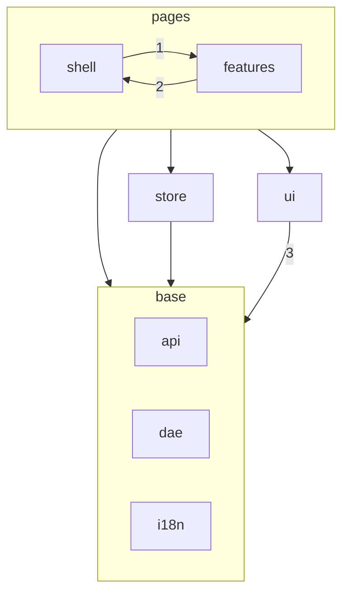
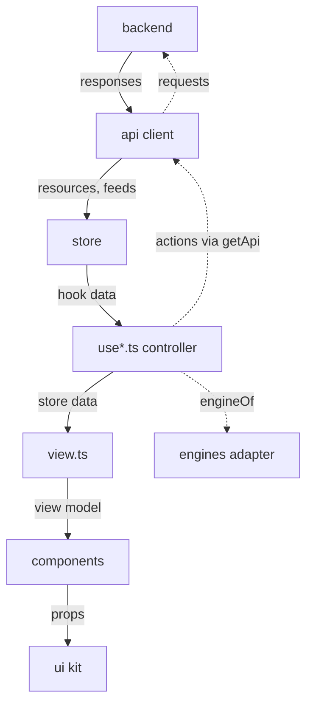

# Contributing

## Set up

Use Node `^22.13.0 || ^24.0.0 || >=26.0.0` and pnpm 11.15.1. From the repository root:

```sh
pnpm install --frozen-lockfile
```

## Run the gate

Before opening a pull request, run the same gates as CI from the repository root: `pnpm check`, `pnpm test:coverage`, `pnpm build`, `pnpm check:size`, and `pnpm e2e` after the one-time `pnpm e2e:install --with-deps`. `pnpm check` runs `typecheck`, `lint`, `check:i18n`, `format:check`, `test`, and `check:gen`.

`REUSE.toml` handles license headers; preserve its third-party annotations when adding or moving files. From the repository root, run `reuse lint` if you have REUSE, and run `pnpm test:coverage` to print coverage totals and write `coverage/lcov.info`.

## Architecture

### Where things are

- `src/`: the app, in the layers described below.
- `e2e/`: Playwright tests.
- `tools/`: build, check and release scripts.
- `contract/`: the vendored native API contract that `pnpm gen:api` reads.
- `public/`: fonts, icons and the logo, served as they are.
- `install/`: packaging for Alpine, Gentoo, nfpm, Nix and OpenWrt.
- `docs/`: the README's screenshots.
- `patches/`: pnpm patches to dependencies.
- `LICENSES/`: license texts for REUSE.
- `.github/`: CI workflows and the issue and pull request templates.

A feature folder, with `src/features/dns` as the example:

```text
src/features/dns/
  Dns.tsx       page
  Analysis.tsx  tab components
  useDns.ts     controller
  view.ts       projection
  cache.ts      pure sibling
  stats.ts      pure sibling
  messages.ts   strings
  nav.ts        tabs
```

`view.ts`, `cache.ts` and `stats.ts` each have a `.test.ts` beside them, and the shell's search reads the tabs in `nav.ts`. New features follow the same shape; a small page may leave pieces out. The folder table under the layer diagram says what each part of `src/` owns.

### Layers

The source tree has one folder per layer, and imports point down. Each arrow is an allowed import; the table under the diagram says exactly what each one covers.



_Allowed imports. Numbered arrows cover only the modules listed in the table._

| Code in                          | May import                                                                                                                                                                                                         |
| -------------------------------- | ------------------------------------------------------------------------------------------------------------------------------------------------------------------------------------------------------------------ |
| `src/shell`                      | `src/store`, `src/ui` and the base layers. From `src/features` (1): `shared/`, each feature's `nav.ts`, and the pages in `registry.ts`                                                                             |
| a feature                        | Its own folder, `src/features/shared`, `src/store`, `src/ui` and the base layers. From `src/shell` (2): `route.ts`, `routes.ts`, `draft.ts`, `preferences.ts`, `install.ts` and `About.tsx`; never another feature |
| `src/store`                      | The base layers                                                                                                                                                                                                    |
| `src/ui`                         | (3) `src/i18n`, `src/dae`, and from `src/api` only `error.ts`, `model.ts`, `serverClock.ts` and `types.ts`. Never the client, `getApi`, `mock` or `src/store`: the kit takes data as props                         |
| `src/api`, `src/dae`, `src/i18n` | Each other                                                                                                                                                                                                         |

Outside `src/api`, code reaches `src/api/engines` only through its `index.ts`. `registry.ts` loads each page lazily except the default page, Activity, which it imports directly so the first paint needs no second round trip. A feature uses the shell for links and URL state, the unsaved-draft guard, stored preferences and the install offer, and Settings shows the same About dialog as the backend menu.

| Folder            | Owns                                                                                                             |
| ----------------- | ---------------------------------------------------------------------------------------------------------------- |
| `src/api`         | The transport client, contract types, error model, selectors and the demo backend (`mock/`)                      |
| `src/api/engines` | Everything doona knows about a particular engine; the rest of the app gets engine-neutral data and reasons       |
| `src/store`       | Watched server reads: resources, caches and live feeds, and the action hooks                                     |
| `src/dae`         | The dae text vocabulary, scanner and group-entry helpers shared by the editor, the features and the demo backend |
| `src/features`    | One folder per page, with its controller, projections, components, strings and tests                             |
| `src/shell`       | Routing, navigation, drafts, appearance, shortcuts and search                                                    |
| `src/ui`          | The presentational kit and its stylesheets                                                                       |
| `src/i18n`        | Message loading and formatting                                                                                   |

### Data flow



_Solid arrows carry data. Dashed arrows are calls and actions._

- `src/store` owns what pages watch and cache: resources, live feeds, and fresh reads such as `readConfigFresh`.
- A feature's controller hook (`use*.ts`) reads through store hooks and owns URL state, drafts and actions. It calls `getApi()` only for actions and for one-off requests the person starts, such as a DNS query or loading older pages.
- `view.ts` turns store data into what the page shows. It is pure: no React, no store, and a unit test beside it. A projection too large for one file may move into pure sibling modules such as `dns/cache.ts`, `dns/stats.ts` and `activity/ranking.ts`, under the same rules.
- Components receive prepared values and callbacks, and never fetch, guard or format on their own. Visible strings live in the feature's `messages.ts`.

A small page need not have every piece; one with nothing to project has no `view.ts`. The rules are about which way data and imports go, not about having every file.

### Engines

The native API contract is shared by any engine that implements it; honk is the only one today. Engine-specific knowledge lives only in `src/api/engines`: setting names, section names, why a capability is off, which sources hold credentials. `engineOf(version)` picks the engine by the API name, and a feature asks the returned `Engine` for neutral data and reasons (`EngineReason`), then maps them to its own messages. An engine doona does not know gives no reasons, so the page falls back to what the contract says.

Features, the shell and the store never compare the engine or API name, or an `Engine`'s `id`. Comments may cite honk's source to explain a contract behaviour a feature handles.

To add an engine, add `src/api/engines/<engine>.ts` that implements `Engine`, add its id to `Engine['id']`, map its API name in `engineOf`, and extend `index.test.ts`. When a feature needs an explanation the adapter does not offer, add a neutral method or reason code to `types.ts`, with an answer for the unknown engine.

### Single-source lists

Some lists have one home, and everything else reads them:

- Pages: `routePaths` in `src/shell/routes.ts` and the definition keyed by that path in `src/shell/registry.ts`.
- Palettes: `src/shell/palettes.ts`. The build injects the ids and the default into the first-paint script `tools/stamp.js`.
- Browser storage keys: `src/api/storage.ts`. Never change a key's string: browsers already hold it.

### How the rules are enforced

`pnpm check` and `pnpm check:size` fail on these; the lint rules live in `eslint.config.js`:

| Boundary                                                                              | Check                                                                                  |
| ------------------------------------------------------------------------------------- | -------------------------------------------------------------------------------------- |
| The import table, the engines entry and both allow-lists                              | `import-x/no-restricted-paths` zones                                                   |
| No import cycles                                                                      | `import-x/no-cycle`                                                                    |
| No engine or API name comparisons in features, shell and store                        | `no-restricted-syntax` (G8)                                                            |
| Kit roles: React Aria, native controls, kit classes, heavy libraries, colour literals | `@typescript-eslint/no-restricted-imports` and `no-restricted-syntax` (G3, G4, G5, G7) |
| Visible text comes from catalogues                                                    | `check:i18n`                                                                           |
| Size budgets                                                                          | `check:size`                                                                           |

A reviewer checks the rest by hand: watched and cached reads go through the store, `view.ts` stays pure and tested, components only render, and no engine-specific setting or section name lands outside `src/api/engines`, even as data.

## User documentation

The user documentation lives in [Zakkaus/doona-docs](https://github.com/Zakkaus/doona-docs) and is published at [zakkaus.github.io/doona-docs](https://zakkaus.github.io/doona-docs/). When a change alters what users see or do, open a matching pull request there. The app links docs sections through `docsHref`; `src/features/shared/docsAnchors.json` maps each anchor to its page, and doona-docs checks that map against its pages.

## Translations

doona ships three languages: Traditional Chinese (`zh-TW`), Simplified Chinese (`zh-CN`) and English (`en`). Each feature keeps its strings in its own `messages.ts`, with the three tables side by side, so a translator sees every language of a key together. `src/i18n/locales/*.ts` is generated from those files; do not edit it.

To correct a translation:

1. Find the key. Search for the text in the `messages.ts` files, then search for the key under `src/` to see where it appears.
2. Change the value in `messages.ts` and run `pnpm gen:locales`.
3. Run `pnpm check`. `check:i18n` fails when a language lacks a key, when a key's placeholders such as `{n}` differ between languages, when a key is unused, and when a component writes interface text itself instead of taking it from a catalogue.
4. In the pull request, say what was wrong. Add a screenshot when the new text is longer, since labels have to fit a phone.

Write formal Traditional Chinese in `zh-TW` and idiomatic Simplified Chinese in `zh-CN`, each with its own region's computing terms (組態／配置, 連線／连接, 記憶體／内存). Write plain English in sentence case. Use the term the rest of the catalogue already uses for the same concept. Keep placeholders as written. A count in English uses `{one, other}` forms; Chinese needs only one form.

Every language must be complete: a key missing from one table fails `pnpm typecheck`, and there is no fallback to another language. To propose a new language, open an issue first, naming the language and who will review its strings.

## UI components

React Spectrum S2 is the design reference: behaviour, spacing, states and wording follow it. Components are built on `react-aria-components` with doona's own CSS in `src/ui`; a new component starts from the S2 design and only then from React Aria.

doona does not depend on `@react-spectrum/s2`. Version 1.7.1 unpacks to about 54 MB against about 6.6 MB for `react-aria-components`, and its styles come from `@parcel/macros`, a build-time macro that needs a bundler plugin. doona is served by routers and keeps gzip budgets of 275 KB for the startup shell and 680 KB for all JavaScript (`sizeBudget` in `package.json`, enforced by `pnpm check:size`).

Each role has one kit component in `src/ui`. Variants are typed props, never class strings, and styling uses tokens only. Features compose kit components and do not use React Aria components or kit class names directly; a composition with a single consumer may stay in its feature until a second one needs it.

| Role (S2 name)                  | Kit component                          |
| ------------------------------- | -------------------------------------- |
| Button, LinkButton              | `Button`, `Link`                       |
| ActionGroup                     | `ActionGroup`                          |
| Menu, ActionMenu                | `ChoiceMenu`                           |
| Picker                          | `LabeledSelect`, `InlineSelect`        |
| SegmentedControl                | `Segmented`                            |
| Card                            | `Card`                                 |
| TableView                       | `DataTable`                            |
| InlineAlert, IllustratedMessage | `InlineAlert`, `Empty`, `ErrorMessage` |
| TagGroup                        | `Tags`, `Tag`                          |

What this leaves out, on purpose:

- No S2 package, style macro or S2 theme tokens. Colours come from the official palettes in `src/ui/styles/palettes.css`.
- No S2 icon package. The icons doona uses are copied one at a time from Adobe Spectrum under Apache-2.0 (see NOTICE).
- No automatic S2 updates. When S2 changes a component's behaviour or look, doona follows by hand.
- No second component library beside React Aria.

Revisit this if S2 stops requiring the macro or the size budgets stop applying.

## Commit and pull request flow

Use commit subjects in this form:

```text
type(scope): short subject
```

Write the subject and body in English. Use an imperative subject and explain the change and its reason in the body. Use these types: `feat`, `fix`, `perf`, `refactor`, `docs`, `test`, `build`, `ci`, `chore`, and `style`.

Branch from `main`. Keep pull requests small and limited to one theme. Keep CI green.

Use the GitHub issue and pull request templates, including their Chinese variants. Name the human responsible and report only verified results.

Write the pull request body in English with one short paragraph under each of `## Problem`, `## How I fixed it` and `## Verified`, in that order: what is wrong, what changed, and what was checked, not the reasoning that led there. Verified lists the commands you ran and what they reported; link long evidence instead of pasting it.

Use [Semantic Versioning 2.0.0](https://semver.org/spec/v2.0.0.html). Start with `0.1.0`
and number pre-releases as `-alpha.N`, `-beta.N` or `-rc.N`. Tag each tested
release `vX.Y.Z[-pre.N]`. Mark GitHub releases for pre-release versions as
pre-releases. Update the declared version and changelog before tagging.
Set `tools/honk-commit.txt` to the full SHA of the honk debug build the release bundles; the release workflow fails if honk's `debug` release has moved to another commit.

For tag `v0.1.0-beta.7`, release assets keep the upstream version without `v`. See the
[package version table](install/README.md#version-spellings) for every archive, binary package and source recipe.

## Update the contract

Start with `contract/api-standardize/SOURCE.md`. Update the vendored contract, run `pnpm gen:api`, then run `tools/check-gen.sh`. Do not edit generated API types directly.
