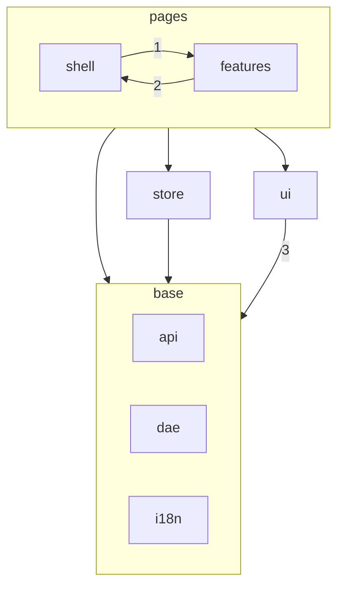
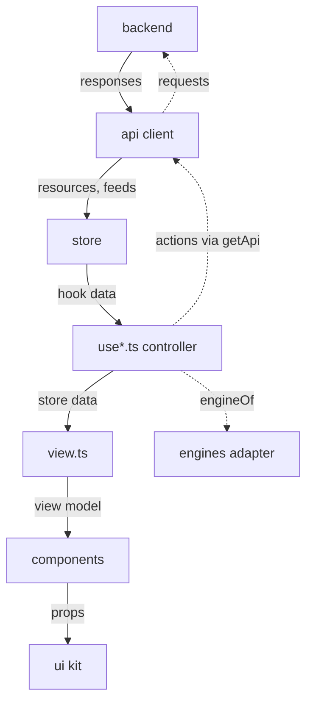

# Contributing

## Set up

Use Node `^22.13.0 || ^24.0.0 || >=26.0.0` and pnpm 11.15.1. From the repository root:

```sh
pnpm install --frozen-lockfile
```

## Run the gate

Run the gates for the CI lane selected by `tools/ci-changes.mjs`, from the repository root. Documentation-only changes run `pnpm format:check` and `pnpm check:i18n`. The full lane runs `pnpm check`, `pnpm test:coverage`, `pnpm build`, `pnpm check:size`, and `DOONA_E2E_WEBKIT=1 pnpm e2e` after the one-time `pnpm e2e:install --with-deps`. `pnpm check` runs `typecheck`, `lint`, `check:i18n`, `format:check`, `test`, and `check:gen`.

`REUSE.toml` handles license headers; preserve its third-party annotations when adding or moving files. From the repository root, run `reuse lint` if you have REUSE, and run `pnpm test:coverage` to print coverage totals and write `coverage/lcov.info`.

## Architecture

### Where things are

- `src/`: the app, in the layers described below.
- `mock/`: the demo backend and its fixtures, shared by the app and tests.
- `e2e/`: Playwright tests.
- `tools/`: build, check and release scripts.
- `changes/`: one changelog fragment per pull request; release tooling collects them into `CHANGELOG.md`.
- `contract/`: the vendored native API contract that `pnpm gen:api` reads.
- `public/`: app icons, logo, manifest and service-worker template. Noto fonts come from npm packages; see [Fonts](docs/fonts.md).
- `install/`: packaging for Alpine, Gentoo, nfpm, Nix and OpenWrt.
- `docs/`: font and country-flag documentation, and the duck artwork. README screenshots live in doona-docs.
- `patches/`: pnpm patches to dependencies.
- `LICENSES/`: license texts for REUSE.
- `.github/`: CI workflows and the issue and pull request templates.

A feature folder, with `src/features/dns` as the example:

```text
src/features/dns/
  Dns.tsx       page
  Analysis.tsx  tab components
  useDns.ts     controller
  view.ts       projection
  cache.ts      pure sibling
  stats.ts      pure sibling
  nav.ts        tabs
```

`view.ts`, `cache.ts` and `stats.ts` each have a `.test.ts` beside them, and the shell's search reads the tabs in `nav.ts`. A field or entry point search should find goes beside that registry too: a `SearchTarget` list in `nav.ts`, a Settings control in `settingsFields` with a matching `data-setting` mark; search builds its entries from these, never from a separate list. New features follow the same shape; a small page may leave pieces out. The folder table under the layer diagram says what each part of `src/` owns.

### Layers

The source tree has one folder per layer, and imports point down. Each arrow is an allowed import; the table under the diagram says exactly what each one covers.



_Allowed imports. Numbered arrows cover only the modules listed in the table._

| Code in                          | May import                                                                                                                                                                                                                         |
| -------------------------------- | ---------------------------------------------------------------------------------------------------------------------------------------------------------------------------------------------------------------------------------- |
| `src/shell`                      | `src/store`, `src/ui` and the base layers. From `src/features` (1): `shared/`, each feature's `nav.ts` and `widgets.ts`, and the pages in `registry.ts`                                                                            |
| a feature                        | Its own folder, `src/features/shared`, `src/store`, `src/ui` and the base layers. From `src/shell` (2): `route.ts`, `routes.ts`, `draft.ts`, `preferences.ts`, `install.ts`, `About.tsx` and `shortcuts.ts`; never another feature |
| `src/store`                      | The base layers                                                                                                                                                                                                                    |
| `src/ui`                         | (3) `src/i18n`, `src/dae`, and from `src/api` only `diagnostics.ts`, `error.ts`, `model.ts`, `serverClock.ts` and `types.ts`. Never the client, `getApi`, `mock` or `src/store`: the kit takes data as props                       |
| `src/api`, `src/dae`, `src/i18n` | Each other                                                                                                                                                                                                                         |

Outside `src/api`, code reaches `src/api/engines` only through its `index.ts`. `registry.ts` loads every page through a dynamic import. It preloads the default page, Activity, as soon as the shell runs, in parallel with the capabilities read the page waits for. A feature uses the shell for links and URL state, the unsaved-draft guard, stored preferences and the install offer, and Settings shows the same About dialog as the backend menu and opens the keyboard shortcuts dialog through `openShortcuts`.

| Folder            | Owns                                                                                                             |
| ----------------- | ---------------------------------------------------------------------------------------------------------------- |
| `src/api`         | The transport client, contract types, error model and selectors                                                  |
| `src/api/engines` | Everything doona knows about a particular engine; the rest of the app gets engine-neutral data and reasons       |
| `src/store`       | Watched server reads: resources, caches and live feeds, and the action hooks                                     |
| `src/dae`         | The dae text vocabulary, scanner and group-entry helpers shared by the editor, the features and the demo backend |
| `src/features`    | One folder per page, with its controller, projections, components and tests                                      |
| `src/shell`       | Routing, navigation, drafts, appearance, shortcuts and search                                                    |
| `src/ui`          | The presentational kit and its stylesheets                                                                       |
| `src/i18n`        | The language list, the catalogues, and message loading and formatting                                            |

### Activity widgets

`src/shell/widgets` owns the versioned browser layout and responsive hosts. The desktop panel floats at the viewport's bottom inline-end corner, between the top bar and the dock, until the reader moves it by its header (pointer, or arrow keys in 16px steps). Its header holds the backend light, whose name carries the engine and its version, then pin, collapse and a menu (edit, dock, hide) as kit quiet icon buttons. An unpinned panel collapses to its header when the page changes; a pinned one stays as the reader left it. Every corner and edge resizes it by pointer with the opposite side fixed (`resizePanel` in `panelSize.ts`), the top inline-start corner also by arrow keys; the handles draw only the resize cursor and a keyboard focus ring, the size and offset are stored within fixed limits, and the height never exceeds the content. The panel sits in a frame between the top bar and the dock; a panel left in its upper half keeps its top edge and one in the lower half its bottom edge (`anchorPanelOffset`), so expanding or resizing grows it towards the room, and moving, resizing and expanding all stay inside that frame without rewriting the stored values. A collapsed panel is its header alone and keeps only the stored width; its chevron points the way it grows. Dropping the header on the sidebar's dock slot, or the menu's dock item, docks the panel as the sidebar's last section: a named group header, widget list and backend footer. The header shares the navigation groups' height and chevron size. Embedded content uses one box from the section headers' text start to their chevrons' end: captions, legend rows, value rows and dividers fill it, values align to its end, and charts and segmented controls fill its width without another inset. The backend footer starts at the navigation icons' inset. These insets and the content width use the sidebar padding and spacing tokens; the floating panel keeps its layout. The gap above the header is a resize handle for the section's height (pointer or arrow keys), with a line on hover or focus instead of a permanent divider. Its height is stored with the layout; the section stays at the sidebar's foot while the links scroll, and its menu floats it again. The docked state is stored; without the sidebar, below 1024px, the phone drawer takes over. The top-bar toggle hides desktop widgets or opens the phone drawer. Earlier layouts' placement and dock fields are dropped on read.

The visual editor keeps changes in a draft until Save. Gallery and canvas previews reuse cached readings without acquiring polling or event subscriptions. Gallery items fall back to typed snapshots in `samples.ts` when cached data is absent or empty; every item has its name as a heading, one preview frame at one scale and no sample badge. Sample charts never write to live history rings. Its gallery allows three instances per module, each with its own size, compatible form and options. The panel canvas shares the live panel's header, widget rendering and section styles at its saved width, falling back to `minPanelSize.width`. Selection frames sit outside sections with at least an 8px displayed gap, including when scaled; the preview reserves unclipped space without narrowing section content. Drag handles use the caption's inline end, clear of its text and the chart below. The preview aligns to its column's start, never stretches, and scales down proportionally within the column's padded space. Three regions sit side by side only when the library, real-width preview and inspector fit; otherwise the inspector sits below the preview. Phones stack the regions with a horizontal library. Library cards size to their content and share a height within each horizontal row. The dialog body owns vertical scrolling; in the three-column layout, the preview and inspector stay alongside the library while it scrolls. Small widgets occupy one column, medium widgets use both columns, and large widgets use two rows. The inspector's size choice and React Aria reorder share the same saved item schema. Cancel confirms before discarding a changed draft. Panel layout versions 1 and 2 migrate to version 3 on read; the old Version widget and sidebar position are discarded.

The canvas never supplies gallery sample history. Changing an uncharted key-value widget to a sparkline shows its chart layout without a curve until live history is available; editing alone must not acquire that history.

Activity uses the same registry with a version 3 dashboard layout: five ordered sections, quick, metrics, traffic, details and extensions, each with a fixed profile in `dashboard.css`. From 1280px, traffic, details and extensions share twelve tracks so their columns line up. The default places 13 cards in the first four sections, then four modules in extensions. Special footprints apply to the first instance of mode, latency, CPU and notices, never to whichever card holds a position. A card's width is Auto or a fraction, 1/5, 1/4, 1/3, 1/2, 2/3 or full width, never under the widget's narrowest (`dashboardSizing.ts`). Auto keeps the footprint the profile gives the card's legacy size (small, medium, large, full row). Once a section holds a chosen width it lays out on the fraction grid from 768px: sixty tracks whose column gap is each cell's inline-start margin, so a fraction has one width in every section, chosen widths snap to sixths below 1280px, and Auto cards keep the footprint their profile gives them at every width, so choosing one card's width never resizes or moves another Auto card. Phones always use the profile's columns. A card's height adjusts what it has: the chart of a charted card, value tiles' sparklines included (0.75, 1 or 2 times its standard height; text never scales), or a list's row count (3, 5 or 8). Lists keep their earlier limits, such as node latency's 3, 6 and 12 rows, until a count is chosen. Both renderers, Activity's `ActivityCard` and the general `WidgetContent`, take the same settings. Version 2 layouts read unchanged as version 3. The renderer follows a card's kind and display, never its size. Every section packs like masonry (`usePacking` in `src/ui/packing.ts`): rows are 1px, a card spans its content and one gap, so a short card sits under the card above it in its column, and a card grows to the lowest end among the cards of its own height step whose span overlaps its own, never past the card below it, so cards of one step in a row share a height and a column of that step beside a taller card ends level with it, but a short card never stretches beside a stack of two. A card's height is its own, as a widget's on a phone grid: setting or dragging one card's height never resizes its neighbours, a taller card spans more rows, and the space beside it under its shorter neighbours takes the cards that follow or shows a row hint. Value tiles of one height step in one packed row share one layout: when any is too narrow for its value and sparkline on one line (the tile container query in `cards-dashboard.css` is the one threshold) or is tall, all of that step stack, the sparkline spanning the card under the value; a short tile is one cell, its value and a narrower sparkline always on one line; with a chosen width an inline sparkline fills the rest of its line. Edit mode renders the same cells in a React Aria GridList per section, packed the same way, inside `ResourcePreview`: every card shows the same content and controls as on the page, inert; the drag handle, settings and remove buttons form a chip on the card's top edge at its inline end, standing out into the gap so it never covers the card's header, shown while a pointer or focus is on the card, whose cell then stands above its neighbours; remove offers Undo in a toast, the drop indicator is a line in the gap, and every drop is a move, within or across sections, applied as one transaction. Each card's inline-end and bottom edges carry resize handles, short pills unlike the move handle's dots, sliders over the card's steps with Auto first for width, that snap a drag to the nearest width or height and step with the arrow keys, mirrored in right-to-left; phones have only the height handle. Over each section, row hints mark the free space at a row's end with its share, take a card that fits and refuse a wider one with a reason. The settings popover holds width, height, display, options, move earlier or later and remove, a complete alternative to dragging. The gallery is a dialog that shows each widget at its preset sizes as real cards scaled from their page width; a thumbnail adds the widget at its size. Done saves; Cancel confirms before discarding a changed draft and restores the saved layout; Reset changes only the draft. Version 1 migrates on read: an untouched layout maps into the default sections, a rearranged one keeps its order in extensions. Without the status card, the page shows the runtime read's error and retry above the cards that read runtime. Each visible module leases existing resources; offscreen bodies and gallery previews retain cached values without polling. Feature `widgets.ts` files expose existing projections and card renderers to the shell without adding cross-feature imports.

The kit owns `FloatingPanel` with `panelSize.ts`, `WidgetPanel`, `WidgetGrid`, `WidgetGalleryTile`, `DashboardTile`, `SortableCanvas` (the one drag-and-drop path, for the dashboard's sections and the panel editor's grid) and `PageActions`. Components expose typed variants and own their styles. Compact charts reuse Activity's legend and series order. Keep projections shared with Activity in `src/features/shared`, and reads and action state in `src/store`. Shared resource subscribers negotiate the fastest requested cadence. Hidden panels mount no widget reads; collapsed floating panels mount only the speed summary, while collapsed docked panels show the group name. Mode drafts and group control state remain shared with their full pages and survive closing the panel.

Latency instances store their own policy group in their layout item. The default dashboard instance migrates the former browser-wide choice; panel choices remain independent. Both surfaces use the same compact picker, with Automatic first and only group names in its menu. Help belongs beside the card title.

### Data flow



_Solid arrows carry data. Dashed arrows are calls and actions._

- `src/store` owns what pages watch and cache: resources, live feeds, and fresh reads such as `readConfigFresh`.
- A feature's controller hook (`use*.ts`) reads through store hooks and owns URL state, drafts and actions. It calls `getApi()` only for actions and for one-off requests the person starts, such as a DNS query or loading older pages.
- `view.ts` turns store data into what the page shows. It is pure: no React, no store, and a unit test beside it. A projection too large for one file may move into pure sibling modules such as `dns/cache.ts`, `dns/stats.ts` and `activity/ranking.ts`, under the same rules.
- Components receive prepared values and callbacks, and never fetch, guard or format on their own. Visible strings live in the catalogues in `src/i18n/locales`.

A small page need not have every piece; one with nothing to project has no `view.ts`. The rules are about which way data and imports go, not about having every file.

### Engines

The native API contract is shared by any engine that implements it; honk is the only one today. Engine-specific knowledge lives only in `src/api/engines`: setting names, section names, why a capability is off, which sources hold credentials. `engineOf(version)` picks the adapter by `version.engine.name`, and a feature asks the returned `Engine` for neutral data and reasons (`EngineReason`), then maps them to its own messages. An engine doona does not know gives no reasons, so the page falls back to what the contract says.

Features, the shell and the store never compare the engine or API name, or an `Engine`'s `id`. Comments may cite honk's source to explain a contract behaviour a feature handles.

To add an engine, add `src/api/engines/<engine>.ts` that implements `Engine`, add its id to `Engine['id']`, map its engine name in `engineOf`, and extend `index.test.ts`. When a feature needs an explanation the adapter does not offer, add a neutral method or reason code to `types.ts`, with an answer for the unknown engine.

### Single-source lists

Some lists have one home, and everything else reads them:

- Pages: `routePaths` in `src/shell/routes.ts` and the definition keyed by that path in `src/shell/registry.ts`.
- Palettes: `src/shell/palettes.ts`, with one stylesheet per family in `src/ui/styles/palettes/`. The build injects the ids and the default into the first-paint script `tools/stamp.js`.
- Languages: `src/i18n/languages.ts`. The build injects the locales and the default into `tools/stamp.js`, and the Node tools read the same file through `tools/languages.mjs`.
- Browser storage keys: `src/api/storage.ts`. Never change a key's string: browsers already hold it.

### How the rules are enforced

`pnpm check` and `pnpm check:size` fail on these; the lint rules live in `eslint.config.js`:

| Boundary                                                                              | Check                                                                                  |
| ------------------------------------------------------------------------------------- | -------------------------------------------------------------------------------------- |
| The import table, the engines entry and both allow-lists                              | `import-x/no-restricted-paths` zones                                                   |
| No import cycles                                                                      | `import-x/no-cycle`                                                                    |
| No engine or API name comparisons in features, shell and store                        | `no-restricted-syntax` (G8)                                                            |
| Kit roles: React Aria, native controls, kit classes, heavy libraries, colour literals | `@typescript-eslint/no-restricted-imports` and `no-restricted-syntax` (G3, G4, G5, G7) |
| Visible text comes from catalogues                                                    | `check:i18n`                                                                           |
| Size budgets                                                                          | `check:size`                                                                           |

`check:size` budgets what a reader downloads, in gzip bytes from the Vite manifest, not the total: the login and Activity startup paths (entry chunk and its static imports, the largest language catalogue, the charts Activity loads), startup CSS, one catalogue, one font stylesheet, each page beyond Activity, the config editor and the mock. The budgets live in `sizeBudget` in `package.json`; a failure names the budget, the measured size, the limit and the largest files. The total is printed for information and does not fail the build. A startup budget that rises needs its reason in the pull request.

A reviewer checks the rest by hand: watched and cached reads go through the store, `view.ts` stays pure and tested, components only render, and no engine-specific setting or section name lands outside `src/api/engines`, even as data.

## User documentation

The user documentation lives in [Zakkaus/doona-docs](https://github.com/Zakkaus/doona-docs) and is published at [zakkaus.github.io/doona-docs](https://zakkaus.github.io/doona-docs/). When a change alters what users see or do, open a matching pull request there. The app links docs sections through `docsHref`; `src/features/shared/docsAnchors.json` maps each anchor to its page, and doona-docs checks that map against its pages.

## Translations

Each language has one catalogue, `src/i18n/locales/<id>.json`: a flat object from message key to text, with the keys sorted. A key starts with its feature or area, such as `dns.` or `ui.`. English is the reference: `en.json` is always complete, and no other catalogue may hold a key it lacks. `src/i18n/languages.ts` lists the languages; Traditional Chinese (`zh-TW`), Simplified Chinese (`zh-CN`) and English (`en`) are complete.

To correct a translation:

1. Find the key. Search the catalogue for the text, then search for the key under `src/` to see where it appears.
2. Change the value in the catalogue.
3. Run `pnpm check`. `check:i18n` fails when a complete language lacks a key, when a catalogue file is missing, when a message is empty, when a catalogue holds a key English lacks, when a key's placeholders such as `{n}`, or the `$` arguments of a CodeMirror phrase (a `cm.` key), differ from English, when keys are out of order, when a key is unused, and when a component writes interface text itself instead of taking it from a catalogue. Data files and sample input it may ignore are listed, each with its reason, in `tools/i18n-literals.mjs`.
4. In the pull request, say what was wrong. Add a screenshot when the new text is longer, since labels have to fit a phone.

A change that adds a string adds its key to `en.json` and to every complete language's catalogue in the same pull request.

Write formal Traditional Chinese in `zh-TW` and idiomatic Simplified Chinese in `zh-CN`, each with its own region's computing terms (組態／配置, 連線／连接, 記憶體／内存). Write plain English in sentence case. Use the term the rest of the catalogue already uses for the same concept. Keep placeholders as written. A plural message is an object with the forms its language's `Intl.PluralRules` names (`zero`, `one`, `two`, `few`, `many`, `other`); `other` is required, and `check:i18n` rejects a form the language lacks. English uses `one` and `other`; Chinese uses a plain string. The form is chosen by the numeric `n` parameter, or by the parameter named in the translator's third argument, such as `t(key, {n, files}, 'files')`. Pass the count as a number, a `bigint` or a UInt64 decimal string, never as formatted text; the translator formats it for the language.

Pass numbers to the translator, not formatted strings; it writes them in the selected language, integers with grouping and decimals with up to three places. For a fixed number of decimals, name it in the fourth argument, as in `t('ui.percent', {n: percent}, 'n', {n: 1})`.

Keep professional terms verbatim in every language: protocol names, dae and honk configuration keywords, and API field names. The catalogues do not cover number and date formats, which come from the browser's `Intl`; React Aria's own announcements for grid selection and drag and drop, which fall back to `en-US` for a language React Aria lacks; or detail text the backend sends.

Template names are doona's own. Generated group labels follow the current UI language; group identifiers and bilingual region match patterns remain configuration data.

To add a language:

1. Open an issue first, naming the language and who will review its strings.
2. Add an entry to `src/i18n/languages.ts` with `complete: false`: its id, its name in itself, its BCP 47 locale, the docs folder it links to (one of the languages doona-docs publishes, otherwise `en`; when doona-docs gains a language, widen the `docs` type there), and, only when its script needs faces doona ships, the `<name>` of the `src/fonts-<name>.css` stylesheet that declares them. List in `faces` the font families its text prefers, before the system font. If the browser's language tag needs more than its primary subtag to pick it, extend `browserLang` there and the same lines in `tools/stamp.js`, and add the tags to `src/i18n/negotiation.test-cases.ts`.
3. Create `src/i18n/locales/<id>.json`. `pnpm check:i18n --missing <id>`, which works before that file exists, prints the keys it lacks with their English text, grouped by prefix, as lines to paste in and translate.
4. Run `pnpm check`, which also prints the language's coverage. The user documentation is translated separately, in doona-docs.

A partial language shows English for the strings it lacks. Once it has every key, maintainers may mark it `complete: true`.

## UI components

React Spectrum S2 is the design reference: behaviour, spacing, states and wording follow it. Components are built on `react-aria-components` with doona's own CSS in `src/ui`; a new component starts from the S2 design and only then from React Aria.

doona does not depend on `@react-spectrum/s2`. Version 1.7.1 unpacks to about 54 MB against about 6.6 MB for `react-aria-components`, and its styles come from `@parcel/macros`, a build-time macro that needs a bundler plugin. doona is served by routers and keeps gzip budgets of 275 KB for the startup shell and 700 KB for all JavaScript (`sizeBudget` in `package.json`, enforced by `pnpm check:size`).

Each role has one kit component in `src/ui`. Variants are typed props, never class strings, and styling uses tokens only. Features compose kit components and do not use React Aria components or kit class names directly; a composition with a single consumer may stay in its feature until a second one needs it.

Layout and text utility classes are not kit components, and features may use them directly: `rp-row` (a title or label and its controls on one line), `rp-cluster` (items that wrap, with `nowrap` to keep one line), `rp-col`, `rp-grow`, `rp-contents`, and the text styles `rp-label`, `rp-note`, `rp-h3` and `rp-code`. They place or style what a feature composes and draw no control or surface, so they are not wrapped in components. Classes that draw a kit part (a card, a button, an empty or loading state, a value tile, a chart placeholder) stay inside `src/ui`, and `no-restricted-syntax` rejects them in features.

Loading states follow one rule. A first load whose content shape is known draws S2's Skeleton in that shape and in the box the content will take, so nothing moves when the content arrives: tables (`DataTable`'s `loading`), fact grids (`Skeleton`), fact strips (`FactStrip`'s `loading`), chart bodies, lists, ranking bars, form fields and card grids (`SkeletonBody`), labelled parts whose labels are known (real labels with `SkeletonBar`s in a `SkeletonGroup`, so a form's Skeleton has the form's rows), and a page body while its chunk or first reads load (`PageSkeleton`, drawing the shape the route declares as `skeleton` in `src/shell/registry.ts`: its tab row, toolbar rows of M bars, fact strip, cards, table rows or editor block, at the page's own gaps). Draw the Skeleton from the same lists the content renders, and keep a box whose height follows the data, such as an editor or a chart of every node, at a typical height. `Loading`, the progress circle, is kept for sign-in and search results while typing; a pending `Button` shows its own. A refresh of content already on screen keeps that content instead of returning to a skeleton. Every loading state holds its box at once, shows after 150ms, reads one visually hidden status, keeps its drawing inert and hidden from assistive technology, and keeps the shimmer still under reduced motion; a dashboard preview shows a dash instead. `src/ui/Feedback.test.tsx` lists the files allowed to use `Loading`, so a new page either draws a Skeleton or names its reason there.

Keyboard focus uses one `--rp-focus-width` (2px) outline in `--rp-focus-color`, following the target's radius. Keep at least 2px between the ring and visible content: text-only targets use padding with compensating margins, and scroll-clipped controls use an inset ring. Text fields put the ring on the field box, not both the input and its wrapper; clear and reveal buttons own their rings. Preserve unfocused content positions, palette values and selection backgrounds when changing focus styles.
Set control sizes only with the kit component's `size` prop (`M` or `L`), never with CSS height, font-size or padding overrides. Every control is S2's default M (32px, 36px on phones/coarse pointers) wherever it sits: page toolbars, page actions and links, cards, dialogs, inspectors, tables, widgets and the sidebar alike. No container forces L; a control is L only where S2 itself prescribes L, by passing `size="L"`, and then takes L's 16px text and L's corners (9px, or a 20px pill for a primary action: an accent or negative fill, or a button in a dialog footer's `PrimaryActions`). A control's own `size` prop wins over the size a `Card` provides through `ControlSizeContext`; dialogs and popovers reset it. S2's SegmentedControl has no size, so `Segmented` has no `size` prop: it is always M, its items flush in the track, and a card's size does not reach it. Page tabs are the segmented control at M, like every control: page navigation, the kit `Tabs` that switch a page between its sections, keeps the tab and tabpanel roles and is drawn as S2's SegmentedControl at M, sharing the segmented control's track, slider and item rules in `segmented.css`. On a page without tabs, the `Segmented` filter in that place (the Policies kinds) and the controls on its row are M as well. Controls on one row share one size. Where the tabs are wider than the page, the bar scrolls within itself, keeping the selected tab in view and fading the end with more tabs. Contextual help stays at XS (24px), centred beside its label or control regardless of the surrounding size. The page heading reserves the M row height even while page actions are unmounted during chunk loading. Side-labelled source pickers wrap the label when needed to keep the complete basename inside the viewport. `src/ui/styles/controlSize.test.ts` guards CSS ownership, height tokens and the size precedence, `e2e/toolbar-height.spec.ts` checks that every route's page rows are M and that no local row mixes M and L, `e2e/page-tabs.spec.ts` checks the tab size and the Policies switch row, the slider and that switching tabs moves nothing, and `e2e/segmented-size.spec.ts` checks every segmented control and its row on every route, the widget panel and dashboard editing.

| Role (S2 name)                    | Kit component                                                                              |
| --------------------------------- | ------------------------------------------------------------------------------------------ |
| Button, ActionButton, LinkButton  | `Button` (ActionButton shape; a pill when accent, negative or in `PrimaryActions`), `Link` |
| ActionGroup                       | `ActionGroup`                                                                              |
| Menu, ActionMenu                  | `ChoiceMenu`                                                                               |
| Picker                            | `LabeledSelect`                                                                            |
| Checkbox, CheckboxGroup           | `Checkbox`, `CheckboxSet`                                                                  |
| Searchable single/multiple choice | `SearchSelect`, `SearchMultiSelect`                                                        |
| SegmentedControl                  | `Segmented`                                                                                |
| Tabs                              | `Tabs`                                                                                     |
| RadioGroup, Radio                 | `RadioGroup`, `Radio`                                                                      |
| Card                              | `Card`                                                                                     |
| Form                              | `Form` (`DialogForm` in a dialog's sections)                                               |
| Dialog and form sections          | `ModalDialog`, `DialogForm`, `DialogSection`                                               |
| TextField, NumberField, Switch    | `TextField`, `NumberField`, `Switch`                                                       |
| TableView                         | `DataTable`                                                                                |
| InlineAlert, IllustratedMessage   | `InlineAlert`, `Empty`, `ErrorMessage`                                                     |
| TagGroup                          | `Tags`, `Tag`                                                                              |

Every form is a kit `Form`, or `DialogForm` in a dialog's sections; no feature or shell file writes a bare `<form>`. A dialog whose submit sits in its footer gives the `Form` an `id` and the footer's button `type="submit"` and `form`, so Enter in a field does what the button does. Every field where a whole number is typed is a `NumberField`, with `minValue`, `maxValue` and `step` taken from the existing check; the draft keeps its text and converts with `numberFromText` and `textFromNumber`. These stay a `TextField`:

- A value written in hex, such as `so_mark_from_dae` (a setting with `hexMax`).
- A number or a keyword, such as `preconnect_node_count` with `auto` (a setting with `choices`).
- A whole number that can exceed `Number.MAX_SAFE_INTEGER`, such as `max_concurrent_dials` (a setting whose `max` is above it).
- A duration or size typed with its unit, such as `sniffing_timeout` (`30s`) or `bandwidth_max_rx`.
- A list, such as the values of a rule or group condition.
- A stored global setting the number field cannot show, such as one written as `0x10`, until a whole number or nothing is saved in its place; the stored value decides, so a field keeps its kind while it is edited.

`src/features/config/formRules.test.ts` checks the first two rules.

Searchable pickers keep the search field fixed; only the option list scrolls. The popover and dialog shrink to the available height rather than adding another scrollbar.

What this leaves out, on purpose:

- No S2 package, style macro or S2 theme tokens. Colours come from the official palettes in `src/ui/styles/palettes/`.
- No S2 icon package. The icons doona uses are copied one at a time from Adobe Spectrum under Apache-2.0 (see NOTICE).
- No automatic S2 updates. When S2 changes a component's behaviour or look, doona follows by hand.
- No second component library beside React Aria.

Revisit this if S2 stops requiring the macro or the size budgets stop applying.

### Add a palette

1. Add an entry to `src/shell/palettes.ts`. The id is `family/flavour`; a family with one flavour repeats its name, as in `nord/nord`.
2. Add `src/ui/styles/palettes/<family>.css` and import it from `src/ui/styles/palettes.css`. It holds a light block keyed on `:root[data-family='<family>']`, a dark block that adds `[data-scheme='dark']`, and a `[data-flavour]` block for each extra flavour. Each block sets every token in the table below, and `tools/palettes.test.mjs` checks that. Images a palette needs go in `src/ui/styles/palettes/<family>/`, referenced relatively from its stylesheet, with licence entries in `NOTICE` and `REUSE.toml`.
3. Add its names under the `palette.*` keys in `en.json` and in every complete language's catalogue (see Translations). A palette may also reword a few statuses: its optional `words` map points a catalogue key at a `palette.*` key of its own, and every `useT` translator reads that key while the palette is on. Components need no palette check.
4. Add it to the map in `e2e/contrast.spec.ts` and run that spec.

Use the palette's official values only. When a pair fails contrast, point the token that use reads at another official colour of the palette, such as `--rp-negative-text: var(--rp-text)`; never add a colour. `src/ui/styles/motion.css` sets those role tokens and says what each one covers.

| Token                                                                        | Meaning                                                                                                                |
| ---------------------------------------------------------------------------- | ---------------------------------------------------------------------------------------------------------------------- |
| `--rp-base`                                                                  | Page background, and inputs and headers set into a card                                                                |
| `--rp-surface`                                                               | Cards and panels                                                                                                       |
| `--rp-overlay`                                                               | Tiles, buttons and menus: the step above a card                                                                        |
| `--rp-text`                                                                  | Body text                                                                                                              |
| `--rp-subtle`                                                                | Secondary text                                                                                                         |
| `--rp-muted`                                                                 | The faintest text and marks: disabled and unavailable items                                                            |
| `--rp-pine`, `--rp-foam`, `--rp-iris`, `--rp-gold`, `--rp-rose`, `--rp-love` | Accent colours. By default pine is the accent and info, foam positive, gold notice and love negative                   |
| `--rp-c1` to `--rp-c8`                                                       | Chart series and group colours, in order                                                                               |
| `--rp-hl-low`, `--rp-hl-med`, `--rp-hl-high`                                 | Highlights: low for dividers and quiet fills on a card, medium for hover and selection, high for tracks and scrollbars |
| `--rp-shadow`                                                                | Card shadow                                                                                                            |

## Commit and pull request flow

Use commit subjects in this form:

```text
type(scope): short subject
```

Write the subject and body in English. Use an imperative subject and explain the change and its reason in the body. Use these types: `feat`, `fix`, `perf`, `refactor`, `docs`, `test`, `build`, `ci`, `chore`, and `style`.

Branch from `main`. Keep pull requests small and limited to one theme. Keep CI green.

Use the GitHub issue and pull request templates, including their Chinese variants. Name the human responsible and report only verified results.

Write the pull request body in English with one short paragraph under each of `## Problem`, `## How I fixed it` and `## Verified`, in that order: what is wrong, what changed, and what was checked, not the reasoning that led there. Verified lists the commands you ran and what they reported; link long evidence instead of pasting it.

### Changelog fragments

Add `changes/<branch-slug>.md` in the same commit as the change, following [the fragment format](changes/README.md). Use one of `Added`, `Changed`, `Fixed`, `Removed`, `Security`, or `Internal` on the first line, then one or more bullet lines. Do not edit `CHANGELOG.md` or add PR numbers to fragments; `pnpm changelog:render` resolves the PR from the commit that added each file.

CI requires a new fragment for PRs touching `src/`, `mock/`, `install/`, or `public/`. Maintainers can apply `no-changelog` when no entry is needed. Fragment-only and documentation-only changes use the documentation lane.

For a release, run `pnpm changelog:release <version> <date>` from the repository root with a version without `v` and a `YYYY-MM-DD` date. It writes the version section and comparison links, then deletes the consumed fragments. Authenticate `gh` to include PR numbers; offline rendering warns and leaves them out. Review the output and commit it with the release changes.

### Release versions

Use [Semantic Versioning 2.0.0](https://semver.org/spec/v2.0.0.html). Start with `0.1.0`
and number pre-releases as `-alpha.N`, `-beta.N` or `-rc.N`. Tag each tested
release `vX.Y.Z[-pre.N]`. Mark GitHub releases for pre-release versions as
pre-releases. Update the declared version and changelog before tagging.
Set `tools/honk-pin.txt` to the honk debug tag the release bundles and its full commit SHA, one per line; the release workflow fetches that tag's own release and fails if its body, target or source tag names anything else.

For tag `v0.1.0-beta.14`, release assets keep the upstream version without `v`. See the
[package version table](install/README.md#version-spellings) for every archive, binary package and source recipe.

## Update the contract

Start with `contract/api-standardize/SOURCE.md`. Update the vendored contract and the SHA-256 that SOURCE.md pins for it, run `pnpm gen:api`, then run `tools/check-gen.sh`, which checks both. Do not edit generated API types directly.
