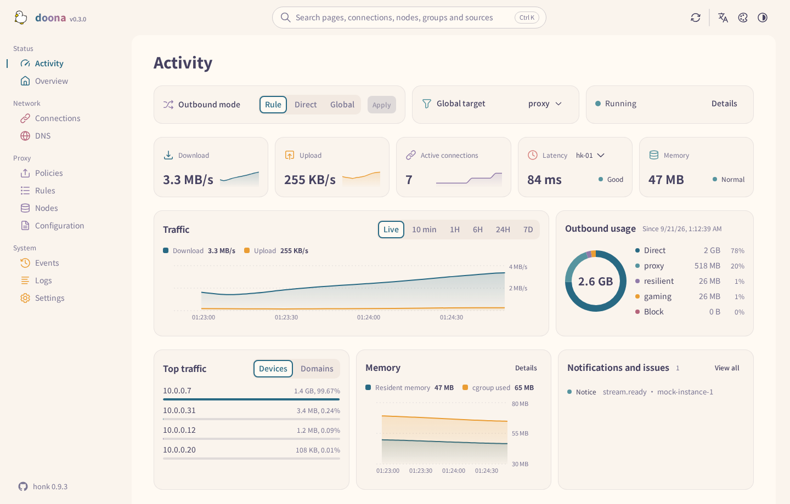
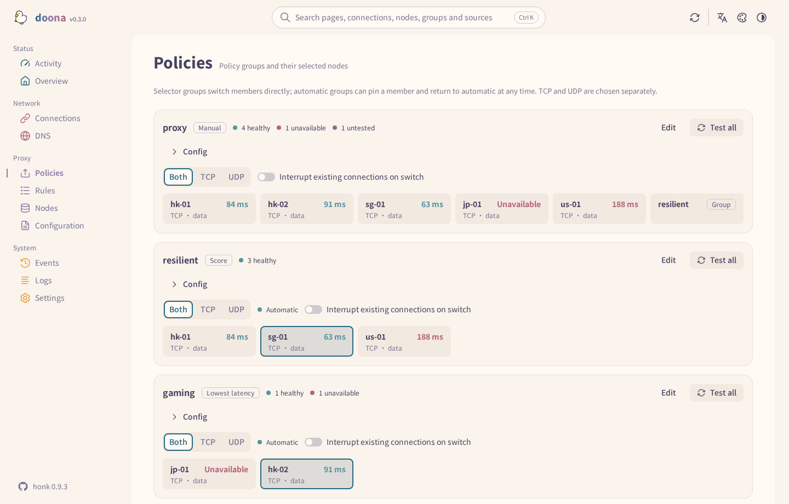
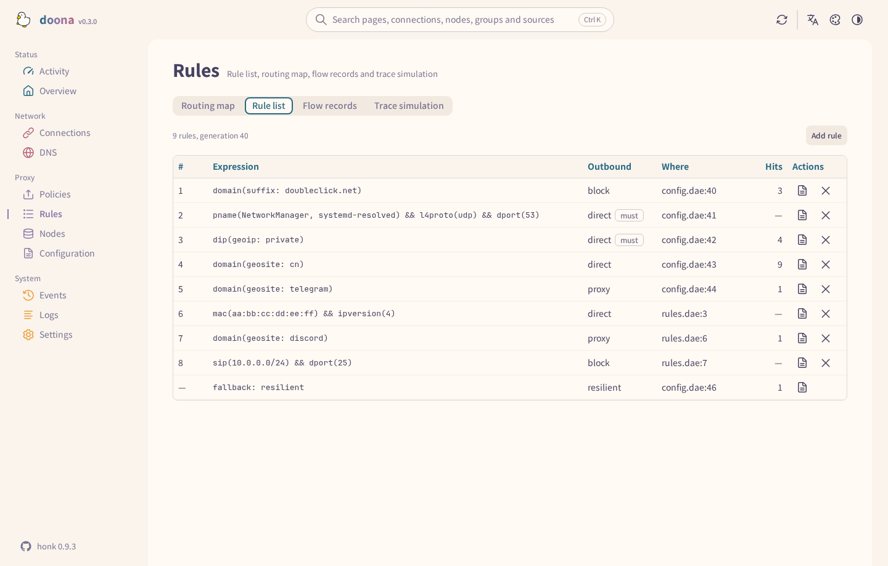
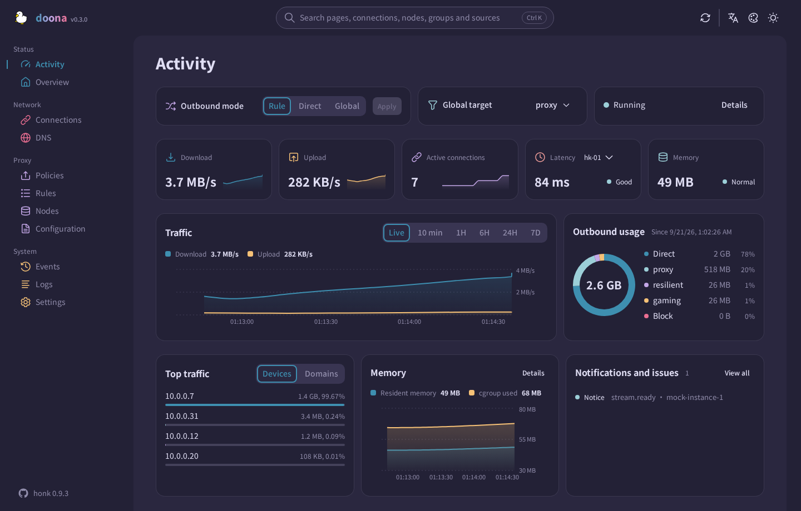

<div align="center">

<picture>
  <source media="(prefers-color-scheme: dark)" srcset="docs/logo-dark.svg">
  
</picture>

# doona

**Web UI for the [daeuniverse](https://github.com/daeuniverse) engines: nodes, groups, rules and the configuration, from a browser.**

English · [简体中文](README.zh-CN.md) · [繁體中文](README.zh-TW.md)

[Requirements](#requirements) • [Install](#install) • [First run](#first-run) • [Pages](#pages) • [Data and settings](#data-and-settings) • [Development](#development) • [Support](#support)

</div>

doona is a set of static files that the engine serves itself, or any web server does. It talks to the native API the daeuniverse engines share: honk today, dae once it implements the same contract. It shows what the engine is doing right now (connections, retained flows, DNS, events, logs, traffic and memory), imports subscriptions and share links, groups nodes and tests their latency, writes routing rules from a form, and edits the configuration files with validation before every save. It speaks Traditional Chinese, Simplified Chinese and English, and ships eleven palettes in light and dark.



<details>
<summary><strong>Every palette</strong></summary>

Rosé Pine and Catppuccin include multiple dark flavours. Use the palette picker in the top bar.


</details>

## Status

doona targets the native API implemented by honk's `feat/native-api` branch; that API is not released yet. The contract it is built against is `daeuniverse/api-standardize` at commit `01a6575` (every doona contract change merged), recorded in [SOURCE.md](contract/api-standardize/SOURCE.md). Backends that omit newer resource keys are accepted: doona fills those keys as unavailable. Every page remains in navigation; a page is marked unavailable only when all of its listed resources are unavailable. With no backend configured, a built-in mock supplies demo data; every screenshot here shows the mock.

## Requirements

| Component | Requirement                                                                                                                                         |
| --------- | --------------------------------------------------------------------------------------------------------------------------------------------------- |
| Backend   | An engine implementing the pinned native API contract above, with its API listener enabled (see [Install](#install))                                |
| Browser   | Chrome or Edge 120, Firefox 120, Safari 17 or later. These are the CSS build targets; the JavaScript target is ES2022. Automated tests use Chromium |
| Build     | Node 22 or later and pnpm 11.15.1; GNU tar, gzip and sha256sum for the archives                                                                     |

## Install

Release archives (`doona-<version>.tar.gz`, the optional `doona-fonts-<version>.tar.gz` with Noto Sans TC and SC, and `SHA256SUMS`) are attached to tags on the [releases page](https://github.com/Zakkaus/doona/releases); until the first tag, build them yourself as described under [Development](#development). Set `VERSION` to the downloaded release asset suffix, including the leading `v` for tagged releases. Then verify and extract the files into the directory the engine or web server will serve:

```sh
VERSION=v0.3.0.beta.1  # replace with the downloaded release tag
sha256sum --ignore-missing -c SHA256SUMS
sudo mkdir -p /usr/share/doona
sudo tar -xzf "doona-${VERSION}.tar.gz" -C /usr/share/doona
if [ -f "doona-fonts-${VERSION}.tar.gz" ]; then
    sudo tar -xzf "doona-fonts-${VERSION}.tar.gz" -C /usr/share/doona
fi
```

Without the font archive, the browser uses its own fonts.

<details>
<summary><strong>Served by honk</strong></summary>

honk's native API is opt-in. Point `ui` at the extracted files and honk serves them at `/ui/`, same-origin with the API, so no CORS entry is needed:

```dae
experimental {
    native_api {
        enabled: true
        listen: '127.0.0.1:9527'
        secret: 'operator-supplied-random-token'
        ui: '/usr/share/doona'
    }
}
```

Keep this block in its own include (`include { api.dae }`): a main file that carries `native_api.secret` is served without its text and stays read-only, so the configuration page could not edit it.

</details>

<details>
<summary><strong>Any static server or reverse proxy</strong></summary>

Serve the extracted files at the web root or under a prefix such as `/ui/`; the pages use hash routes (`/ui/#/activity`), so no rewrite rules are needed. If the UI and engine have different origins, configure the engine to allow the UI's origin. Follow the engine's documentation for its native API listener, CORS and authentication settings.

A reverse proxy in front of both keeps them same-origin: forward `/api/` to the engine's listener and serve the files under `/ui/`.

</details>

<details>
<summary><strong>Distribution packages</strong></summary>

None published yet. Each release carries `deb`, `rpm`, `ipk` and Arch packages built by [nfpm](install/nfpm) from `make install`, all architecture-independent, with `doona-fonts` as a separate optional package. Recipes for the package repositories live in [install/](install/): an OpenWrt feed Makefile, an Alpine `APKBUILD`, a nixpkgs-style expression, and `doona-bin` for the AUR in its own repository. Each release also attaches `doona-<tag>-deps.tar.xz`, the installed `node_modules`, for builds that must run offline; it carries the native build helpers for every Linux architecture they ship (x86, x86_64, armv7, aarch64, riscv64, loong64, ppc64le, s390x, mips64el; glibc and musl), and the build falls back to esbuild's CSS minifier where lightningcss has no binary. `make install DESTDIR=… PREFIX=/usr` and `make install-fonts` are the entry points for any other packaging.

</details>

## First run

Open `/ui/` on the engine host. On a first visit doona asks the origin it was served from for `/api`; when the engine answers it becomes the saved backend and a token prompt follows. Served from elsewhere, or to reach another engine, open Settings and enter the server root (`http://router:9527`, without `/api/v1`) and the token; Test Connection checks discovery before saving, and saving reloads the page. A pairing link fills the form for you: `/ui/#/settings?api=http://router:9527&token=…`, and the token leaves the address bar on load.

The activity page then shows the running engine. The usual route through the rest:

1. **Nodes**: add a subscription (a name and its URL) or paste share links; nodes appear with their protocol, latency and groups. Set how often a subscription refreshes, test a node, or add it to a group from its row.
2. **Policies**: each group is a card with its members' latency. Pick a member of a selector group, pin one in an automatic group and release it again, test them all, or edit the group's policy and filters.
3. **Rules**: the routing dictionary in evaluation order with the flows each rule decided. Add a rule from a kind and its values (a domain suffix, a geosite category, a port, a process name) or as an expression, before any rule or at the end.
4. **Configuration**: the accepted sources with their diagnostics. Edit a file in place, validate, save and reload; a quick setup covers the main file's common settings.

Every write goes through the engine: the text is validated in full, saved with the hash it was read at (a file changed on disk answers 412 instead of being overwritten), then reloaded. Secrets in a source are redacted on the way out and never written back.

## Pages



| Page          | Shows                                                                                                              | Needs                               |
| ------------- | ------------------------------------------------------------------------------------------------------------------ | ----------------------------------- |
| Activity      | Outbound mode, traffic and memory, active connections, node latency, outbound usage, top clients and notifications | —                                   |
| Overview      | Engine and eBPF state, traffic counters, backend capabilities, and the status as JSON                              | `runtime`                           |
| Connections   | Live connections with source, destination, rule, chain and traffic; close one or all; filters from the URL         | `connections`                       |
| DNS           | Queries with their answers, the cache, and the log; a flush                                                        | `dns_query`, `dns_log`, `dns_cache` |
| Policies      | Groups, their members and health; selection, pinning, probing and editing                                          | `groups`                            |
| Rules         | The rule list with hits, the distribution of retained flows, the flow log and a routing trace for a chosen target  | `rules`, `flows`, `routing_trace`   |
| Nodes         | Subscriptions and their refresh interval, inline nodes, add and remove, probe and join a group                     | `nodes`, `providers`                |
| Configuration | Sources with diagnostics, an editor with validation, quick setup and export                                        | `config`                            |
| Events        | The backend event stream                                                                                           | `events`                            |
| Logs          | The log stream with level and module filters, pause and export                                                     | `logs`                              |
| Settings      | Backends, runtime settings and backend actions, language, appearance and palette                                   | —                                   |

Every page remains in navigation. A page is marked unavailable only when every resource listed for it in [registry.ts](src/shell/registry.ts) is unavailable; opening it shows an unavailable notice. `Ctrl K` searches pages, connections, nodes, groups, rules and sources from anywhere.



## Data and settings

doona has no server-side store for its own UI settings. Configuration and runtime changes are written through the engine; doona's UI settings live in the browser's `localStorage` for the site's origin:

| Setting       | Key              | Values                                                                                                                                                                                                                                         |
| ------------- | ---------------- | ---------------------------------------------------------------------------------------------------------------------------------------------------------------------------------------------------------------------------------------------- |
| Backends      | `doona-profiles` | JSON list of `{id, name, api, token}`; `api` is a server root or proxy prefix, empty or `mock` for demo data; API requests send the token in the `Authorization` header. Pairing links may carry it in the URL fragment and remove it on load. |
| Active one    | `doona-profile`  | `id` of the selected backend                                                                                                                                                                                                                   |
| Language      | `doona-lang`     | `zh-TW` (default), `zh-CN`, `en`                                                                                                                                                                                                               |
| Colour scheme | `doona-scheme`   | `system` (default), `light`, `dark`                                                                                                                                                                                                            |
| Palette       | `doona-palette`  | `rose-pine/moon` (default); the other ids are the `PaletteId` union in [settings.ts](src/features/settings/settings.ts)                                                                                                                        |
| Wordmark      | `doona-wordmark` | `gradient` (default), `plain`                                                                                                                                                                                                                  |

The saved theme and language are applied before the first paint, so a reload does not flash the default look.

Over HTTPS or on localhost a service worker precaches the application shell and caches fonts and icons, so the pages open offline and the site can be installed as an app. API responses are never cached. See [SECURITY.md](SECURITY.md) for reporting a vulnerability.



## Development

```sh
pnpm install --frozen-lockfile
pnpm build                       # writes dist/
pnpm check                       # types, lint, translations, formatting, unit tests, generated API types
pnpm e2e:install --with-deps     # once, for the browser tests
pnpm e2e                         # browser tests against the mock, at the root and under /ui/
pnpm package                     # release/doona-<version>.tar.gz, doona-fonts-<version>.tar.gz, SHA256SUMS
```

`pnpm dev` serves the mock on Vite's dev server. Archive versions come from `package.json` locally and from the Git description on tags; timestamps use `SOURCE_DATE_EPOCH` or the HEAD commit time. `node tools/screenshots.mjs <url> docs/screenshots` refreshes the images above from a running build (the palette sheet needs `cwebp`). See [CONTRIBUTING.md](CONTRIBUTING.md) and [CHANGELOG.md](CHANGELOG.md).

| Path            | Purpose                                                                    |
| --------------- | -------------------------------------------------------------------------- |
| `src/features/` | Pages, their hooks and messages, one folder each                           |
| `src/shell/`    | Application shell, navigation and search                                   |
| `src/ui/`       | Shared components, theme and icons                                         |
| `src/api/`      | Client, backend profiles, resource store, mock backend and generated types |
| `src/i18n/`     | Translations and locale helpers                                            |
| `contract/`     | The vendored OpenAPI contract and its pin                                  |
| `public/`       | Static assets, fonts and the service worker                                |
| `e2e/`          | Browser tests                                                              |
| `tools/`        | Build, packaging, conformance and screenshot tools                         |
| `install/`      | nfpm configs, OpenWrt, Alpine and Nix recipes                              |

### Contract

[SOURCE.md](contract/api-standardize/SOURCE.md) records the pin of [openapi.yaml](contract/api-standardize/openapi.yaml). After moving the pin, run `pnpm gen:api` to regenerate [src/api/types.ts](src/api/types.ts). `node tools/conformance.mjs http://router:9527 --token …` checks a live backend's discovery, capabilities and read-only responses against the contract without sending a mutation.

## Support

Report bugs and ask questions in the [issues](https://github.com/Zakkaus/doona/issues). Report backend issues to the connected engine's project: [honk](https://github.com/daeuniverse/honk) or [dae](https://github.com/daeuniverse/dae).

## License and credits

[GPL-3.0-only](LICENSE). Noto Sans TC and SC are under the [Open Font License](public/fonts/OFL.txt); [NOTICE](NOTICE) credits the Adobe Spectrum icons (Apache-2.0). The duck is the maintainer's own artwork.
