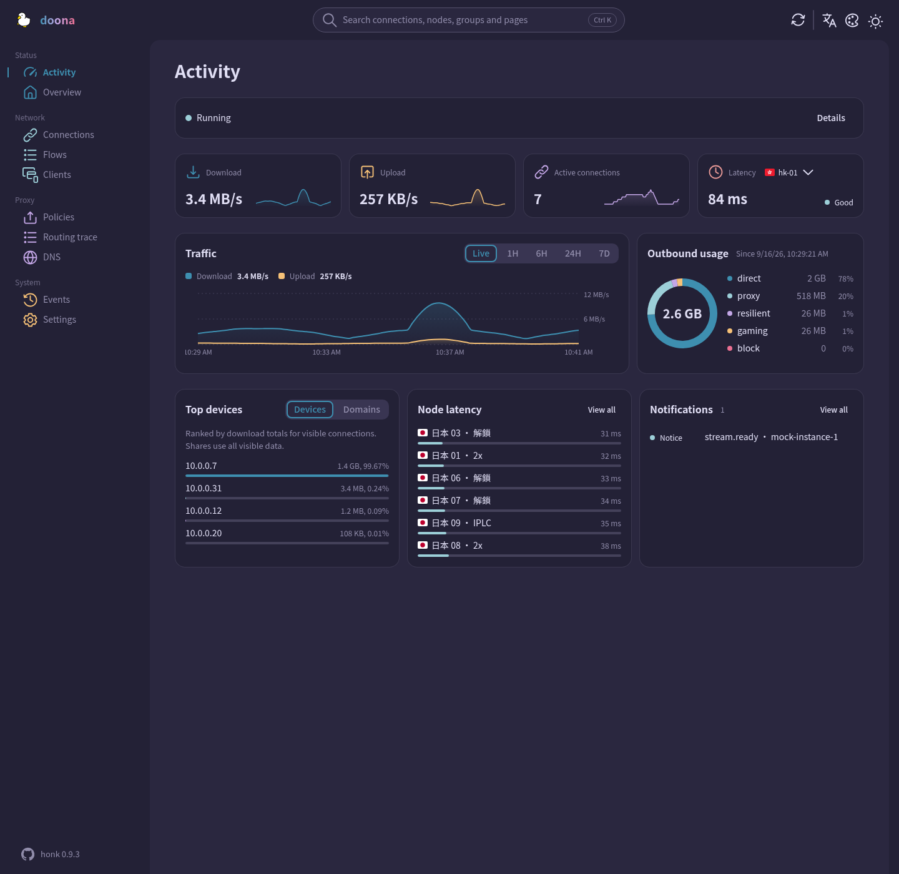

<div align="center">

<picture>
  <source media="(prefers-color-scheme: dark)" srcset="docs/logo-dark.svg">
  
</picture>

# doona

**A web interface for honk**, `doona`.

English · [简体中文](README.zh-CN.md) · [繁體中文](README.zh-TW.md)

[Requirements](#requirements) • [Install / Deploy](#install--deploy) • [Settings](#settings) • [Pages](#pages) • [Development](#development) • [Contract](#contract)

</div>


## Status

doona is a contract and demo preview until honk ships `/api/v1`, not a claim of compatibility with a released backend. It targets `daeuniverse/api-standardize`, branch `ui-findings`, commit `8bd9871`, pinned in [SOURCE.md](contract/api-standardize/SOURCE.md). The mock backend is the default; the screenshots show mock data.

## Requirements

| Component      | Requirement                                                                           |
| -------------- | ------------------------------------------------------------------------------------- |
| Chrome / Edge  | 120 or later                                                                          |
| Firefox        | 120 or later                                                                          |
| Safari         | 17 or later                                                                           |
| Build only     | Node 22 or later, pnpm 11.15.1                                                        |
| Runtime        | Static hosting and a browser; no Node runtime or server-side application dependencies |
| Packaging only | GNU tar, gzip, sha256sum                                                              |

Browser versions are build targets from [vite.config.ts](vite.config.ts), not a cross-browser test matrix. Automated browser tests use Chromium.

## Install / Deploy

Build from source using the [development commands](#development), or use archives from a published [release](https://github.com/Zakkaus/doona/releases). Tags matching `v*` create draft releases; publication is manual.

In the download directory, set `VERSION` to the archive's version and `WEBROOT` to an existing deployment directory. Keep both archives beside `SHA256SUMS`, then verify before extracting:

```sh
sha256sum -c SHA256SUMS
tar -xzf "doona-${VERSION}.tar.gz" -C "$WEBROOT"
```

To add the optional Noto Sans TC and SC fonts, extract into the same directory:

```sh
tar -xzf "doona-fonts-${VERSION}.tar.gz" -C "$WEBROOT"
```

| Deployment            | Destination and serving                                                                                                                                           |
| --------------------- | ----------------------------------------------------------------------------------------------------------------------------------------------------------------- |
| Embedded in honk      | When honk provides UI hosting, serve the extracted files at `/ui/` and open `/ui/`. This does not establish backend compatibility                                 |
| Static server         | Serve the extracted files, or the contents of `dist/`, at the web root or a subdirectory such as `/ui/`                                                           |
| Distribution packages | Package the same static files for Nix, Debian, AUR, Gentoo or OpenWrt, with `doona-fonts` optional. These are packaging options, not a list of available packages |

Hash routes such as `/ui/#/activity` need no server-side route rewriting. Without the font archive, font requests return 404 and the browser uses local fallback fonts.

## Settings

With no saved backend, opening the root page shows Settings; direct page links remain usable. Enter an HTTP(S) server root or reverse-proxy prefix, without `/api/v1`, credentials, a query or a fragment. An empty URL or `mock` selects the built-in demo.

Values live in this browser's `localStorage`, scoped to the site's origin:

| Field         | Storage key       | Values                                                      |
| ------------- | ----------------- | ----------------------------------------------------------- |
| Server URL    | `doona-api`       | Server root or proxy prefix; empty or `mock` for demo data  |
| Token         | `doona-api-token` | Bearer token; sent in the Authorization header, not the URL |
| Language      | `doona-lang`      | `zh-TW` (default), `zh-CN`, `en`                            |
| Colour scheme | `doona-scheme`    | `system` (default), `light`, `dark`                         |
| Palette       | `doona-palette`   | Default: `rose-pine/moon`                                   |
| Wordmark      | `doona-wordmark`  | `gradient` (default), `plain`                               |

Test Connection checks native API discovery at `/api`; saving backend settings reloads the page. The token persists in browser storage. See [SECURITY.md](SECURITY.md) for security reporting.

## Pages

The resource column lists navigation requirements from [registry.ts](src/shell/registry.ts), not every request a page makes. No gate does not mean no backend data; DNS remains available if either listed resource is available.

| Page          | Shows                                                                    | Native resource gate       |
| ------------- | ------------------------------------------------------------------------ | -------------------------- |
| Activity      | Traffic, outbound usage, client rankings, node latency and recent events | None                       |
| Overview      | Runtime status                                                           | `runtime`                  |
| Connections   | Active connections and their details                                     | `connections`              |
| Flows         | Retained flows and observation coverage                                  | `flows`                    |
| Clients       | Clients grouped by source IP                                             | None                       |
| Policies      | Groups and nodes                                                         | `groups`                   |
| Routing trace | Routing diagnostics                                                      | `routing_trace`            |
| DNS           | Queries and cache entries                                                | `dns_query` or `dns_cache` |
| Events        | Backend event stream                                                     | `events`                   |
| Settings      | Backend and appearance settings                                          | None                       |

## Languages and appearance

The interface has Traditional Chinese, Simplified Chinese and English. Choose light, dark or system appearance in Settings. Palettes: Rosé Pine, Rosé Pine Moon, Catppuccin Frappé, Catppuccin Macchiato, Catppuccin Mocha, Nord, Ant Design, Arco Design, Semi Design and Glass.



## Offline and PWA

HTTPS or localhost enables service workers and PWA installation in supporting browsers. The service worker precaches `index.html` and built assets, then caches successful same-origin asset, font and icon requests within its scope. Offline navigation uses the cached application shell. API responses are never cached; offline access does not provide live backend data.

## Development

From the repository root, with the build and packaging tools listed above:

```sh
pnpm install --frozen-lockfile
pnpm build
pnpm check
pnpm e2e:install --with-deps
pnpm e2e
pnpm package
```

The build writes `dist/`. `pnpm check` runs type, lint, translation, formatting, unit and generated-API checks. Browser tests cover root and `/ui/` deployments. Packaging writes `release/doona-<version>.tar.gz`, `release/doona-fonts-<version>.tar.gz` and `release/SHA256SUMS`.

Run `pnpm test:coverage` from the repository root to print coverage totals and write `coverage/lcov.info`.

Local archive versions come from `package.json`; release builds use the Git description. Archive timestamps use `SOURCE_DATE_EPOCH` or the HEAD commit time. Set `SOURCE_DATE_EPOCH` when packaging without Git metadata. See [CONTRIBUTING.md](CONTRIBUTING.md) and [CHANGELOG.md](CHANGELOG.md).

| Path            | Purpose                                       |
| --------------- | --------------------------------------------- |
| `src/features/` | Product pages, hooks and messages             |
| `src/shell/`    | Application shell and routing                 |
| `src/ui/`       | Shared components and icons                   |
| `src/api/`      | Client, mock backend and generated types      |
| `src/i18n/`     | Translations and locale helpers               |
| `contract/`     | Vendored OpenAPI contract                     |
| `public/`       | Static assets, fonts and service worker       |
| `e2e/`          | Browser tests                                 |
| `tools/`        | Development, verification and packaging tools |
| `reference/`    | Read-only archived UI references              |

## Contract

[contract/api-standardize/SOURCE.md](contract/api-standardize/SOURCE.md) records the pin for [openapi.yaml](contract/api-standardize/openapi.yaml). After updating the contract, run `pnpm gen:api` from the repository root to regenerate [src/api/types.ts](src/api/types.ts).

[tools/conformance.mjs](tools/conformance.mjs) checks discovery, version, capabilities and permitted read-only observations against a server; it does not send mutations or diagnostic DNS queries.

## License and credits

[GPL-3.0-only](LICENSE). Noto Sans TC and SC use the [Open Font License](public/fonts/OFL.txt). [NOTICE](NOTICE) credits Adobe Spectrum icons under Apache-2.0 and flag-icons under MIT. The duck logo is the maintainer's artwork.
