<div align="center">

<picture>
  <source media="(prefers-color-scheme: dark)" srcset="docs/logo-dark.svg">
  
</picture>

# doona

**[daeuniverse](https://github.com/daeuniverse) 引擎的 Web 界面：在浏览器里管理节点、群组、规则与配置。**

[English](README.md) · 简体中文 · [繁體中文](README.zh-TW.md)

[安装](#安装) • [首次使用](#首次使用) • [页面](#页面) • [开发](#开发) • [使用指南](docs/guide.zh-CN.md)

</div>

doona 是 daeuniverse 引擎共用原生 API 的静态 Web 界面：现在是 honk，dae 实现同一份契约后亦可。它由引擎自己或任意 Web 服务器提供，显示引擎当前的状态，并管理节点、群组、路由规则与配置文件。

[使用示例数据体验演示版](https://zakkaus.github.io/doona/)。

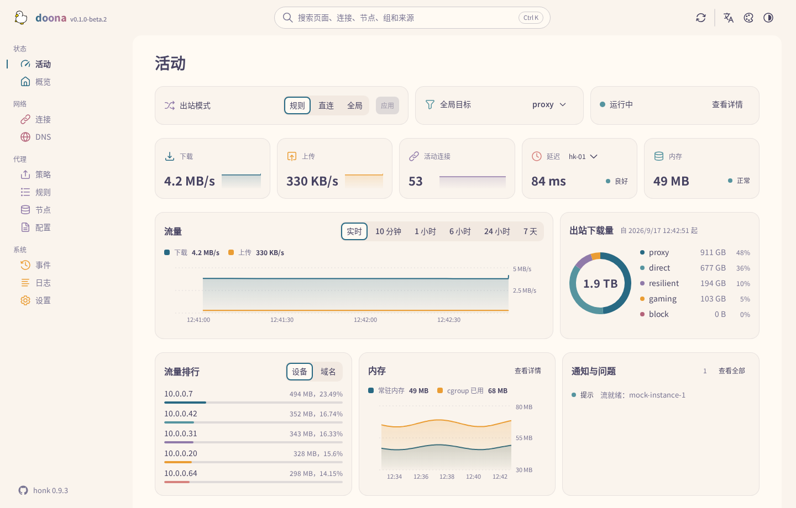

<details>
<summary><strong>全部配色</strong></summary>

十一套配色各有浅色与深色；Rosé Pine 与 Catppuccin 另有多种深色变体。配色在顶栏切换。


</details>

## 配色示例

下图展示活动页的四种配色。可在顶栏切换配色和模式。

| 配色       | 浅色                                                                | 深色                                                               |
| ---------- | ------------------------------------------------------------------- | ------------------------------------------------------------------ |
| Rosé Pine  | 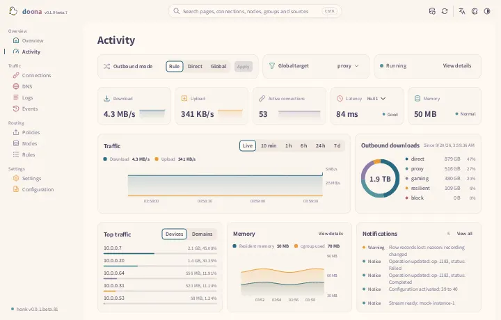   | 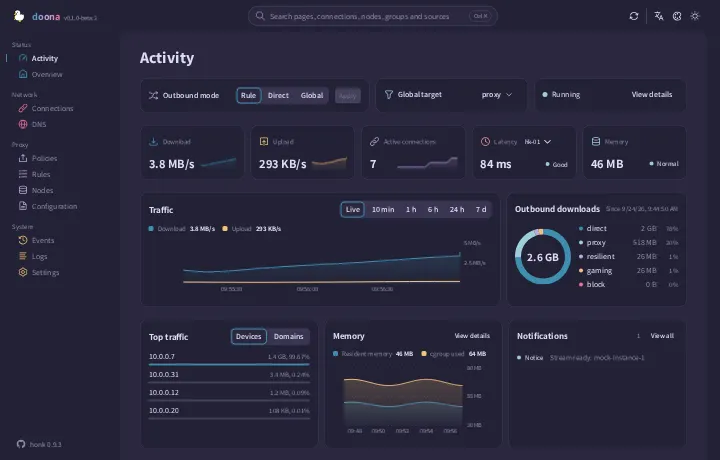   |
| Catppuccin | 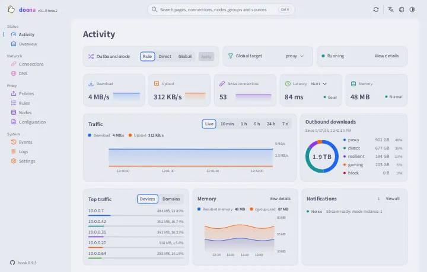 | 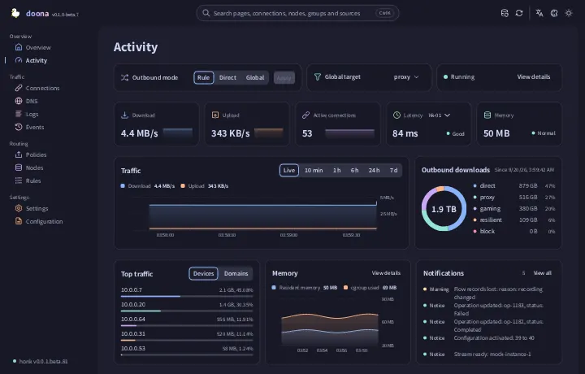 |
| Nord       | 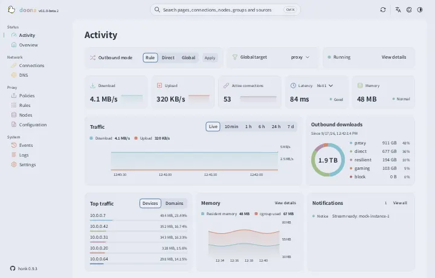             | 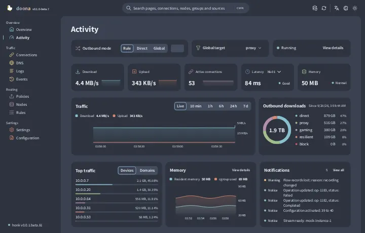             |
| Glass      | 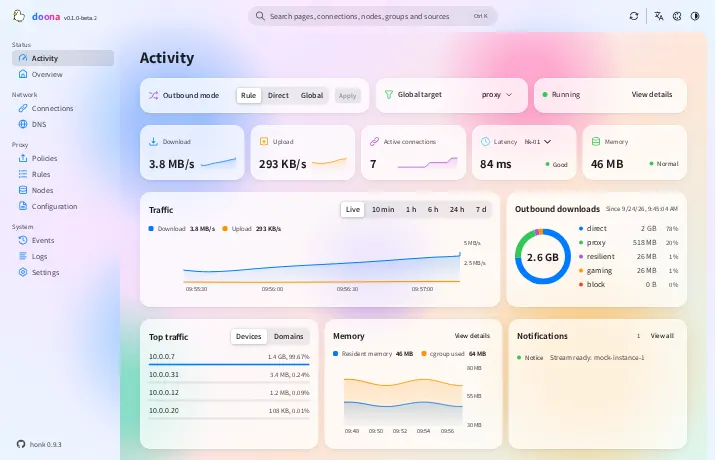           | 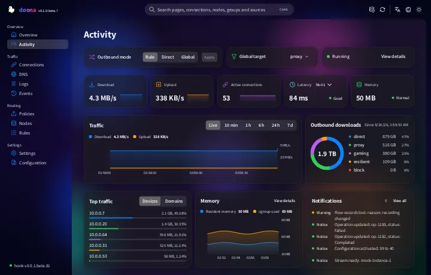           |

## 状态

doona 对接 honk `feat/native-api` 分支实现的原生 API；这套 API 尚未发布。契约的钉点记录在 [SOURCE.md](contract/api-standardize/SOURCE.md)。后端缺少较新资源键时，doona 会把这些键视为不可用。未设置后端时，内置模拟后端提供演示数据；本文截图全部来自模拟数据。

## 安装

发行文件（`doona-<version>.tar.gz`、可选的 `doona-fonts-<version>.tar.gz`（Noto Sans TC 与 SC）、`SHA256SUMS`）附在[发布页](https://github.com/Zakkaus/doona/releases)的标签上；第一个标签发布之前，请按[开发](#开发)一节自行构建。校验文件并解压到引擎或 Web 服务器要提供的目录：

```sh
VERSION=v0.1.0-beta.2  # 替换为下载文件对应的发行标签
sha256sum --ignore-missing -c SHA256SUMS
sudo mkdir -p /usr/share/doona
sudo tar -xzf "doona-${VERSION}.tar.gz" -C /usr/share/doona
if [ -f "doona-fonts-${VERSION}.tar.gz" ]; then
    sudo tar -xzf "doona-fonts-${VERSION}.tar.gz" -C /usr/share/doona
fi
```

### honk 原生 API 要求

**所需 honk 构建：**doona 需要 [Glassyiris/honk 的 `feat/native-api` 分支](https://github.com/Glassyiris/honk/tree/feat/native-api)提供的原生 API；daeuniverse/honk 尚无包含该功能的正式发行版本。`native_api` 和 `password_auth` 配置项在上游发布前可能变化。已发布的 honk 对 `/api` 和 `/ui/` 返回 404。下方配置仅适用于该分支。

honk 的原生 API 需要显式开启。把 `ui` 指向解压后的目录，honk 就在 `/ui/` 提供这些文件，与 API 同源：

```dae
experimental {
    native_api {
        enabled: true
        listen: '127.0.0.1:9527'
        password_auth: true
        ui: '/usr/share/doona'
    }
}
```

这个块请放在独立的 include（`include { api.dae }`），主文件才能在配置页编辑。供脚本和自动化程序使用时，以 `secret: '<random token>'` 代替 `password_auth: true`。运行环境、由其他 Web 服务器或反向代理提供、发行版软件包，见[使用指南](docs/guide.zh-CN.md#安装)。

## 首次使用

在引擎主机上打开 `/ui/`。首次访问时，doona 向提供页面的来源请求 `/api`，并将引擎保存为后端。密码模式下，锁定的登录对话框提供首次设置入口，用于创建管理员；请从本机或私有网络客户端完成设置，然后使用用户名和密码登录。若页面来自别处，或要连接另一台引擎，打开设置页填写服务器根地址。

token 模式下，doona 会提示输入 token。可在设置页填写服务器根地址和 token，或使用配对链接（`/ui/#/settings?api=http://router:9527&token=…`）代填表单；加载后，doona 会从地址栏移除 token。

接着活动页显示运行中的引擎。在节点页新增订阅或粘贴分享链接，在策略页选择或固定群组成员，在规则页加规则，在配置页编辑、校验并重载来源。每次写入都带着读取时的哈希经过引擎；重载失败时仍沿用先前的世代。各页面的用法见[使用指南](docs/guide.zh-CN.md#首次使用)。

## 页面

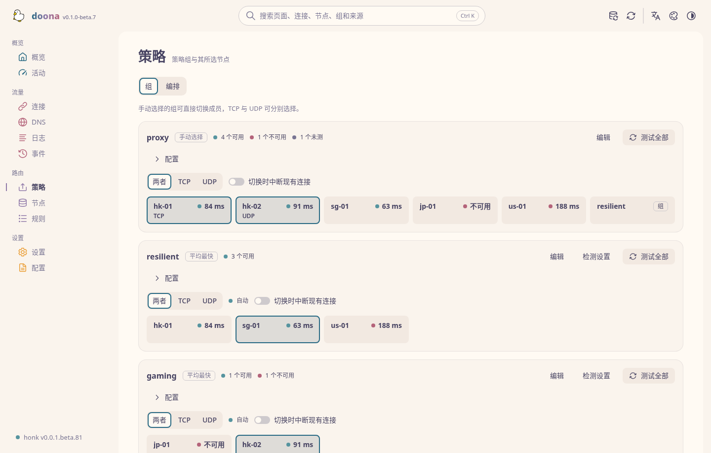

| 页面       | 内容                                                                                   |
| ---------- | -------------------------------------------------------------------------------------- |
| 活动       | 出站模式、流量与内存、活动连接、节点延迟、出站用量、流量最高的客户端、通知             |
| 概览       | 引擎与 eBPF 状态、流量计数、后端能力、状态 JSON 导出                                   |
| 连接       | 实时连接的来源、目的、规则、链路与流量；关闭单条或全部                                 |
| DNS        | 查询与解析结果、缓存、日志；清空缓存                                                   |
| 策略       | 群组、成员与健康；选择、手动固定、恢复自动选择、测试、编辑                             |
| 规则       | 从规则或设备经出站到所选节点的分流树、规则列表与命中数、流程记录、对指定目标的追踪模拟 |
| 节点       | 订阅与更新间隔、配置内节点、新增与移除、测试、加入群组                                 |
| 配置       | 来源与诊断、带校验的编辑器、快速设置、导出                                             |
| 事件、日志 | 后端事件流；日志流，可筛选、暂停、导出                                                 |
| 设置       | 后端、运行时设置与后端操作、语言、外观与配色                                           |

只有页面需要的资源全部不可用时，页面才会标为不可用。任何页面按 `Ctrl K` 可搜索页面、连接、节点、群组、规则与来源。各页面需要的资源与 doona 自身设置的存放位置，见[使用指南](docs/guide.zh-CN.md#页面)。

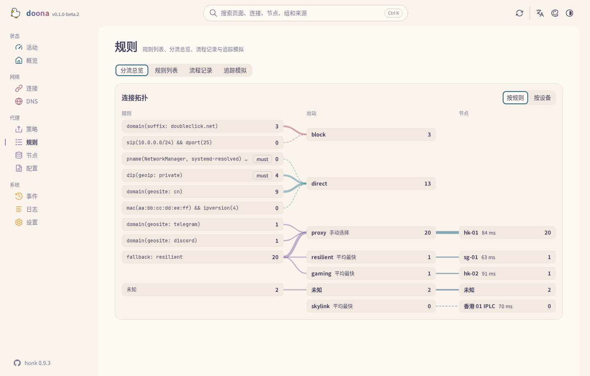

## 开发

```sh
pnpm install --frozen-lockfile
pnpm build                       # 输出 dist/
pnpm check                       # 类型、lint、翻译、格式、单元测试、生成的 API 类型
pnpm check:size                  # dist/ 构建的 gzip 大小限制
pnpm e2e:install --with-deps     # 浏览器测试只需安装一次
pnpm e2e                         # 重新构建，再对模拟后端运行浏览器测试，覆盖根目录与 /ui/
pnpm package                     # release/doona-<version>.tar.gz、doona-fonts-<version>.tar.gz、SHA256SUMS
```

`pnpm dev` 以 Vite 开发服务器提供模拟后端。对实际后端的测试、性能与截图工具、源码布局与契约钉点，见[使用指南](docs/guide.zh-CN.md#开发)；提交 pull request 前先读 [CONTRIBUTING.md](CONTRIBUTING.md)。

## 支持

问题与提问请到 [issues](https://github.com/Zakkaus/doona/issues)。后端问题请提交到所连接引擎的项目：[honk](https://github.com/daeuniverse/honk) 或 [dae](https://github.com/daeuniverse/dae)。

## 许可与致谢

[GPL-3.0-only](LICENSE)。Noto Sans TC 与 SC 采用 [Open Font License](public/fonts/OFL.txt)；[NOTICE](NOTICE) 注明 Adobe Spectrum 图标（Apache-2.0）。鸭子是维护者自己画的。
