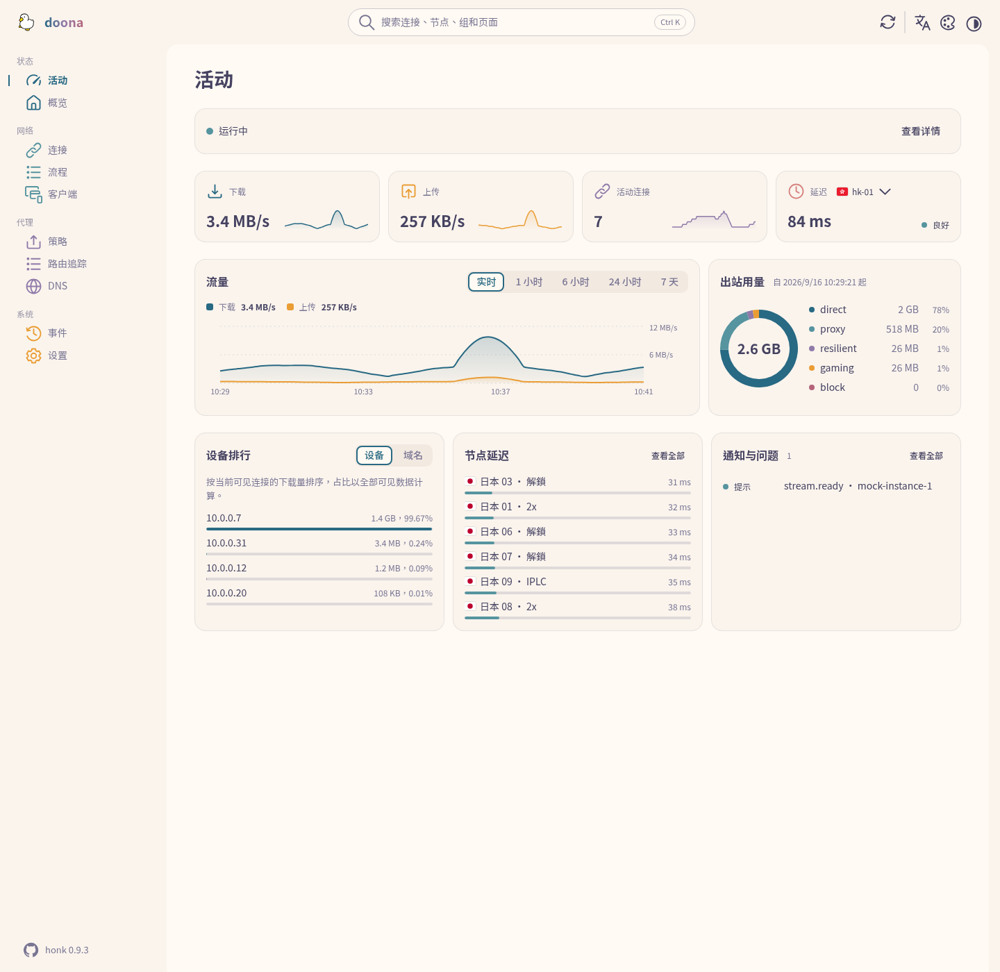
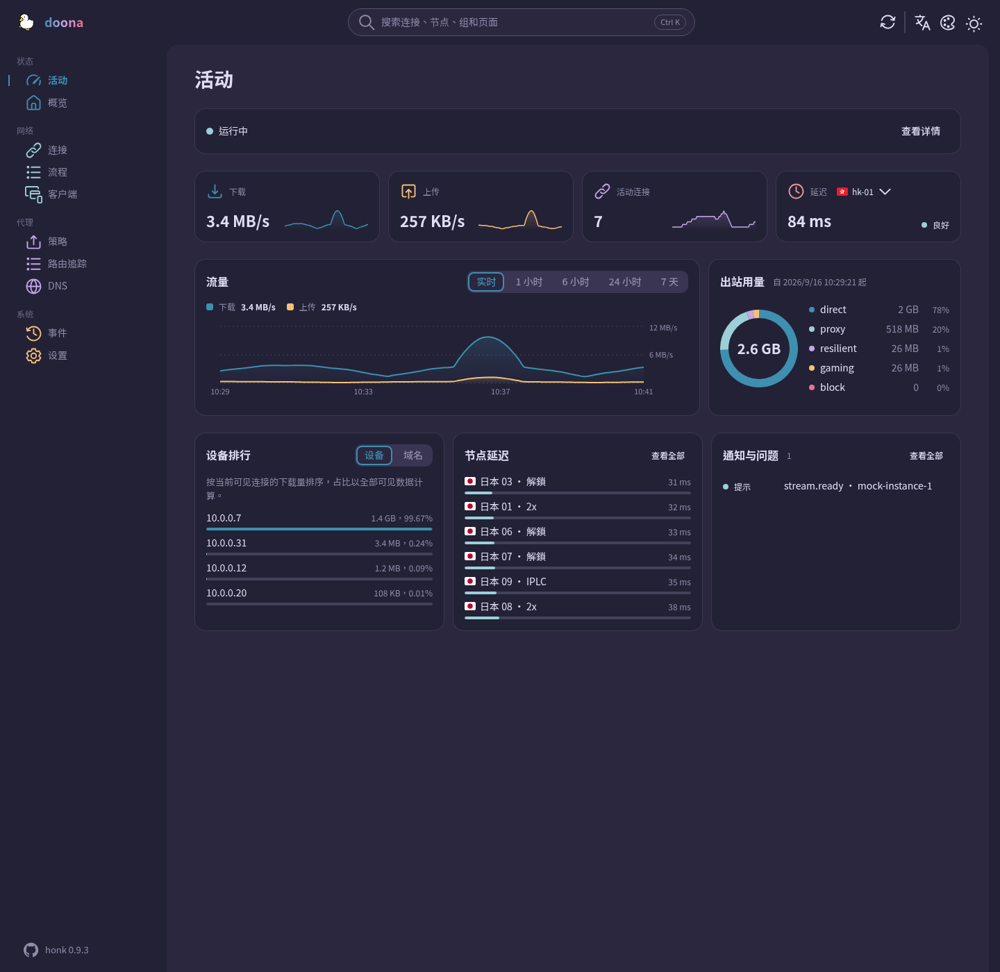

<div align="center">

<picture>
  <source media="(prefers-color-scheme: dark)" srcset="docs/logo-dark.svg">
  
</picture>

# doona

**honk 的 Web 界面**，`doona`。

[English](README.md) · 简体中文 · [繁體中文](README.zh-TW.md)

[运行环境](#运行环境) • [安装与部署](#安装与部署) • [设置](#设置) • [页面](#页面) • [开发](#开发) • [契约](#契约)

</div>



## 状态

在 honk 发布 `/api/v1` 之前，doona 仅供契约验证与演示，不承诺与已发布的后端兼容。
目标契约为 `daeuniverse/api-standardize` 的 fork 分支 `doona-pin`，固定提交为 `868768d`（合并 PR #4、#5、#6、#7），记录见 [SOURCE.md](contract/api-standardize/SOURCE.md)。
默认使用模拟后端；截图展示的也是模拟数据。

## 运行环境

| 组件          | 要求                                               |
| ------------- | -------------------------------------------------- |
| Chrome / Edge | 120 及以后                                         |
| Firefox       | 120 及以后                                         |
| Safari        | 17 及以后                                          |
| 仅构建时需要  | Node 22 及以后、pnpm 11.15.1                       |
| 运行时        | 静态托管与浏览器；无需 Node 运行时或服务端应用依赖 |
| 仅打包时需要  | GNU tar、gzip、sha256sum                           |

浏览器版本取自 [vite.config.ts](vite.config.ts) 的构建目标，不代表跨浏览器测试范围。
自动化浏览器测试使用 Chromium。

## 安装与部署

按[开发命令](#开发)从源码构建，或使用已公开[发行版](https://github.com/Zakkaus/doona/releases)的归档文件。
匹配 `v*` 的标签会创建发行草稿，需手动发布。

在下载目录中，将 `VERSION` 设为归档文件的版本，将 `WEBROOT` 设为已有的部署目录。
将两个归档文件与 `SHA256SUMS` 放在同一目录，校验后再解压：

```sh
sha256sum -c SHA256SUMS
tar -xzf "doona-${VERSION}.tar.gz" -C "$WEBROOT"
```

如需可选的 Noto Sans TC 与 SC 字体，将字体归档解压至同一目录：

```sh
tar -xzf "doona-fonts-${VERSION}.tar.gz" -C "$WEBROOT"
```

| 部署方式     | 目标位置与托管方式                                                                                                            |
| ------------ | ----------------------------------------------------------------------------------------------------------------------------- |
| 嵌入 honk    | 在 honk 提供 UI 托管时，将解压后的文件作为 `/ui/` 的内容提供服务，再打开 `/ui/`。这不代表后端兼容性已获确认                   |
| 静态服务器   | 将解压后的文件或 `dist/` 的内容部署至网站根目录或 `/ui/` 等子目录                                                             |
| 发行版软件包 | 将相同的静态文件打包为 Nix、Debian、AUR、Gentoo 或 OpenWrt 软件包，`doona-fonts` 为可选包。这些是打包方案，并非已有软件包清单 |

`/ui/#/activity` 等哈希路由无需服务端路由重写。
未安装字体归档时，字体请求会返回 404，浏览器改用本地后备字体。

## 设置

未保存后端时，打开根页面会显示设置页；直接访问页面链接不受影响。
输入 HTTP(S) 服务器根地址或反向代理前缀，不要附加 `/api/v1`，也不要包含凭据、查询参数或片段。
地址留空或填入 `mock` 即使用内置演示数据。

设置保存在当前浏览器的 `localStorage` 中，以网站的源为范围：

| 字段       | 存储键            | 取值                                                   |
| ---------- | ----------------- | ------------------------------------------------------ |
| 服务器地址 | `doona-api`       | 服务器根地址或代理前缀；留空或 `mock` 使用演示数据     |
| 令牌       | `doona-api-token` | Bearer 令牌，通过 Authorization 请求头发送，不放入 URL |
| 语言       | `doona-lang`      | `zh-TW`（默认）、`zh-CN`、`en`                         |
| 明暗模式   | `doona-scheme`    | `system`（默认）、`light`、`dark`                      |
| 配色       | `doona-palette`   | 默认值：`rose-pine/moon`                               |
| 品牌字样   | `doona-wordmark`  | `gradient`（默认）、`plain`                            |

测试连接会检查原生 API 的 `/api` 发现端点；保存后端设置会重新加载页面。
令牌会持久保存在浏览器存储中。安全问题的报告方式见 [SECURITY.md](SECURITY.md)。

## 页面

资源列列出 [registry.ts](src/shell/registry.ts) 中的导航显示条件，并非页面发出的所有请求。
没有资源限制不代表无需后端数据；DNS 所列资源任一可用时，该页面就会显示。

| 页面     | 显示内容                                       | 所需原生资源               |
| -------- | ---------------------------------------------- | -------------------------- |
| 活动     | 流量、出站用量、客户端排名、节点延迟与近期事件 | 无限制                     |
| 概览     | 运行状态                                       | `runtime`                  |
| 连接     | 活动连接及其详情                               | `connections`              |
| 流程     | 保留的流程与观测覆盖范围                       | `flows`                    |
| 客户端   | 按源 IP 分组的客户端                           | 无限制                     |
| 策略     | 组与节点                                       | `groups`                   |
| 路由追踪 | 路由诊断                                       | `routing_trace`            |
| DNS      | 查询与缓存条目                                 | `dns_query` 或 `dns_cache` |
| 事件     | 后端事件流                                     | `events`                   |
| 设置     | 后端与外观设置                                 | 无限制                     |

## 语言与外观

界面提供繁体中文、简体中文与英文。可在设置页选择浅色、深色或跟随系统。
配色包括 Rosé Pine、Rosé Pine Moon、Catppuccin Frappé、Catppuccin Macchiato 与 Catppuccin Mocha。
另有 Nord、Ant Design、Arco Design、Semi Design 与玻璃。



## 离线与 PWA

在支持的浏览器中，HTTPS 或 localhost 可启用 Service Worker 与 PWA 安装。
Service Worker 预缓存 `index.html` 与构建产物，再缓存作用域内成功的同源静态资源、字体与图标请求。
离线导航使用缓存的应用外壳。API 响应从不缓存；离线访问不提供实时后端数据。

## 开发

安装上述构建与打包工具后，在仓库根目录执行：

```sh
pnpm install --frozen-lockfile
pnpm build
pnpm check
pnpm e2e:install --with-deps
pnpm e2e
pnpm package
```

构建结果写入 `dist/`。`pnpm check` 执行类型、代码规范、翻译、格式、单元测试与 API 生成结果检查。
浏览器测试覆盖根路径与 `/ui/` 部署。
打包结果为 `release/doona-<version>.tar.gz`、`release/doona-fonts-<version>.tar.gz` 与 `release/SHA256SUMS`。

在仓库根目录执行 `pnpm test:coverage`，输出覆盖率汇总并生成 `coverage/lcov.info`。

本地归档版本取自 `package.json`；发行构建使用 Git 版本描述。
归档时间戳取自 `SOURCE_DATE_EPOCH`，未设置时使用 HEAD 提交时间。
没有 Git 元数据时，打包前须设置 `SOURCE_DATE_EPOCH`。
参见 [CONTRIBUTING.md](CONTRIBUTING.md) 与 [CHANGELOG.md](CHANGELOG.md)。

| 路径            | 用途                            |
| --------------- | ------------------------------- |
| `src/features/` | 产品页面、钩子与界面文案        |
| `src/shell/`    | 应用外壳与路由                  |
| `src/ui/`       | 共用组件与图标                  |
| `src/api/`      | 客户端、模拟后端与生成的类型    |
| `src/i18n/`     | 翻译与语言区域辅助函数          |
| `contract/`     | 仓库内固定的 OpenAPI 契约副本   |
| `public/`       | 静态资源、字体与 Service Worker |
| `e2e/`          | 浏览器测试                      |
| `tools/`        | 开发、验证与打包工具            |
| `reference/`    | 只读的历史 UI 参考资料          |

## 契约

[contract/api-standardize/SOURCE.md](contract/api-standardize/SOURCE.md) 记录 [openapi.yaml](contract/api-standardize/openapi.yaml) 的固定版本。
更新契约后，在仓库根目录执行 `pnpm gen:api`，重新生成 [src/api/types.ts](src/api/types.ts)。

[tools/conformance.mjs](tools/conformance.mjs) 对服务器执行发现、版本、能力与获准的只读观测检查，不发送修改操作或诊断 DNS 查询。

## 许可与致谢

采用 [GPL-3.0-only](LICENSE)。Noto Sans TC 与 SC 使用 [Open Font License](public/fonts/OFL.txt)。
[NOTICE](NOTICE) 列出采用 Apache-2.0 的 Adobe Spectrum 图标与采用 MIT 的 flag-icons。
鸭子标志由维护者绘制。
