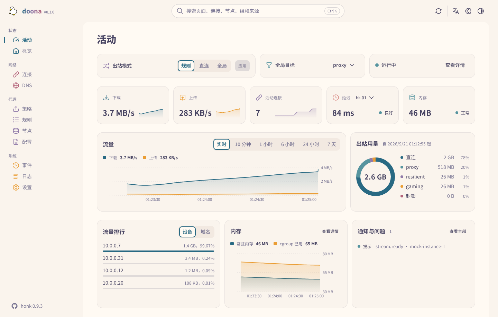
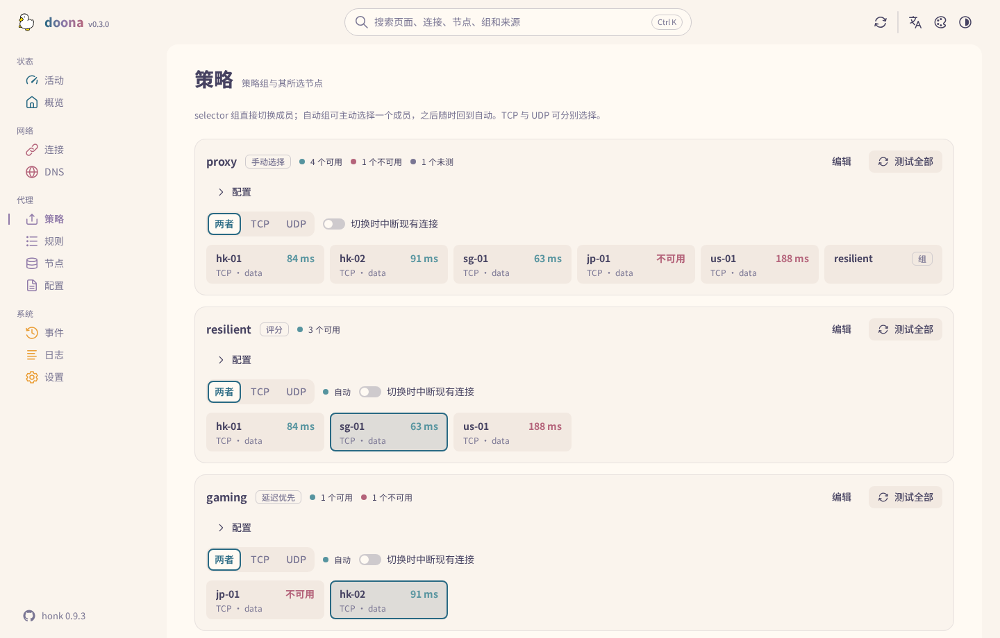
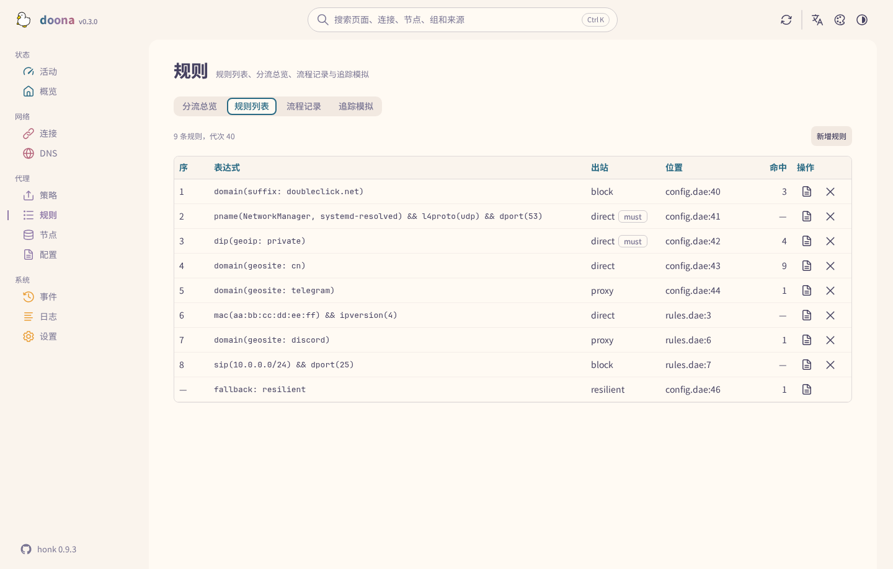
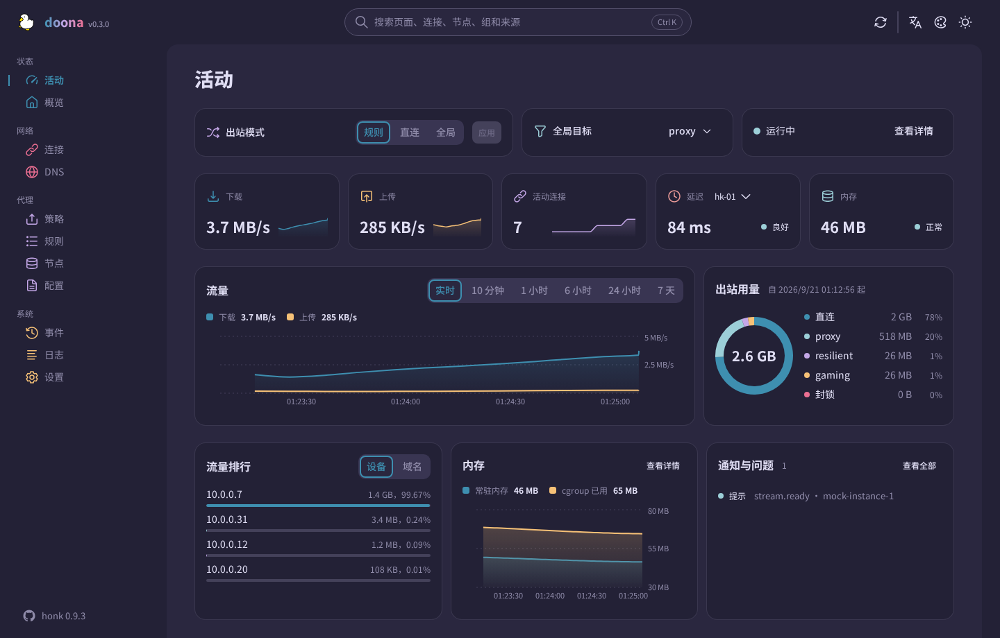

<div align="center">

<picture>
  <source media="(prefers-color-scheme: dark)" srcset="docs/logo-dark.svg">
  
</picture>

# doona

**[honk](https://github.com/daeuniverse/honk) 的 Web 界面：在浏览器里管理节点、群组、规则与配置。**

[English](README.md) · 简体中文 · [繁體中文](README.zh-TW.md)

[运行环境](#运行环境) • [安装](#安装) • [首次使用](#首次使用) • [页面](#页面) • [数据与设置](#数据与设置) • [开发](#开发) • [支持](#支持)

</div>

doona 是一组静态文件，由 honk 自己或任意 Web 服务器提供。它显示 honk 当前的状态：连接、保留的流程、DNS、事件、日志、流量与内存。它也导入订阅与分享链接，把节点编成群组并测延迟，用表单写路由规则，配置文件每次保存前先校验。界面有繁体中文、简体中文与英文，十套配色，各有浅色与深色。



## 状态

doona 对接 honk 的原生 API。这套 API 在 honk 的 `feat/native-api` 分支，尚未发布。契约是 `daeuniverse/api-standardize` 的 fork 分支 `doona-pin`，固定在提交 `ba3e4c3`，记录见 [SOURCE.md](contract/api-standardize/SOURCE.md)。按较旧钉点构建的后端仍可用：后端没有声明的资源视为不可用，对应页面从导航栏消失。未设置后端时，内置模拟后端提供演示数据；本文截图全部来自模拟数据。

## 运行环境

| 组件   | 要求                                                                                     |
| ------ | ---------------------------------------------------------------------------------------- |
| 后端   | 启用 `native_api` 的 honk（见[安装](#安装)）；服务器上不需要其他程序                     |
| 浏览器 | Chrome 或 Edge 120、Firefox 120、Safari 17 及以后。这是构建目标，自动化测试只用 Chromium |
| 构建   | Node 22 及以后、pnpm 11.15.1；打包需要 GNU tar、gzip 与 sha256sum                        |

## 安装

发行文件（`doona-<version>.tar.gz`、可选的 `doona-fonts-<version>.tar.gz`（Noto Sans TC 与 SC）、`SHA256SUMS`）附在[发布页](https://github.com/Zakkaus/doona/releases)的标签上；第一个标签发布之前，请按[开发](#开发)一节自行构建。校验后解压到 honk 或 Web 服务器要提供的目录：

```sh
sha256sum -c SHA256SUMS
sudo mkdir -p /usr/share/doona
sudo tar -xzf "doona-${VERSION}.tar.gz" -C /usr/share/doona
sudo tar -xzf "doona-fonts-${VERSION}.tar.gz" -C /usr/share/doona   # 可选
```

不装字体包时，浏览器改用本机字体。

<details>
<summary><strong>由 honk 提供</strong></summary>

honk 的原生 API 需要显式开启。把 `ui` 指向解压后的目录，honk 就在 `/ui/` 提供这些文件，与 API 同源，不需要 CORS 设置：

```dae
experimental {
    native_api {
        enabled: true
        listen: '127.0.0.1:9527'
        secret: 'operator-supplied-random-token'
        ui: '/usr/share/doona'
    }
}
```

这个区块请放在独立的 include（`include { api.dae }`）：主文件若含 `native_api.secret`，API 不会返回它的内容，也不允许写入，配置页就无法编辑主文件。

</details>

<details>
<summary><strong>任意静态服务器或反向代理</strong></summary>

把解压后的文件放在网站根目录或 `/ui/` 这类前缀下即可；页面用 hash 路由（`/ui/#/activity`），不需要重写规则。UI 与 honk 不同源时，该来源必须列在 honk 的 `allow_origins`；除非监听地址是 loopback 且显式开启匿名访问，否则必须提供 token。

前面放一个反向代理可让两者同源：把 `/api/` 转给 honk 的监听地址，文件放在 `/ui/` 下。

</details>

<details>
<summary><strong>发行版软件包</strong></summary>

目前没有。发行文件就是静态文件，Nix、Debian、AUR、Gentoo 或 OpenWrt 的软件包只需把文件装进目录、把 honk 的 `ui` 指过去；字体包可做成独立的可选软件包。

</details>

## 首次使用

在 honk 主机上打开 `/ui/`。首次访问时，doona 向提供页面的来源请求 `/api`；honk 响应后就成为已保存的后端，接着提示输入 token。若页面来自别处，或要连接另一台 honk，打开设置页填写服务器根地址（`http://router:9527`，不含 `/api/v1`）与 token；「测试连接」在保存前先检查发现端点，保存后重新加载页面。配对链接可以代填表单：`/ui/#/settings?api=http://router:9527&token=…`，加载后 token 会从地址栏移除。

接着活动页显示运行中的引擎。其余页面的常见顺序：

1. **节点**：新增订阅（名称与网址）或粘贴分享链接；节点列出协议、延迟与所属群组。可设置订阅多久更新一次、测试单个节点，或从该行把节点加入群组。
2. **策略**：每个群组一张卡片，列出成员与延迟。selector 群组可直接选成员；自动群组可钉住一个成员、之后再放开；可全部测试，也可编辑群组的策略与筛选。
3. **规则**：按评估顺序列出路由字典，附每条规则决定过的流程数。新增规则可以挑选依据与值（域名后缀、geosite 分类、端口、进程名称），也可以直接写表达式，插在任意一条之前或最后。
4. **配置**：已接受的来源与其诊断。就地编辑文件，校验、保存、重载；快速设置覆盖主文件的常用项目。

每一次写入都经过 honk：全文校验，带着读取时的哈希保存（磁盘上已变动的文件会返回 412，不会被覆盖），再重载。来源里的密钥在返回时已脱敏，也不会被写回。

## 页面



| 页面 | 内容                                                                       | 需要的资源                          |
| ---- | -------------------------------------------------------------------------- | ----------------------------------- |
| 活动 | 出站模式、流量与内存、活动连接、节点延迟、出站用量、流量最高的客户端、通知 | —                                   |
| 概览 | 引擎与 eBPF 状态、流量计数、后端能力、状态 JSON 导出                       | `runtime`                           |
| 连接 | 实时连接的来源、目的、规则、链路与流量；关闭单条或全部；筛选条件可写在网址 | `connections`                       |
| DNS  | 查询与解析结果、缓存、日志；清空缓存                                       | `dns_query`、`dns_log`、`dns_cache` |
| 策略 | 群组、成员与健康；选择、钉住、测试、编辑                                   | `groups`                            |
| 规则 | 规则列表与命中数、保留流程的分布、流程记录、对指定目标的追踪模拟           | `rules`、`flows`、`routing_trace`   |
| 节点 | 订阅与更新间隔、配置内节点、新增与移除、测试、加入群组                     | `nodes`、`providers`                |
| 配置 | 来源与诊断、带校验的编辑器、快速设置、导出                                 | `config`                            |
| 事件 | 后端事件流                                                                 | `events`                            |
| 日志 | 日志流，可按级别与模块筛选、暂停、导出                                     | `logs`                              |
| 设置 | 后端、语言、外观与配色                                                     | —                                   |

后端没有声明所需资源的页面会从导航栏消失，需求定义在 [registry.ts](src/shell/registry.ts)。任何页面按 `Ctrl K` 可搜索页面、连接、节点、群组、规则与来源。



## 数据与设置

doona 不在服务器上保存任何数据。设置存在浏览器该来源的 `localStorage`：

| 设置     | 键               | 值                                                                                                                                       |
| -------- | ---------------- | ---------------------------------------------------------------------------------------------------------------------------------------- |
| 后端     | `doona-profiles` | `{id, name, api, token}` 的 JSON 数组；`api` 是服务器根地址或代理前缀，留空或 `mock` 用演示数据；token 只放在 Authorization 头，不进网址 |
| 使用中的 | `doona-profile`  | 所选后端的 `id`                                                                                                                          |
| 语言     | `doona-lang`     | `zh-TW`（默认）、`zh-CN`、`en`                                                                                                           |
| 配色方案 | `doona-scheme`   | `system`（默认）、`light`、`dark`                                                                                                        |
| 配色     | `doona-palette`  | `rose-pine/moon`（默认）；Rosé Pine、Catppuccin Frappé／Macchiato／Mocha、Nord、Ant Design、Arco Design、Semi Design、Glass              |
| 字标     | `doona-wordmark` | `gradient`（默认）、`plain`                                                                                                              |

保存的主题与语言在第一帧之前就应用，重新加载不会闪出默认外观。

在 HTTPS 或 localhost 下，service worker 预先缓存应用外壳，并缓存字体与图标，离线也能打开页面，网站可安装为应用。API 响应一律不缓存。安全问题的报告方式见 [SECURITY.md](SECURITY.md)。



<details>
<summary><strong>全部配色</strong></summary>

十套配色各有浅色与深色；Rosé Pine 与 Catppuccin 另有多种深色变体。配色在顶栏切换。


</details>

## 开发

```sh
pnpm install --frozen-lockfile
pnpm build                       # 输出 dist/
pnpm check                       # 类型、lint、翻译、格式、单元测试、生成的 API 类型
pnpm e2e:install --with-deps     # 浏览器测试只需安装一次
pnpm e2e                         # 对模拟后端的浏览器测试，根目录与 /ui/ 各一轮
pnpm package                     # release/doona-<version>.tar.gz、doona-fonts-<version>.tar.gz、SHA256SUMS
```

`pnpm dev` 以 Vite 开发服务器提供模拟后端。版本号本机取自 `package.json`，标签上取自 Git 描述；时间戳用 `SOURCE_DATE_EPOCH`，未设置时用 HEAD 提交时间。`node tools/screenshots.mjs <url> docs/screenshots` 从运行中的构建重新生成上面的截图（配色总览需要 `cwebp`）。另见 [CONTRIBUTING.md](CONTRIBUTING.md) 与 [CHANGELOG.md](CHANGELOG.md)。

| 路径            | 用途                                   |
| --------------- | -------------------------------------- |
| `src/features/` | 各页面及其 hook 与文案，一页一个文件夹 |
| `src/shell/`    | 应用外壳、导航与搜索                   |
| `src/ui/`       | 共用组件、主题与图标                   |
| `src/api/`      | 客户端、模拟后端与生成的类型           |
| `src/i18n/`     | 翻译与区域设置辅助                     |
| `contract/`     | 内嵌的 OpenAPI 契约与钉点              |
| `public/`       | 静态资源、字体与 service worker        |
| `e2e/`          | 浏览器测试                             |
| `tools/`        | 构建、打包、一致性检查与截图工具       |

### 契约

[SOURCE.md](contract/api-standardize/SOURCE.md) 记录 [openapi.yaml](contract/api-standardize/openapi.yaml) 的钉点。移动钉点后执行 `pnpm gen:api` 重新生成 [src/api/types.ts](src/api/types.ts)。`node tools/conformance.mjs http://router:9527 --token …` 按契约检查线上后端的发现端点、能力与只读响应，不发送任何修改。

## 支持

问题与提问请到 [issues](https://github.com/Zakkaus/doona/issues)。后端行为属于 [honk](https://github.com/daeuniverse/honk)。

## 许可与致谢

[GPL-3.0-only](LICENSE)。Noto Sans TC 与 SC 采用 [Open Font License](public/fonts/OFL.txt)；[NOTICE](NOTICE) 注明 Adobe Spectrum 图标（Apache-2.0）。鸭子是维护者自己画的。
