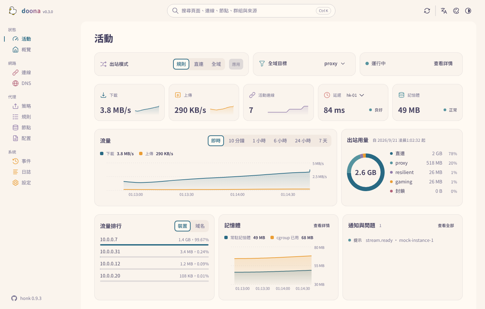
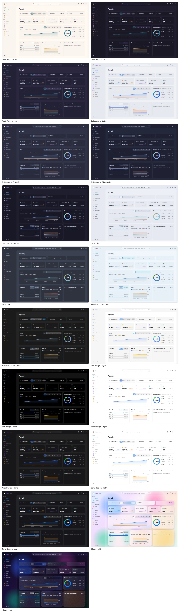
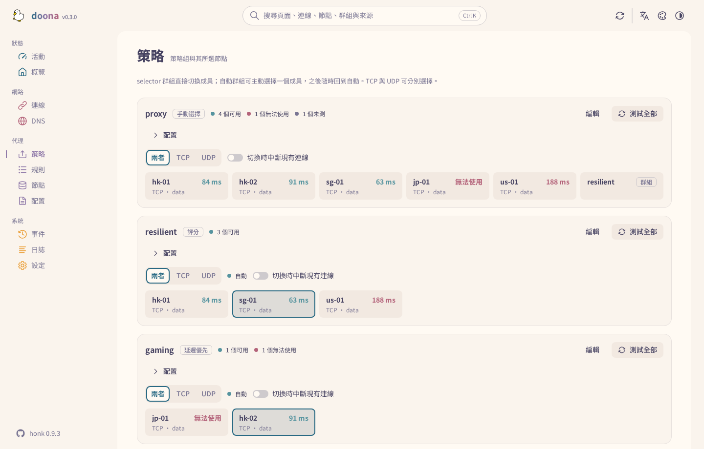
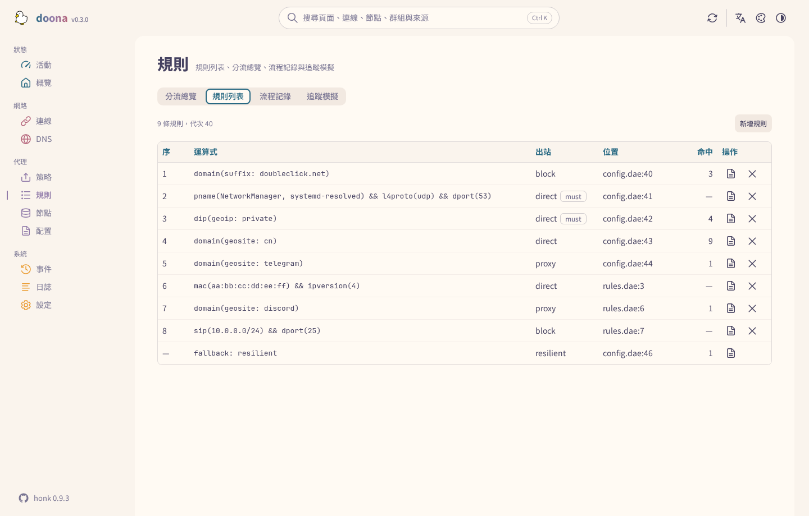
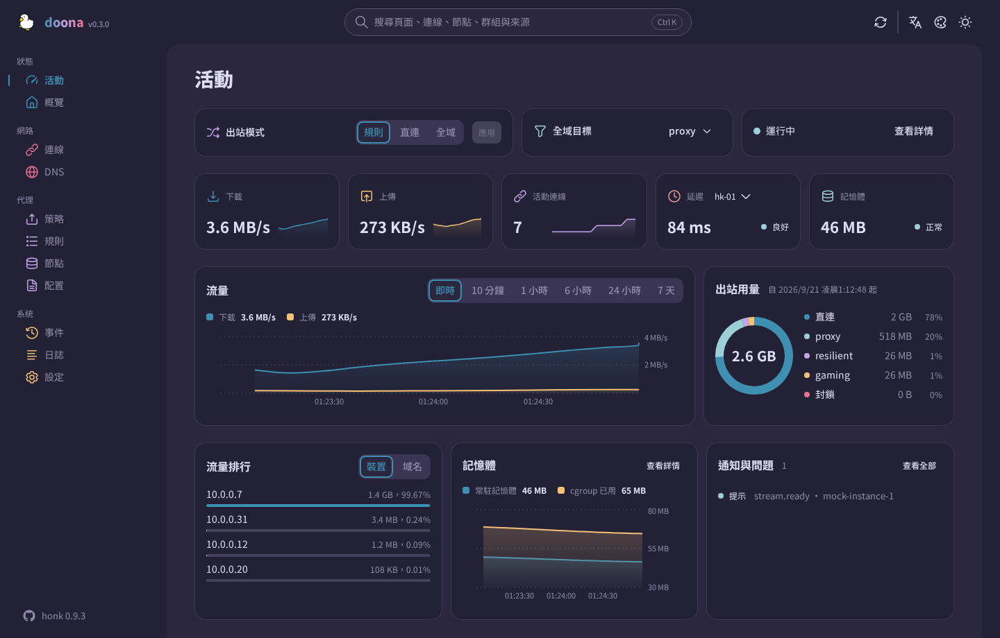

<div align="center">

<picture>
  <source media="(prefers-color-scheme: dark)" srcset="docs/logo-dark.svg">
  
</picture>

# doona

**[daeuniverse](https://github.com/daeuniverse) 引擎的 Web 介面：在瀏覽器裡管節點、群組、規則與配置。**

[English](README.md) · [简体中文](README.zh-CN.md) · 繁體中文

[執行環境](#執行環境) • [安裝](#安裝) • [第一次使用](#第一次使用) • [頁面](#頁面) • [資料與設定](#資料與設定) • [開發](#開發) • [支援](#支援)

</div>

doona 是一組靜態檔案，由引擎自己或任一 Web 伺服器提供。現在對接 [honk](https://github.com/daeuniverse/honk)，dae 實作同一套 API 後也能用。它顯示引擎當下的狀態：連線、保留的流程、DNS、事件、日誌、流量與記憶體。它也匯入訂閱與分享連結，把節點編成群組並測延遲，用表單寫路由規則，配置檔每次儲存前先校驗。介面有繁體中文、簡體中文與英文，十一套配色，各有淺色與深色。



<details>
<summary><strong>全部配色</strong></summary>

十一套配色各有淺色與深色；Rosé Pine 與 Catppuccin 另有多種深色變體。配色在頂欄切換。



</details>

## 狀態

doona 對接原生 API。honk 在 `feat/native-api` 分支實作了這套 API，尚未發行；dae 預計實作同一份契約。契約是 `daeuniverse/api-standardize` 提交 `01a6575`（doona 提的契約修改已全部合併），記錄見 [SOURCE.md](contract/api-standardize/SOURCE.md)。以較舊釘點建置的後端仍可用：後端沒宣告的資源視為不可用，對應頁面從導覽列消失。未設定後端時，內建模擬後端提供示範資料；本文截圖全部來自模擬資料。

## 執行環境

| 元件   | 要求                                                                                     |
| ------ | ---------------------------------------------------------------------------------------- |
| 後端   | 啟用 `native_api` 的 honk（見[安裝](#安裝)）；伺服器上不需要其他程式                     |
| 瀏覽器 | Chrome 或 Edge 120、Firefox 120、Safari 17 及以後。這是建置目標，自動化測試只用 Chromium |
| 建置   | Node 22 及以後、pnpm 11.15.1；打包需要 GNU tar、gzip 與 sha256sum                        |

## 安裝

發行檔（`doona-<version>.tar.gz`、選用的 `doona-fonts-<version>.tar.gz`（Noto Sans TC 與 SC）、`SHA256SUMS`）附在[發行頁](https://github.com/Zakkaus/doona/releases)的標籤上；第一個標籤打出來之前，請照[開發](#開發)一節自行建置。驗證後解壓到 honk 或 Web 伺服器要提供的目錄：

```sh
sha256sum -c SHA256SUMS
sudo mkdir -p /usr/share/doona
sudo tar -xzf "doona-${VERSION}.tar.gz" -C /usr/share/doona
sudo tar -xzf "doona-fonts-${VERSION}.tar.gz" -C /usr/share/doona   # 選用
```

不裝字型檔時，瀏覽器改用本機字型。

<details>
<summary><strong>由 honk 提供</strong></summary>

honk 的原生 API 需要明確開啟。把 `ui` 指向解壓後的目錄，honk 就在 `/ui/` 提供這些檔案，與 API 同源，不需要 CORS 設定：

```dae
experimental {
    native_api {
        enabled: true
        listen: '127.0.0.1:9527'
        secret: 'operator-supplied-random-token'
        ui: '/usr/share/doona'
    }
}
```

這個區塊請放在獨立的 include（`include { api.dae }`）：主檔若含 `native_api.secret`，API 不會回傳它的內容，也不允許寫入，配置頁就無法編輯主檔。

</details>

<details>
<summary><strong>任一靜態伺服器或反向代理</strong></summary>

把解壓後的檔案放在網站根目錄或 `/ui/` 這類前綴下即可；頁面用 hash 路由（`/ui/#/activity`），不需要改寫規則。UI 與 honk 不同源時，該來源必須列在 honk 的 `allow_origins`；除非監聽位址是 loopback 且明確開啟匿名存取，否則必須提供 token。

前面放一個反向代理可讓兩者同源：把 `/api/` 轉給 honk 的監聽位址，檔案放在 `/ui/` 下。

</details>

<details>
<summary><strong>發行版套件</strong></summary>

尚未發布。每個發行版本附 [nfpm](install/nfpm) 從 `make install` 打出的 `deb`、`rpm`、`ipk` 與 Arch 套件，全部與架構無關，`doona-fonts` 是獨立的選用套件。各套件倉庫的寫法在 [install/](install/)：OpenWrt feed Makefile、Alpine `APKBUILD`、nixpkgs 式表達式；AUR 的 `doona-bin` 另有倉庫。發行版本另附 `doona-<tag>-deps.tar.xz`（裝好的 `node_modules`），給必須離線建置的套件用。原生模組涵蓋工具鏈有出的每種 Linux 架構與 libc，清單見 `pnpm-workspace.yaml`；lightningcss 沒有二進位的架構改用 esbuild 壓 CSS。其他打包方式從 `make install DESTDIR=… PREFIX=/usr` 與 `make install-fonts` 入手。

</details>

## 第一次使用

在 honk 主機上開 `/ui/`。第一次造訪時，doona 向提供頁面的來源請求 `/api`；honk 回應後就成為已儲存的後端，接著提示輸入 token。若頁面來自別處，或要連另一台 honk，開設定頁填伺服器根位址（`http://router:9527`，不含 `/api/v1`）與 token；「測試連線」在儲存前先檢查探索端點，儲存後重新載入頁面。配對連結可以代填表單：`/ui/#/settings?api=http://router:9527&token=…`，載入後 token 會從網址列移除。

接著活動頁顯示執行中的引擎。其餘頁面的常見順序：

1. **節點**：新增訂閱（名稱與網址）或貼入分享連結；節點列出協定、延遲與所屬群組。可設定訂閱多久更新一次、測試單一節點，或從該列把節點加入群組。
2. **策略**：每個群組一張卡，列出成員與延遲。selector 群組可直接選成員；自動群組可釘住一個成員、之後再放開；可全部測試，也可編輯群組的策略與篩選。
3. **規則**：依評估順序列出路由字典，附每條規則決定過的流程數。新增規則可以挑選依據與值（網域後綴、geosite 分類、埠、程序名稱），也可以直接寫表達式，插在任一條之前或最後。
4. **配置**：已接受的來源與其診斷。就地編輯檔案，校驗、儲存、重載；快速設定涵蓋主檔的常用項目。

每一次寫入都經過 honk：全文校驗，帶著讀取時的雜湊儲存（磁碟上已變動的檔案會回 412，不會被覆蓋），再重載。來源裡的密鑰在回傳時已遮蔽，也不會被寫回。

## 頁面



| 頁面 | 內容                                                                         | 需要的資源                          |
| ---- | ---------------------------------------------------------------------------- | ----------------------------------- |
| 活動 | 出站模式、流量與記憶體、活動連線、節點延遲、出站用量、流量最高的客戶端、通知 | —                                   |
| 概覽 | 引擎與 eBPF 狀態、流量計數、後端能力、狀態 JSON 匯出                         | `runtime`                           |
| 連線 | 即時連線的來源、目的、規則、鏈路與流量；關閉單條或全部；篩選條件可寫在網址   | `connections`                       |
| DNS  | 查詢與解析結果、快取、日誌；清空快取                                         | `dns_query`、`dns_log`、`dns_cache` |
| 策略 | 群組、成員與健康；選擇、釘住、測試、編輯                                     | `groups`                            |
| 規則 | 規則列表與命中數、保留流程的分佈、流程記錄、對指定目標的追蹤模擬             | `rules`、`flows`、`routing_trace`   |
| 節點 | 訂閱與更新間隔、配置內節點、新增與移除、測試、加入群組                       | `nodes`、`providers`                |
| 配置 | 來源與診斷、附校驗的編輯器、快速設定、匯出                                   | `config`                            |
| 事件 | 後端事件串流                                                                 | `events`                            |
| 日誌 | 日誌串流，可按等級與模組篩選、暫停、匯出                                     | `logs`                              |
| 設定 | 後端、語言、外觀與配色                                                       | —                                   |

後端沒宣告所需資源的頁面會從導覽列消失，需求定義在 [registry.ts](src/shell/registry.ts)。任何頁面按 `Ctrl K` 可搜尋頁面、連線、節點、群組、規則與來源。



## 資料與設定

doona 不在伺服器上保存任何資料。設定存在瀏覽器該來源的 `localStorage`：

| 設定     | 鍵               | 值                                                                                                                                         |
| -------- | ---------------- | ------------------------------------------------------------------------------------------------------------------------------------------ |
| 後端     | `doona-profiles` | `{id, name, api, token}` 的 JSON 陣列；`api` 是伺服器根位址或代理前綴，留空或 `mock` 用示範資料；token 只放在 Authorization 標頭，不進網址 |
| 使用中的 | `doona-profile`  | 所選後端的 `id`                                                                                                                            |
| 語言     | `doona-lang`     | `zh-TW`（預設）、`zh-CN`、`en`                                                                                                             |
| 配色方案 | `doona-scheme`   | `system`（預設）、`light`、`dark`                                                                                                          |
| 配色     | `doona-palette`  | `rose-pine/moon`（預設）；其他值見 [settings.ts](src/features/settings/settings.ts) 的 `PaletteId`                                         |
| 字標     | `doona-wordmark` | `gradient`（預設）、`plain`                                                                                                                |

儲存的主題與語言在第一幀之前就套用，重新載入不會閃出預設外觀。

在 HTTPS 或 localhost 下，service worker 預先快取應用外殼，並快取字型與圖示，離線也能開頁面，網站可安裝成應用程式。API 回應一律不快取。安全問題的回報方式見 [SECURITY.md](SECURITY.md)。



## 開發

```sh
pnpm install --frozen-lockfile
pnpm build                       # 輸出 dist/
pnpm check                       # 型別、lint、翻譯、格式、單元測試、產生的 API 型別
pnpm e2e:install --with-deps     # 瀏覽器測試只需安裝一次
pnpm e2e                         # 對模擬後端的瀏覽器測試，根目錄與 /ui/ 各一輪
pnpm package                     # release/doona-<version>.tar.gz、doona-fonts-<version>.tar.gz、SHA256SUMS
```

`pnpm dev` 以 Vite 開發伺服器提供模擬後端。版本號本機取自 `package.json`，標籤上取自 Git 描述；時間戳用 `SOURCE_DATE_EPOCH`，未設定時用 HEAD 提交時間。`node tools/screenshots.mjs <url> docs/screenshots` 從執行中的建置重新產生上面的截圖（配色總覽需要 `cwebp`）。另見 [CONTRIBUTING.md](CONTRIBUTING.md) 與 [CHANGELOG.md](CHANGELOG.md)。

| 路徑            | 用途                                   |
| --------------- | -------------------------------------- |
| `src/features/` | 各頁面及其 hook 與文案，一頁一個資料夾 |
| `src/shell/`    | 應用外殼、導覽與搜尋                   |
| `src/ui/`       | 共用元件、主題與圖示                   |
| `src/api/`      | 客戶端、模擬後端與產生的型別           |
| `src/i18n/`     | 翻譯與地區設定輔助                     |
| `contract/`     | 內嵌的 OpenAPI 契約與釘點              |
| `public/`       | 靜態資源、字型與 service worker        |
| `e2e/`          | 瀏覽器測試                             |
| `tools/`        | 建置、打包、一致性檢查與截圖工具       |
| `install/`      | nfpm 設定與 OpenWrt、Alpine、Nix 寫法  |

### 契約

[SOURCE.md](contract/api-standardize/SOURCE.md) 記錄 [openapi.yaml](contract/api-standardize/openapi.yaml) 的釘點。移動釘點後執行 `pnpm gen:api` 重新產生 [src/api/types.ts](src/api/types.ts)。`node tools/conformance.mjs http://router:9527 --token …` 按契約檢查線上後端的探索端點、能力與唯讀回應，不送出任何修改。

## 支援

問題與提問請到 [issues](https://github.com/Zakkaus/doona/issues)。後端行為屬於 [honk](https://github.com/daeuniverse/honk)。

## 授權與致謝

[GPL-3.0-only](LICENSE)。Noto Sans TC 與 SC 採 [Open Font License](public/fonts/OFL.txt)；[NOTICE](NOTICE) 註明 Adobe Spectrum 圖示（Apache-2.0）。鴨子是維護者自己畫的。
