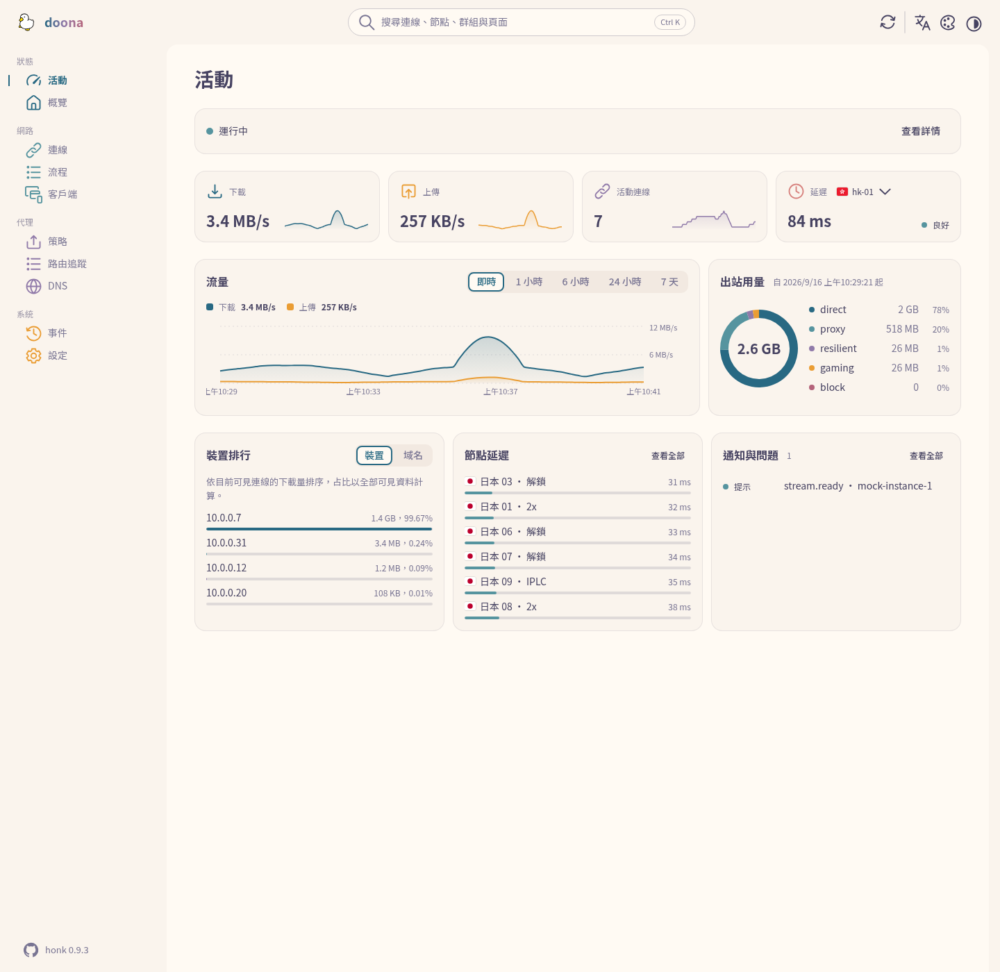
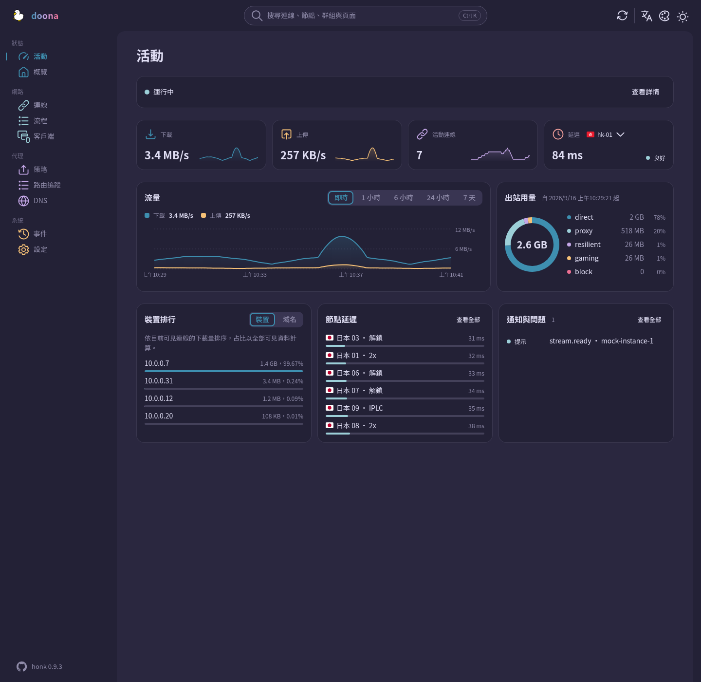

<div align="center">

<picture>
  <source media="(prefers-color-scheme: dark)" srcset="docs/logo-dark.svg">
  
</picture>

# doona

**honk 的 Web 介面**，`doona`。

[English](README.md) · [简体中文](README.zh-CN.md) · 繁體中文

[執行環境](#執行環境) • [安裝與部署](#安裝與部署) • [設定](#設定) • [頁面](#頁面) • [開發](#開發) • [契約](#契約)

</div>



## 狀態

在 honk 發布 `/api/v1` 之前，doona 僅供契約驗證與示範，不承諾與已發布的後端相容。
目標契約為 `daeuniverse/api-standardize` 的 `ui-findings` 分支，固定提交為 `8bd9871`，記錄見 [SOURCE.md](contract/api-standardize/SOURCE.md)。
預設使用模擬後端；截圖展示的也是模擬資料。

## 執行環境

| 元件          | 要求                                                     |
| ------------- | -------------------------------------------------------- |
| Chrome / Edge | 120 及以後                                               |
| Firefox       | 120 及以後                                               |
| Safari        | 17 及以後                                                |
| 僅建置時需要  | Node 22 及以後、pnpm 11.15.1                             |
| 執行時        | 靜態託管與瀏覽器；無需 Node 執行環境或伺服端應用相依套件 |
| 僅打包時需要  | GNU tar、gzip、sha256sum                                 |

瀏覽器版本取自 [vite.config.ts](vite.config.ts) 的建置目標，不代表跨瀏覽器測試範圍。
自動化瀏覽器測試使用 Chromium。

## 安裝與部署

依[開發命令](#開發)從原始碼建置，或使用已公開[發行版](https://github.com/Zakkaus/doona/releases)的封存檔。
符合 `v*` 的標籤會建立發行草稿，需手動發布。

在下載目錄中，將 `VERSION` 設為封存檔的版本，將 `WEBROOT` 設為既有的部署目錄。
將兩個封存檔與 `SHA256SUMS` 放在同一目錄，校驗後再解壓縮：

```sh
sha256sum -c SHA256SUMS
tar -xzf "doona-${VERSION}.tar.gz" -C "$WEBROOT"
```

如需選用的 Noto Sans TC 與 SC 字型，將字型封存檔解壓縮至同一目錄：

```sh
tar -xzf "doona-fonts-${VERSION}.tar.gz" -C "$WEBROOT"
```

| 部署方式   | 目標位置與託管方式                                                                                                          |
| ---------- | --------------------------------------------------------------------------------------------------------------------------- |
| 嵌入 honk  | 在 honk 提供 UI 託管時，將解壓縮後的檔案作為 `/ui/` 的內容提供服務，再開啟 `/ui/`。這不代表後端相容性已獲確認               |
| 靜態伺服器 | 將解壓縮後的檔案或 `dist/` 的內容部署至網站根目錄或 `/ui/` 等子目錄                                                         |
| 發行版套件 | 將相同的靜態檔案打包為 Nix、Debian、AUR、Gentoo 或 OpenWrt 套件，`doona-fonts` 為選用套件。這些是打包方案，並非既有套件清單 |

`/ui/#/activity` 等雜湊路由無需伺服端路由重寫。
未安裝字型封存檔時，字型請求會回傳 404，瀏覽器改用本機後備字型。

## 設定

未儲存後端時，開啟根頁面會顯示設定頁；直接存取頁面連結不受影響。
輸入 HTTP(S) 伺服器根網址或反向代理前綴，不要附加 `/api/v1`，也不要包含憑證、查詢參數或片段。
網址留空或填入 `mock` 即使用內建示範資料。

設定儲存在目前瀏覽器的 `localStorage` 中，以網站的來源為範圍：

| 欄位       | 儲存鍵            | 取值                                                     |
| ---------- | ----------------- | -------------------------------------------------------- |
| 伺服器網址 | `doona-api`       | 伺服器根網址或代理前綴；留空或 `mock` 使用示範資料       |
| 權杖       | `doona-api-token` | Bearer 權杖，透過 Authorization 請求標頭傳送，不放入 URL |
| 語言       | `doona-lang`      | `zh-TW`（預設）、`zh-CN`、`en`                           |
| 明暗模式   | `doona-scheme`    | `system`（預設）、`light`、`dark`                        |
| 配色       | `doona-palette`   | 預設值：`rose-pine/moon`                                 |
| 品牌字樣   | `doona-wordmark`  | `gradient`（預設）、`plain`                              |

測試連線會檢查原生 API 的 `/api` 探索端點；儲存後端設定會重新載入頁面。
權杖會持久儲存在瀏覽器儲存空間中。安全問題的回報方式見 [SECURITY.md](SECURITY.md)。

## 頁面

資源欄列出 [registry.ts](src/shell/registry.ts) 中的導覽顯示條件，並非頁面發出的所有請求。
沒有資源限制不代表無需後端資料；DNS 所列資源任一可用時，該頁面就會顯示。

| 頁面     | 顯示內容                                       | 所需原生資源               |
| -------- | ---------------------------------------------- | -------------------------- |
| 活動     | 流量、出站用量、客戶端排名、節點延遲與近期事件 | 無限制                     |
| 概覽     | 運行狀態                                       | `runtime`                  |
| 連線     | 活動連線及其詳情                               | `connections`              |
| 流程     | 保留的流程與觀測涵蓋範圍                       | `flows`                    |
| 客戶端   | 依來源 IP 分組的客戶端                         | 無限制                     |
| 策略     | 群組與節點                                     | `groups`                   |
| 路由追蹤 | 路由診斷                                       | `routing_trace`            |
| DNS      | 查詢與快取項目                                 | `dns_query` 或 `dns_cache` |
| 事件     | 後端事件串流                                   | `events`                   |
| 設定     | 後端與外觀設定                                 | 無限制                     |

## 語言與外觀

介面提供繁體中文、簡體中文與英文。可在設定頁選擇淺色、深色或跟隨系統。
配色包括 Rosé Pine、Rosé Pine Moon、Catppuccin Frappé、Catppuccin Macchiato 與 Catppuccin Mocha。
另有 Nord、Ant Design、Arco Design、Semi Design 與玻璃。



## 離線與 PWA

在支援的瀏覽器中，HTTPS 或 localhost 可啟用 Service Worker 與 PWA 安裝。
Service Worker 預先快取 `index.html` 與建置產物，再快取作用域內成功的同源靜態資源、字型與圖示請求。
離線導覽使用快取的應用外殼。API 回應從不快取；離線存取不提供即時後端資料。

## 開發

安裝上述建置與打包工具後，在儲存庫根目錄執行：

```sh
pnpm install --frozen-lockfile
pnpm build
pnpm check
pnpm e2e:install --with-deps
pnpm e2e
pnpm package
```

建置結果寫入 `dist/`。`pnpm check` 執行型別、程式碼規範、翻譯、格式、單元測試與 API 生成結果檢查。
瀏覽器測試涵蓋根路徑與 `/ui/` 部署。
打包結果為 `release/doona-<version>.tar.gz`、`release/doona-fonts-<version>.tar.gz` 與 `release/SHA256SUMS`。

在儲存庫根目錄執行 `pnpm test:coverage`，輸出覆蓋率彙總並產生 `coverage/lcov.info`。

本機封存檔版本取自 `package.json`；發行建置使用 Git 版本描述。
封存檔時間戳記取自 `SOURCE_DATE_EPOCH`，未設定時使用 HEAD 提交時間。
沒有 Git 中繼資料時，打包前須設定 `SOURCE_DATE_EPOCH`。
參見 [CONTRIBUTING.md](CONTRIBUTING.md) 與 [CHANGELOG.md](CHANGELOG.md)。

| 路徑            | 用途                            |
| --------------- | ------------------------------- |
| `src/features/` | 產品頁面、鉤子與介面文案        |
| `src/shell/`    | 應用外殼與路由                  |
| `src/ui/`       | 共用元件與圖示                  |
| `src/api/`      | 客戶端、模擬後端與生成的型別    |
| `src/i18n/`     | 翻譯與語言區域輔助函式          |
| `contract/`     | 儲存庫內固定的 OpenAPI 契約副本 |
| `public/`       | 靜態資源、字型與 Service Worker |
| `e2e/`          | 瀏覽器測試                      |
| `tools/`        | 開發、驗證與打包工具            |
| `reference/`    | 唯讀的歷史 UI 參考資料          |

## 契約

[contract/api-standardize/SOURCE.md](contract/api-standardize/SOURCE.md) 記錄 [openapi.yaml](contract/api-standardize/openapi.yaml) 的固定版本。
更新契約後，在儲存庫根目錄執行 `pnpm gen:api`，重新生成 [src/api/types.ts](src/api/types.ts)。

[tools/conformance.mjs](tools/conformance.mjs) 對伺服器執行探索、版本、能力與獲准的唯讀觀測檢查，不傳送修改操作或診斷 DNS 查詢。

## 授權與致謝

採用 [GPL-3.0-only](LICENSE)。Noto Sans TC 與 SC 使用 [Open Font License](public/fonts/OFL.txt)。
[NOTICE](NOTICE) 列出採用 Apache-2.0 的 Adobe Spectrum 圖示與採用 MIT 的 flag-icons。
鴨子標誌由維護者繪製。
