

# doona

**[daeuniverse](https://github.com/daeuniverse) 引擎的 Web 介面：在瀏覽器中管理節點、群組、規則與組態。**

[English](README.md) · [简体中文](README.zh-CN.md) · 繁體中文

[安裝](#安裝) • [頁面](#頁面) • [頁面導覽](#頁面導覽) • [手機版面](#手機版面) • [開發](#開發) • [文件](https://zakkaus.github.io/doona-docs/zh-TW/)

doona 是 daeuniverse 引擎共用原生 API 的靜態 Web 介面：現在是 honk，dae 實作同一份契約後亦可。它由引擎自己或任一 Web 伺服器提供，顯示引擎當下的狀態，並管理節點、群組、路由規則與組態檔。

[使用範例資料體驗示範版](https://demo.daeuniverse.org/)。

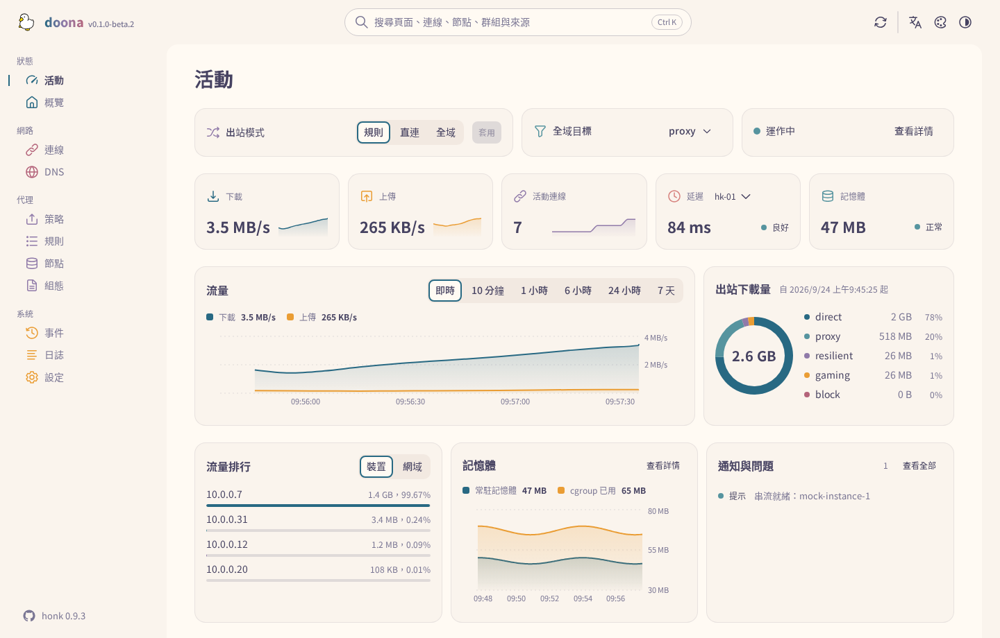

<strong>全部配色</strong>

十一套配色各有淺色與深色；Rosé Pine 與 Catppuccin 另有多種深色變體。配色在頂欄切換。

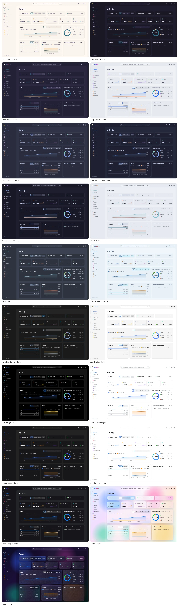

## 配色範例

下圖展示活動頁的四種配色。可在頂欄切換配色和模式。

| 配色       | 淺色                                                                | 深色                                                               |
| ---------- | ------------------------------------------------------------------- | ------------------------------------------------------------------ |
| Rosé Pine  | 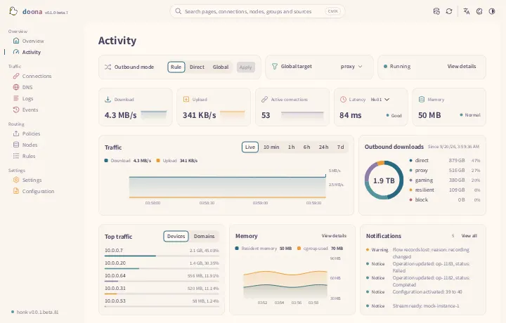   | 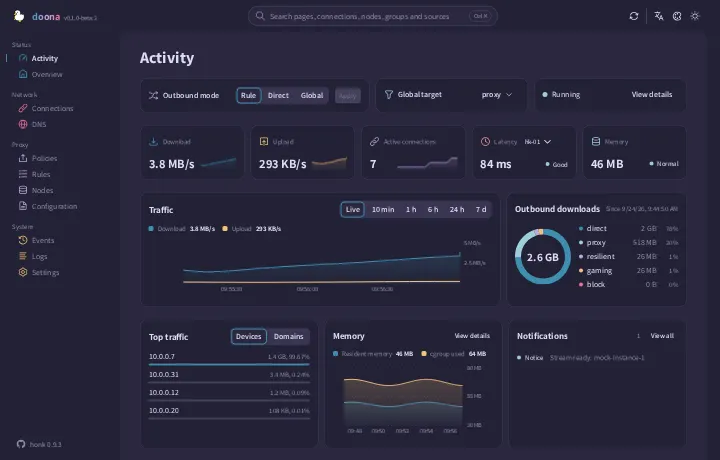   |
| Catppuccin | 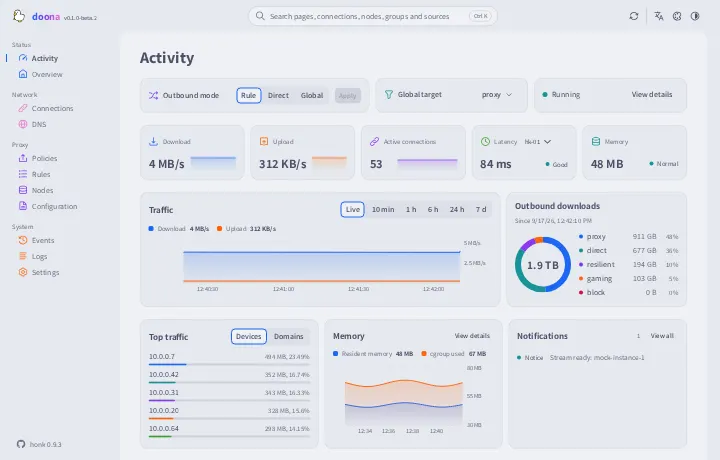 | 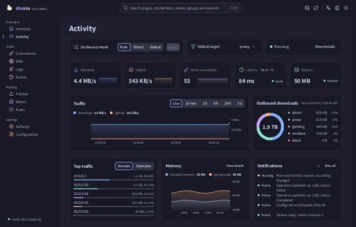 |
| Nord       | 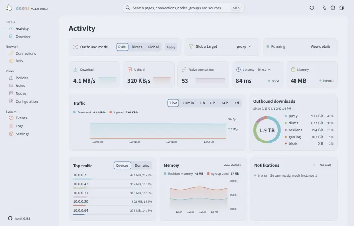             | 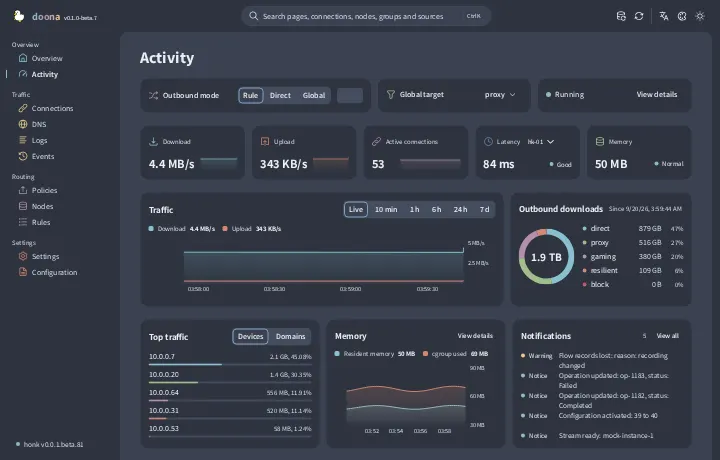             |
| Glass      | 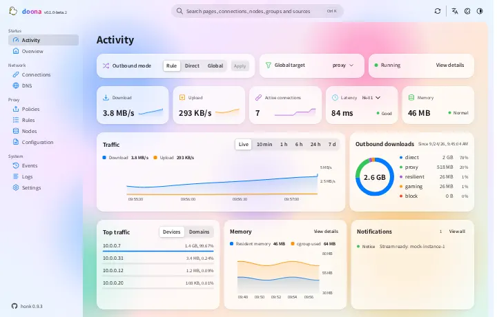           | 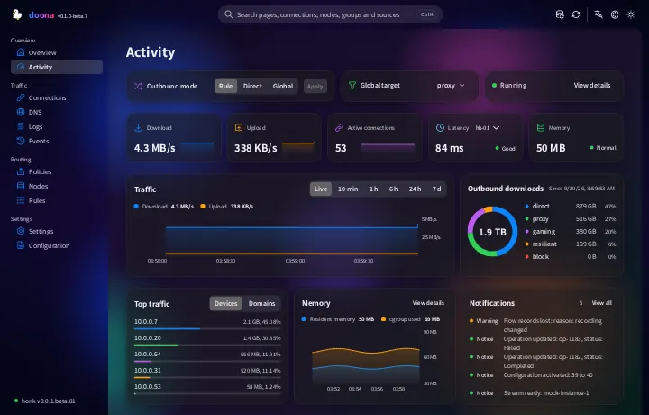           |

## 狀態

doona 對接 honk `feat/native-api` 分支實作的原生 API；這套 API 尚未發行。契約的釘點記錄在 [SOURCE.md](contract/api-standardize/SOURCE.md)。後端缺少較新的資源鍵時，doona 會把這些鍵視為不可用。未設定後端時，內建模擬後端提供示範資料；本文截圖全部來自模擬資料。

## 安裝

doona 需要 honk 的原生 API，目前只有 [Glassyiris/honk `feat/native-api`](https://github.com/Glassyiris/honk/tree/feat/native-api) 分支的 `debug` 版本提供。發行檔（`doona-<version>.tar.gz`、選用的 `doona-fonts-<version>.tar.gz`（Noto Sans TC 與 SC）、`SHA256SUMS`）附在[發布頁](https://github.com/Zakkaus/doona/releases)的標籤上。將其解壓縮到 honk `native_api` 組態區塊中 `ui` 指定的目錄，honk 即在 `/ui/` 提供 doona。

在 honk 發行含原生 API 的正式版本之前，每個 doona 發行版也附上該 `debug` 版本預先建置的 `honk-core-debug-<target>[-stock].tar.gz`，使用者不需自行編譯 honk。`HONK-SOURCE.txt` 註明建置所用的 honk 提交。[安裝 honk](https://zakkaus.github.io/doona-docs/zh-TW/install.html#install) 說明如何依閘道器選擇封存檔。

[文件](https://zakkaus.github.io/doona-docs/zh-TW/)涵蓋系統需求、honk 與 doona 的安裝、範例組態、首次登入、逐項檢查功能與疑難排解。

## 頁面

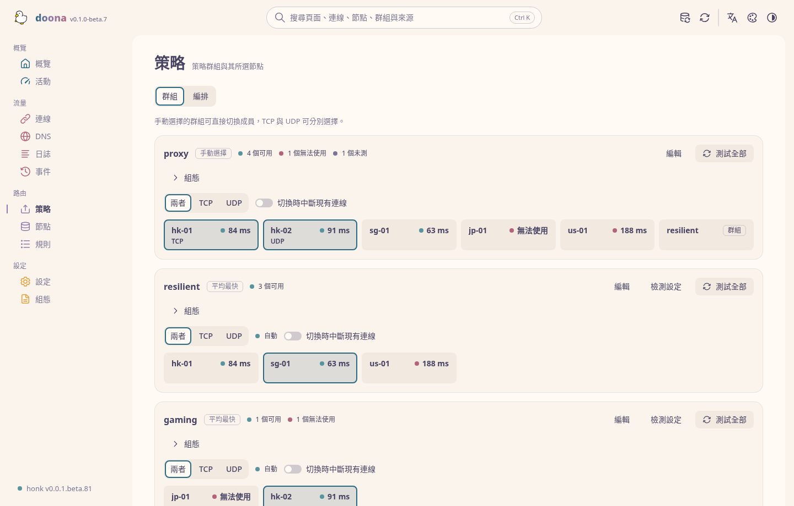

| 頁面       | 內容                                                                                   |
| ---------- | -------------------------------------------------------------------------------------- |
| 活動       | 出站模式、流量與記憶體、活動連線、節點延遲、出站用量、流量最高的客戶端、通知           |
| 概覽       | 引擎與 eBPF 狀態、程序 CPU 使用率、流量計數、後端能力、狀態 JSON 匯出                  |
| 連線       | 即時連線的來源、目的、規則、鏈路、流量與傳輸速率；關閉單條或全部                       |
| DNS        | 查詢與解析結果、快取、日誌；清空快取                                                   |
| 策略       | 群組、成員與健康；選擇、手動固定、恢復自動選擇、測試、編輯與健康檢查網址               |
| 規則       | 從規則或設備經出站到所選節點的分流樹、規則列表與命中數、流程記錄、對指定目標的追蹤模擬 |
| 節點       | 訂閱與更新間隔、組態內節點、新增與移除、測試、加入群組                                 |
| 組態       | 新增與編輯來源檔案、診斷、校驗、快速設定、匯出                                         |
| 事件、日誌 | 後端事件串流；日誌串流，可篩選、暫停、匯出                                             |
| 設定       | 後端、執行期設定與後端操作、語言、外觀、配色與通知位置                                 |

只有頁面需要的資源全部不可用時，頁面才會標為不可用。任何頁面按 `Ctrl K` 可搜尋頁面、連線、節點、群組、規則與來源。各頁面需要的資源與 doona 自身設定的存放位置，見[功能](https://zakkaus.github.io/doona-docs/zh-TW/features.html#pages)一頁。

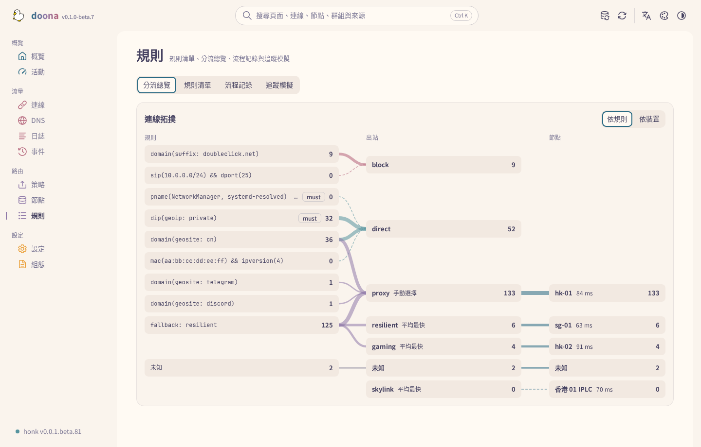

## 頁面導覽

### 編排群組

在策略頁的編排分頁，將右側列表中的節點或訂閱拖曳到群組上，即可加入該群組。每列的加入選單與鍵盤拖曳也能完成相同操作。

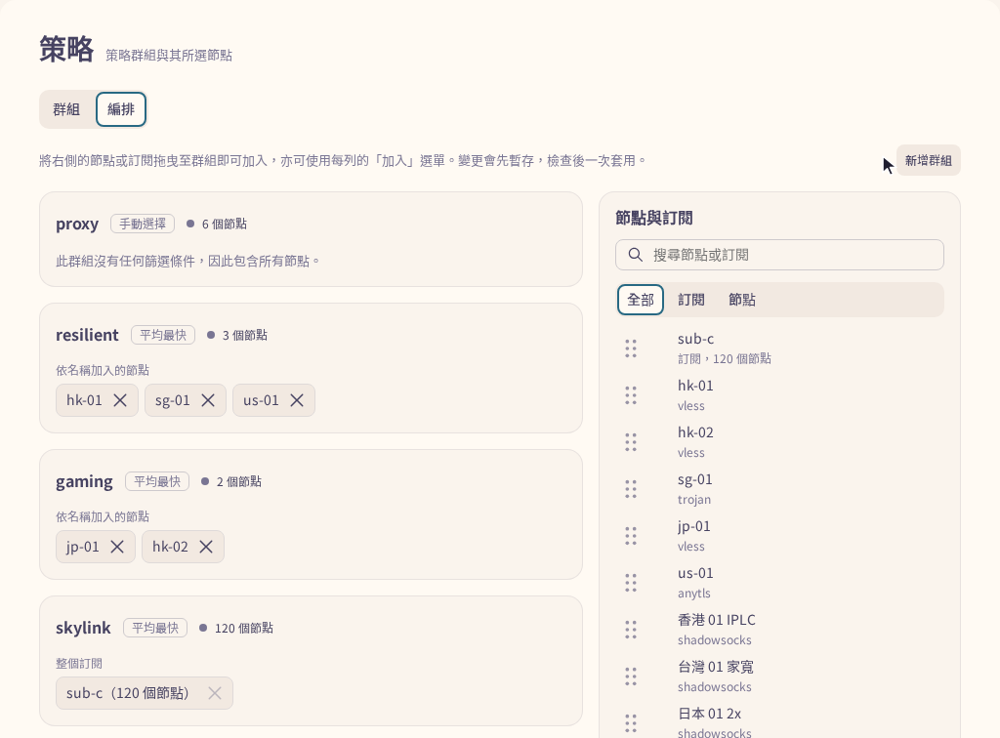

### 流量與連線

連線頁的流量分頁以散佈圖呈現每條連線的上傳量與下載量，並依出站著色；選取資料點即可開啟對應的連線。連線分頁依裝置或出站將即時連線分組，可依協定與出站篩選，並匯出為 CSV。

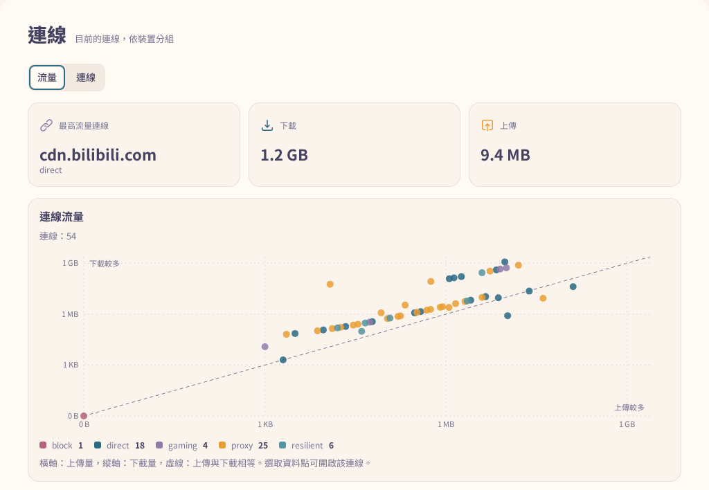

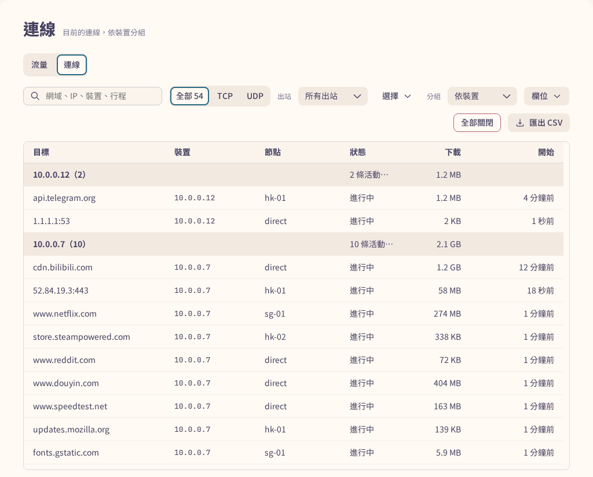

### DNS

統計分頁顯示解析時間的中位數與 P95、快取命中率、失敗率、各上游在延遲刻度上的查詢分布，以及查詢的結果分類。

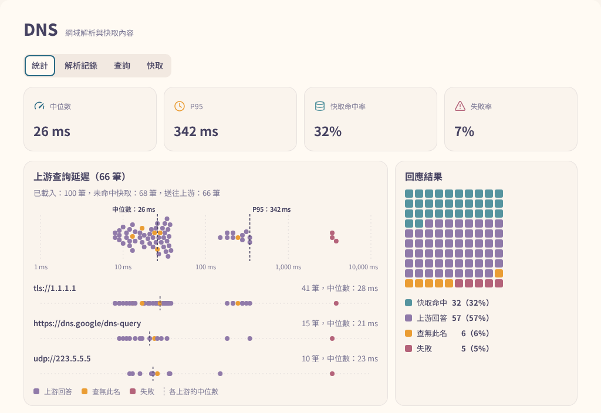

### 日誌時間分布

日誌列表上方的熱圖按時間統計各級別的記錄數。點選級別的列標題，即可設定列表顯示的最低級別。

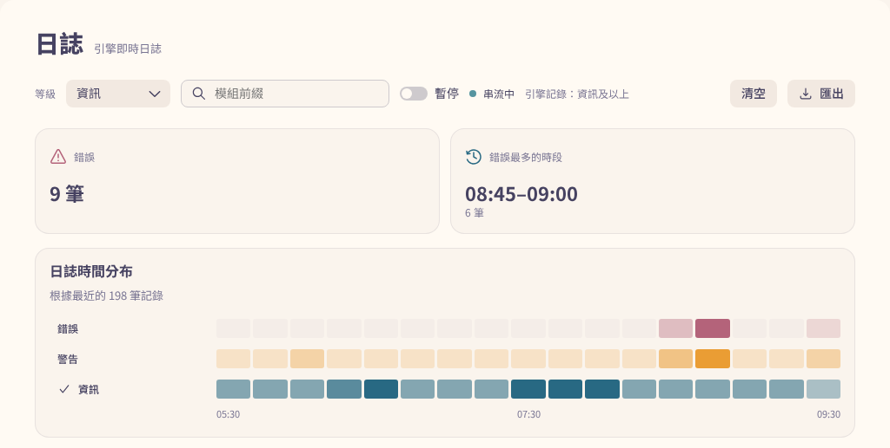

### 分流總覽

規則頁的分流總覽依規則或裝置，經出站追蹤到節點。將指標移到規則、出站或節點上，或選取其中一項，即可標示經過該項的路徑。

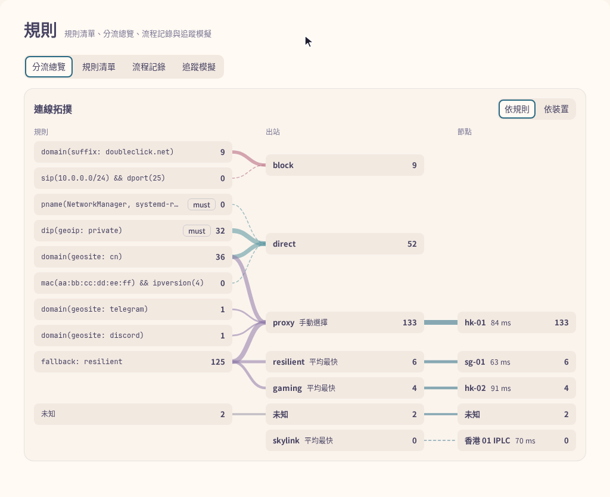

### 節點延遲

節點頁的延遲分頁依策略群組或協定分組，顯示每個節點的目前延遲、移動平均與近 10 次平均。無法使用的節點列在所屬群組下方。

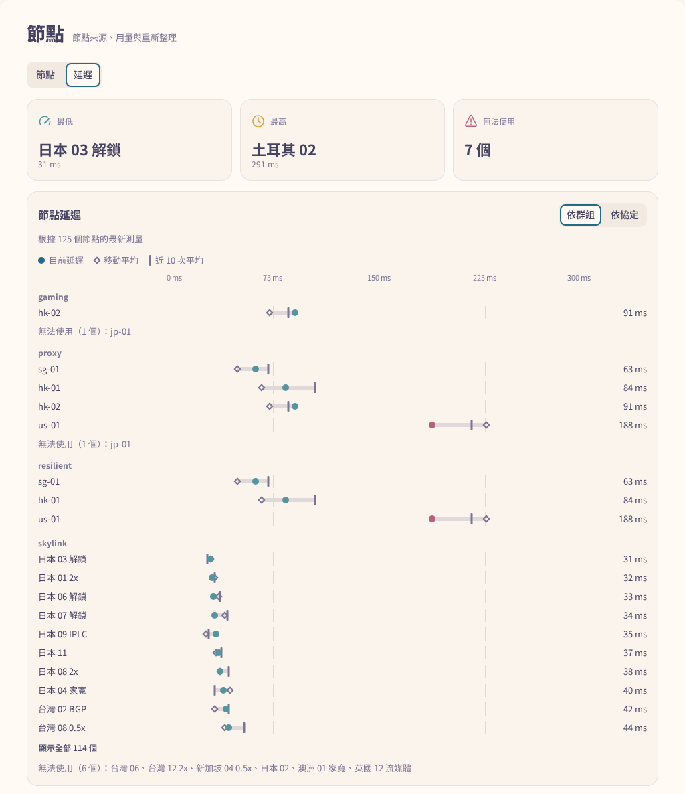

## 手機版面

視窗寬度小於 1024 像素時，側邊導覽改為底部列，分為概覽、流量、路由與設定四組。每組開啟時顯示本次工作階段最後瀏覽的頁面，組內各頁排成一列，位於內容上方。語言、主題、配色與字標移入頂欄的溢位選單，各為一個子選單。

表格依預設順序隱藏放不下的欄位，工具列換行排列。在概覽、DNS 與日誌頁，第一個操作保留為按鈕，其餘收進選單。

透過 HTTPS 或在 localhost 上開啟時，doona 可安裝為應用程式。在 Chrome 與 Edge 中，設定頁的關於卡片提供安裝為應用程式按鈕。Safari 沒有安裝提示，因此卡片改為顯示操作步驟：iPhone 與 iPad 上點一下分享，再點一下加入主畫面；macOS 上的 Safari 26 選擇檔案 > 加入 Dock 中。

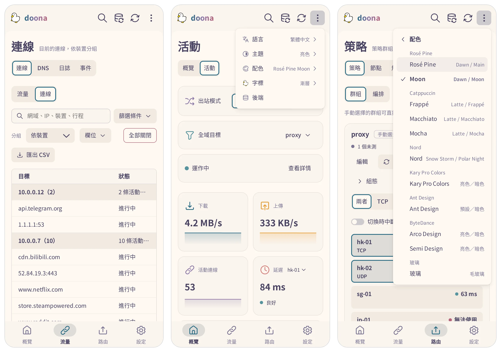

## 開發

建置、測試與打包指令、原始碼配置與契約釘點，見[開發](https://zakkaus.github.io/doona-docs/zh-TW/development.html)一頁；送出 pull request 前先讀 [CONTRIBUTING.md](CONTRIBUTING.md)。

## 支援

問題與提問請到 [issues](https://github.com/Zakkaus/doona/issues)。後端問題請提交到所連接引擎的專案：[honk](https://github.com/daeuniverse/honk) 或 [dae](https://github.com/daeuniverse/dae)。

## 授權與致謝

[GPL-3.0-only](LICENSE)。Noto Sans TC 與 SC 版權歸 Adobe 所有，採用 [Open Font License](public/fonts/OFL.txt)；[NOTICE](NOTICE) 註明 Adobe Spectrum 圖示（Apache-2.0）。鴨子是維護者自己畫的。
