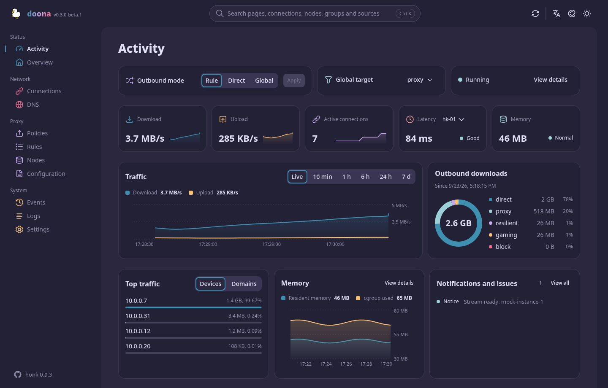

# doona guide

English · [简体中文](guide.zh-CN.md) · [繁體中文](guide.zh-TW.md)

The parts of the [README](../README.md) that are only needed once: what doona runs on, the other ways to serve it, what each page needs from the backend, where doona keeps its own settings, and the development tools.

## Requirements

| Component | Requirement                                                                                                                                                          |
| --------- | -------------------------------------------------------------------------------------------------------------------------------------------------------------------- |
| Backend   | An engine implementing the native API contract pinned in [SOURCE.md](../contract/api-standardize/SOURCE.md), with its API listener enabled (see [Install](#install)) |
| Browser   | Chrome or Edge 120, Firefox 121, Safari 17 or later. These are the CSS build targets; the JavaScript target is ES2022. Automated tests use Chromium                  |
| Build     | Node `^22.13.0 \|\| ^24.0.0 \|\| >=26.0.0` and pnpm 11.15.1; GNU tar, gzip and sha256sum for the archives                                                            |

## Install

The release archives and the honk block are in the [README](../README.md#install).

<strong>Any static server or reverse proxy</strong>

Serve the extracted files at the web root or under a prefix such as `/ui/`; the pages use hash routes (`/ui/#/activity`), so no rewrite rules are needed. If the UI and engine have different origins, configure the engine to allow the UI's origin. Follow the engine's documentation for its native API listener, CORS and authentication settings.

A reverse proxy keeps the UI and engine same-origin. Forward the exact `/api` discovery endpoint and the `/api/` subtree to the engine's listener; serve the files under `/ui/`. Preserve any configured proxy prefix for both API routes.

<strong>Distribution packages</strong>

None published yet. Each release carries `deb`, `rpm`, `ipk` and Arch packages built by [nfpm](../install/nfpm) from `make install`, all architecture-independent, with `doona-fonts` as a separate optional package. Recipes for the package repositories live in [install/](../install/): an OpenWrt feed Makefile, an Alpine `APKBUILD`, a Gentoo ebuild, a nixpkgs-style expression, and `doona-bin` for the AUR in its own repository. Each release also attaches `doona-<tag>-deps.tar.xz`, the installed `node_modules`, for builds that must run offline; it carries the native build helpers for every Linux architecture they ship (x86, x86_64, armv7, aarch64, riscv64, loong64, ppc64le, s390x, mips64el; glibc and musl), and the build falls back to esbuild's CSS minifier where lightningcss has no binary. `make install DESTDIR=… PREFIX=/usr` and `make install-fonts` are the entry points for any other packaging.

## First run

Open `/ui/` on the engine host. On a first visit doona asks the origin it was served from for `/api` and saves the engine as a backend. In password mode, the locked sign-in dialog offers first-time setup to create the administrator; complete setup from a loopback or private-network client, then sign in with the username and password. Served from elsewhere, or to reach another engine, open Settings and enter the server root (`http://router:9527`, without `/api/v1`); Test Connection checks discovery before saving, and saving reloads the page.

In token mode, doona asks for the token. Enter it in Settings with the server root, or use a pairing link to fill the form: `/ui/#/settings?api=http://router:9527&token=…`. Doona removes the token from the address bar on load.

The activity page then shows the running engine. The usual route through the rest:

1. **Nodes**: add a subscription (a name and its URL) or paste share links; nodes appear with their protocol, latency and groups. Set how often a subscription refreshes, test a node, or add it to a group from its row.
2. **Policies**: each group is a card with its members' latency. Pick a member of a selector group, pin one in an automatic group and release it again, test them all, or edit the group's policy and filters.
3. **Rules**: the routing dictionary in evaluation order with the flows each rule decided. Add a rule from a kind and its values (a domain suffix, a geosite category, a port, a process name) or as an expression, before any rule or at the end.
4. **Configuration**: the accepted sources with their diagnostics. Edit a file in place, validate, save and reload; a quick setup covers the main file's common settings.

Every configuration-source write goes through the engine: doona sends the hash it read the source at (`If-Match`; a file changed on disk answers 412 and nothing is written), the engine validates the whole source set before saving and reloading, and a failed reload keeps the previous generation active. Dry-run validation never writes, and redacted text is never written back. Runtime settings and group selection are separate endpoints with their own checks.

## Pages

| Page          | Shows                                                                                                                                                                                        | Needs                               |
| ------------- | -------------------------------------------------------------------------------------------------------------------------------------------------------------------------------------------- | ----------------------------------- |
| Activity      | Outbound mode, traffic and memory, active connections, node latency, outbound usage, top clients and notifications                                                                           | —                                   |
| Overview      | Engine and eBPF state, traffic counters, backend capabilities, and the status as JSON                                                                                                        | `runtime`                           |
| Connections   | Live connections with source, destination, rule, chain and traffic; close one or all; filters from the URL                                                                                   | `connections`                       |
| DNS           | Queries with their answers, the cache, and the log; a flush                                                                                                                                  | `dns_query`, `dns_log`, `dns_cache` |
| Policies      | Groups, their members and health; selection, pinning, probing and editing                                                                                                                    | `groups`                            |
| Rules         | A routing tree from rules (or devices) through outbounds to the nodes they select, the rule list with hits, the flow log with a rule one click away, and a routing trace for a chosen target | `rules`, `flows`, `routing_trace`   |
| Nodes         | Subscriptions and their refresh interval, inline nodes, add and remove, probe and join a group                                                                                               | `nodes`, `providers`                |
| Configuration | Sources with diagnostics, an editor with validation, quick setup and export                                                                                                                  | `config`                            |
| Events        | The backend event stream                                                                                                                                                                     | `events`                            |
| Logs          | The log stream with level and module filters, pause and export                                                                                                                               | `logs`                              |
| Settings      | Backends, runtime settings and backend actions, language, appearance and palette                                                                                                             | —                                   |

Every page remains in navigation. A page is marked unavailable only when every resource listed for it in [registry.ts](../src/shell/registry.ts) is unavailable; opening it shows an unavailable notice. `Ctrl K` searches pages, connections, nodes, groups, rules and sources from anywhere.

## Data and settings

doona has no server-side store for its own UI settings. Configuration and runtime changes are written through the engine; doona's UI settings live in the browser's `localStorage` for the site's origin:

| Setting       | Key              | Values                                                                                                                                                                                                                                                                                                                                                                                            |
| ------------- | ---------------- | ------------------------------------------------------------------------------------------------------------------------------------------------------------------------------------------------------------------------------------------------------------------------------------------------------------------------------------------------------------------------------------------------- |
| Backends      | `doona-profiles` | JSON list of `{id, name, api, token}`; `api` is a server root or proxy prefix, empty or `mock` for demo data. For password backends, `token` is empty and honk manages the session; doona keeps its session token in this tab's `sessionStorage`. In token mode, API requests send the token in the `Authorization` header. Pairing links may carry it in the URL fragment and remove it on load. |
| Active one    | `doona-profile`  | `id` of the selected backend                                                                                                                                                                                                                                                                                                                                                                      |
| Language      | `doona-lang`     | `zh-TW` (default), `zh-CN`, `en`                                                                                                                                                                                                                                                                                                                                                                  |
| Colour scheme | `doona-scheme`   | `system` (default), `light`, `dark`                                                                                                                                                                                                                                                                                                                                                               |
| Palette       | `doona-palette`  | `rose-pine/moon` (default); the other ids are the `PaletteId` union in [preferences.ts](../src/shell/preferences.ts)                                                                                                                                                                                                                                                                              |
| Wordmark      | `doona-wordmark` | `gradient` (default), `plain`                                                                                                                                                                                                                                                                                                                                                                     |

The saved theme and language are applied before the first paint, so a reload does not flash the default look.

Over HTTPS or on localhost a service worker precaches the application shell and caches fonts and icons, so the pages open offline and the site can be installed as an app. API responses are never cached. See [SECURITY.md](../.github/SECURITY.md) for reporting a vulnerability.

## Development

The commands are in the [README](../README.md#development).

For a read-only pass against a live backend, run `DOONA_API=http://router:9527 DOONA_TOKEN=… pnpm e2e:live` from the repository root. `DOONA_API` is required; omit `DOONA_TOKEN` when authentication is not required. The command runs accessibility, mobile-navigation and keyboard specs, rejects backend overrides in fixture storage, and aborts control requests, including DNS queries. Ordinary `pnpm e2e` runs reject `DOONA_API` unless `DOONA_LIVE_OBSERVE=1` is explicitly set.

`pnpm dev` serves the mock on Vite's dev server. Archive versions come from `package.json` locally and from the Git description on tags; timestamps use `SOURCE_DATE_EPOCH` or the HEAD commit time. `node tools/screenshots.mjs <url> docs/screenshots` captures pages and the palette sheet from a running build as lossless WebP; it requires `cwebp`. See [CONTRIBUTING.md](../CONTRIBUTING.md) and [CHANGELOG.md](../CHANGELOG.md).

| Path            | Purpose                                                    |
| --------------- | ---------------------------------------------------------- |
| `src/features/` | Pages, their hooks and messages, one folder each           |
| `src/shell/`    | Application shell, navigation and search                   |
| `src/ui/`       | Shared components, theme and icons                         |
| `src/api/`      | Client, backend profiles, mock backend and generated types |
| `src/store/`    | Resource watching, cached reads and action hooks           |
| `src/i18n/`     | Translations and locale helpers                            |
| `contract/`     | The vendored OpenAPI contract and its pin                  |
| `public/`       | Static assets, fonts and the service worker                |
| `e2e/`          | Browser tests                                              |
| `tools/`        | Build, packaging, conformance and screenshot tools         |
| `install/`      | nfpm configs, OpenWrt, Alpine, Gentoo and Nix recipes      |

### Contract

[SOURCE.md](../contract/api-standardize/SOURCE.md) records the pin of [openapi.yaml](../contract/api-standardize/openapi.yaml). After moving the pin, run `pnpm gen:api` to regenerate [src/api/types.ts](../src/api/types.ts). `node tools/conformance.mjs http://router:9527 --token …` checks a live backend's discovery, capabilities and read-only responses against the contract without sending a mutation.
