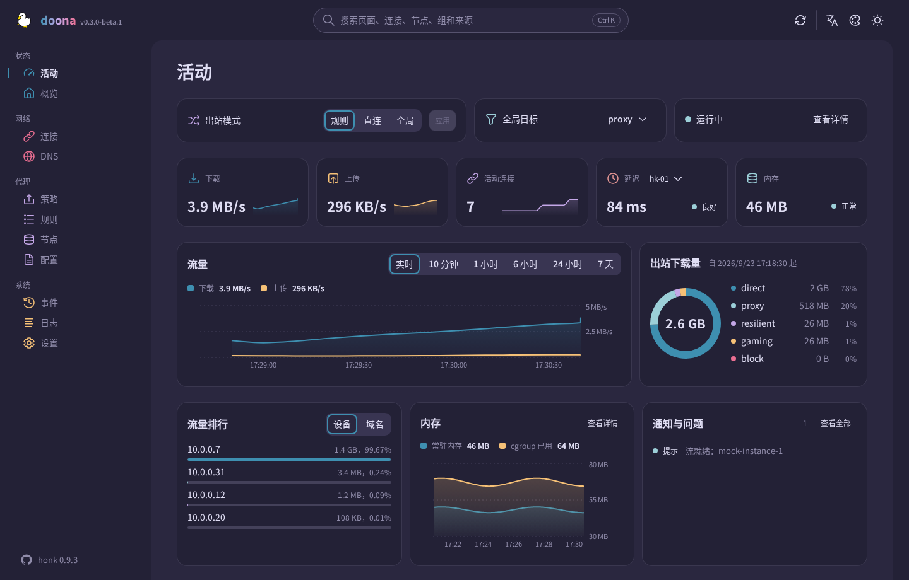

# doona 使用指南

[English](guide.md) · 简体中文 · [繁體中文](guide.zh-TW.md)

[README](../README.zh-CN.md) 之外只需要看一次的内容：运行环境、其他提供方式、各页面需要的后端资源、doona 自身设置的存放位置，以及开发工具。

## 运行环境

| 组件   | 要求                                                                                                                          |
| ------ | ----------------------------------------------------------------------------------------------------------------------------- |
| 后端   | 实现 [SOURCE.md](../contract/api-standardize/SOURCE.md) 所钉契约并启用 API 监听的引擎（见[安装](#安装)）                      |
| 浏览器 | Chrome 或 Edge 120、Firefox 121、Safari 17 及以后。这些是 CSS 构建目标；JavaScript 构建目标是 ES2022。自动化测试只用 Chromium |
| 构建   | Node `^22.13.0 \|\| ^24.0.0 \|\| >=26.0.0`、pnpm 11.15.1；打包需要 GNU tar、gzip 与 sha256sum                                 |

## 安装

发行文件与 honk 的配置块见 [README](../README.zh-CN.md#安装)。

<strong>任意静态服务器或反向代理</strong>

把解压后的文件放在网站根目录或 `/ui/` 这类前缀下即可；页面用 hash 路由（`/ui/#/activity`），不需要重写规则。UI 与引擎不同源时，需要在引擎中允许 UI 的来源。原生 API 监听、CORS 与身份验证的设置请参阅引擎文档。

反向代理可让两者同源：将精确路径 `/api`（发现端点）和 `/api/` 下的所有路径转发到引擎的监听地址，静态文件放在 `/ui/` 下。如果配置了代理路径前缀，两类 API 路径都须保留该前缀。

<strong>发行版软件包</strong>

尚未发布。每个发行版本附 [nfpm](../install/nfpm) 通过 `make install` 生成的 `deb`、`rpm`、`ipk` 与 Arch 软件包，全部与架构无关，`doona-fonts` 是独立的可选软件包。各软件仓库的打包配置位于 [install/](../install/)：OpenWrt feed Makefile、Alpine `APKBUILD`、Gentoo ebuild、nixpkgs 表达式；AUR 的 `doona-bin` 使用独立仓库。

发行版本另附 `doona-<tag>-deps.tar.xz`（已安装的 `node_modules`），供离线构建使用。原生模块涵盖构建工具支持的 Linux 架构与 libc，清单见 `pnpm-workspace.yaml`；lightningcss 未提供二进制文件的架构改用 esbuild 压缩 CSS。其他打包方式可使用 `make install DESTDIR=… PREFIX=/usr` 与 `make install-fonts`。

## 首次使用

在引擎主机上打开 `/ui/`。首次访问时，doona 向提供页面的来源请求 `/api`，并将引擎保存为后端。密码模式下，锁定的登录对话框提供首次设置入口，用于创建管理员；请从本机或私有网络客户端完成设置，然后使用用户名和密码登录。若页面来自别处，或要连接另一台引擎，打开设置页填写服务器根地址（`http://router:9527`，不含 `/api/v1`）；「测试连接」在保存前先检查发现端点，保存后重新加载页面。

token 模式下，doona 会提示输入 token。可在设置页填写服务器根地址和 token，或使用配对链接代填表单：`/ui/#/settings?api=http://router:9527&token=…`。加载后，doona 会从地址栏移除 token。

接着活动页显示运行中的引擎。其余页面的常见顺序：

1. **节点**：新增订阅（名称与网址）或粘贴分享链接；节点列出协议、延迟与所属群组。可设置订阅多久更新一次、测试单个节点，或从该行把节点加入群组。
2. **策略**：每个群组一张卡片，列出成员与延迟。selector 群组可直接选择成员；自动群组可手动固定成员，并随时恢复自动选择；可测试全部成员，也可编辑群组的策略与筛选条件。
3. **规则**：按评估顺序列出路由字典，附每条规则决定过的流程数。新增规则可以挑选依据与值（域名后缀、geosite 分类、端口、进程名称），也可以直接写表达式，插在任意一条之前或最后。
4. **配置**：已接受的来源与其诊断。就地编辑文件，校验、保存、重载；快速设置覆盖主文件的常用项目。

每一次配置来源的写入都经过引擎：doona 带着读取时的哈希发送（`If-Match`；磁盘上已变动的文件会返回 412，不会写入），引擎先验证整组来源再保存并重载，重载失败时仍沿用先前的世代。预先验证不会写入，脱敏后的文本也不会写回。运行时设置与组选择走各自的端点，各有检查。

## 页面

| 页面 | 内容                                                                                                       | 需要的资源                          |
| ---- | ---------------------------------------------------------------------------------------------------------- | ----------------------------------- |
| 活动 | 出站模式、流量与内存、活动连接、节点延迟、出站用量、流量最高的客户端、通知                                 | —                                   |
| 概览 | 引擎与 eBPF 状态、流量计数、后端能力、状态 JSON 导出                                                       | `runtime`                           |
| 连接 | 实时连接的来源、目的、规则、链路与流量；关闭单条或全部；筛选条件可写在网址                                 | `connections`                       |
| DNS  | 查询与解析结果、缓存、日志；清空缓存                                                                       | `dns_query`、`dns_log`、`dns_cache` |
| 策略 | 群组、成员与健康；选择、手动固定、恢复自动选择、测试、编辑                                                 | `groups`                            |
| 规则 | 从规则或设备经出站到所选节点的分流树、规则列表与命中数、可直接为目标加规则的流程记录、对指定目标的追踪模拟 | `rules`、`flows`、`routing_trace`   |
| 节点 | 订阅与更新间隔、配置内节点、新增与移除、测试、加入群组                                                     | `nodes`、`providers`                |
| 配置 | 来源与诊断、带校验的编辑器、快速设置、导出                                                                 | `config`                            |
| 事件 | 后端事件流                                                                                                 | `events`                            |
| 日志 | 日志流，可按级别与模块筛选、暂停、导出                                                                     | `logs`                              |
| 设置 | 后端、运行时设置与后端操作、语言、外观与配色                                                               | —                                   |

所有页面都保留在导航栏中。只有 [registry.ts](../src/shell/registry.ts) 为页面列出的资源全部不可用时，页面才会标为不可用；打开后会显示不可用提示。任何页面按 `Ctrl K` 可搜索页面、连接、节点、群组、规则与来源。

## 数据与设置

doona 没有用于存储自身界面设置的服务器端存储。配置与运行时变更通过引擎写入；doona 的界面设置存储在浏览器中，范围限于该网站来源的 `localStorage`：

| 设置     | 键               | 值                                                                                                                                                                                                                                                                                                                    |
| -------- | ---------------- | --------------------------------------------------------------------------------------------------------------------------------------------------------------------------------------------------------------------------------------------------------------------------------------------------------------------- |
| 后端     | `doona-profiles` | `{id, name, api, token}` 的 JSON 数组；`api` 是服务器根地址或代理前缀，留空或 `mock` 使用演示数据。密码模式下，`token` 为空，honk 管理会话，doona 将会话 token 保存在当前标签页的 `sessionStorage` 中。token 模式下，API 请求通过 `Authorization` 头发送 token。配对链接可能把 token 放在网址片段中，并在加载后移除。 |
| 使用中的 | `doona-profile`  | 所选后端的 `id`                                                                                                                                                                                                                                                                                                       |
| 语言     | `doona-lang`     | `zh-TW`（默认）、`zh-CN`、`en`                                                                                                                                                                                                                                                                                        |
| 配色方案 | `doona-scheme`   | `system`（默认）、`light`、`dark`                                                                                                                                                                                                                                                                                     |
| 配色     | `doona-palette`  | `rose-pine/moon`（默认）；其他值见 [preferences.ts](../src/shell/preferences.ts) 的 `PaletteId`                                                                                                                                                                                                                       |
| 字标     | `doona-wordmark` | `gradient`（默认）、`plain`                                                                                                                                                                                                                                                                                           |

保存的主题与语言在第一帧之前就应用，重新加载不会闪出默认外观。

在 HTTPS 或 localhost 下，service worker 预先缓存应用外壳，并缓存字体与图标，离线也能打开页面，网站可安装为应用。API 响应一律不缓存。安全问题的报告方式见 [SECURITY.md](../.github/SECURITY.md)。

## 开发

命令见 [README](../README.zh-CN.md#开发)。

在仓库根目录执行 `DOONA_API=http://router:9527 DOONA_TOKEN=… pnpm e2e:live`，可对实际后端执行只读的无障碍、移动端导航与键盘测试。`DOONA_API` 必填；后端不要求身份验证时可省略 `DOONA_TOKEN`。测试拒绝通过 fixture 存储覆盖后端设置，并中止控制请求，包括 DNS 查询。普通 `pnpm e2e` 测试在设置了 `DOONA_API` 时拒绝执行，除非显式设置 `DOONA_LIVE_OBSERVE=1`。

`pnpm dev` 以 Vite 开发服务器提供模拟后端。版本号本机取自 `package.json`，标签上取自 Git 描述；时间戳用 `SOURCE_DATE_EPOCH`，未设置时用 HEAD 提交时间。`node tools/screenshots.mjs <url> docs/screenshots` 从运行中的构建截取页面与配色总览，输出无损 WebP，需要安装 `cwebp`。另见 [CONTRIBUTING.md](../CONTRIBUTING.md) 与 [CHANGELOG.md](../CHANGELOG.md)。

| 路径            | 用途                                          |
| --------------- | --------------------------------------------- |
| `src/features/` | 各页面及其 hook 与文案，一页一个文件夹        |
| `src/shell/`    | 应用外壳、导航与搜索                          |
| `src/ui/`       | 共用组件、主题与图标                          |
| `src/api/`      | 客户端、后端档案、模拟后端与生成的类型        |
| `src/store/`    | 资源监听、读取缓存与操作 hook                 |
| `src/i18n/`     | 翻译与区域设置辅助                            |
| `contract/`     | 内嵌的 OpenAPI 契约与钉点                     |
| `public/`       | 静态资源、字体与 service worker               |
| `e2e/`          | 浏览器测试                                    |
| `tools/`        | 构建、打包、一致性检查与截图工具              |
| `install/`      | nfpm 配置与 OpenWrt、Alpine、Gentoo、Nix 写法 |

### 契约

[SOURCE.md](../contract/api-standardize/SOURCE.md) 记录 [openapi.yaml](../contract/api-standardize/openapi.yaml) 的钉点。移动钉点后执行 `pnpm gen:api` 重新生成 [src/api/types.ts](../src/api/types.ts)。`node tools/conformance.mjs http://router:9527 --token …` 按契约检查线上后端的发现端点、能力与只读响应，不发送任何修改。
