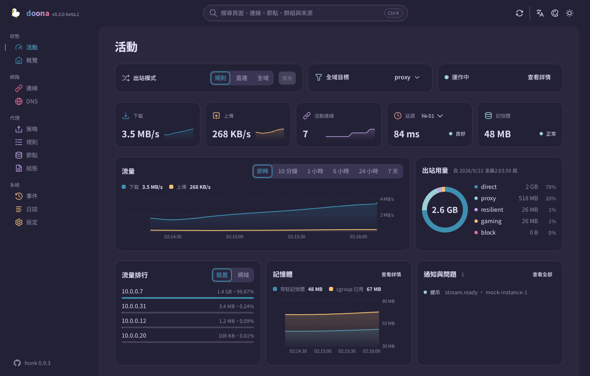

# doona 使用指南

[English](guide.md) · [简体中文](guide.zh-CN.md) · 繁體中文

[README](../README.zh-TW.md) 之外只需要看一次的內容：執行環境、其他提供方式、各頁面需要的後端資源、doona 自身設定的存放位置，以及開發工具。

[使用範例資料體驗示範版](https://zakkaus.github.io/doona/)。

## 執行環境

| 元件   | 要求                                                                                                                          |
| ------ | ----------------------------------------------------------------------------------------------------------------------------- |
| 後端   | 實作 [SOURCE.md](../contract/api-standardize/SOURCE.md) 所釘契約並啟用 API 監聽的引擎（見[安裝](#安裝)）                      |
| 瀏覽器 | Chrome 或 Edge 120、Firefox 121、Safari 17 及以後。這些是 CSS 建置目標；JavaScript 建置目標是 ES2022。自動化測試只用 Chromium |
| 建置   | Node `^22.13.0 \|\| ^24.0.0 \|\| >=26.0.0`、pnpm 11.15.1；打包需要 GNU tar、gzip 與 sha256sum                                 |

## 安裝

**所需 honk 建置：**doona 需要 [Glassyiris/honk 的 `feat/native-api` 分支](https://github.com/Glassyiris/honk/tree/feat/native-api)提供的原生 API；daeuniverse/honk 尚無包含此功能的正式發行版本。`native_api` 與 `password_auth` 設定項目在上游發行前可能變更。已發行的 honk 對 `/api` 與 `/ui/` 回傳 404。[README 中的設定](../README.zh-TW.md#honk-原生-api-要求)僅適用於該分支。

發行檔與 honk 的設定區塊見 [README](../README.zh-TW.md#安裝)。

<strong>任一靜態伺服器或反向代理</strong>

把解壓後的檔案放在網站根目錄或 `/ui/` 這類前綴下即可；頁面用 hash 路由（`/ui/#/activity`），不需要改寫規則。UI 與引擎不同源時，需要在引擎中允許 UI 的來源。原生 API 監聽、CORS 與身分驗證的設定請參閱引擎文件。

反向代理可讓兩者同源：將精確路徑 `/api`（探索端點）和 `/api/` 下的所有路徑轉送至引擎的監聽位址，靜態檔案放在 `/ui/` 下。如果設定了代理路徑前綴，兩類 API 路徑都須保留該前綴。

<strong>發行版套件</strong>

尚未發布。每個發行版本附 [nfpm](../install/nfpm) 以預先建置檔案產生的 `deb`、`rpm`、`ipk` 與 Arch 套件，全部與架構無關，`doona-fonts` 是獨立的選用套件。各套件倉庫的打包設定位於 [install/](../install/)：OpenWrt feed Makefile、Alpine `APKBUILD`、Gentoo ebuild、nixpkgs 表達式；AUR 的 `doona-bin` 使用獨立倉庫。

各發行版套件均安裝預先建置的程式封存檔與可選字型封存檔，不需要離線建置依賴。封裝本機建置結果時，可使用 `make install DESTDIR=… PREFIX=/usr` 與 `make install-fonts`。

## 第一次使用

在引擎主機上開 `/ui/`。第一次造訪時，doona 向提供頁面的來源請求 `/api`，並將引擎儲存為後端。密碼模式下，鎖定的登入對話方塊提供首次設定入口，用於建立管理員；請從本機或私人網路用戶端完成設定，再以使用者名稱和密碼登入。若頁面來自別處，或要連另一台引擎，開設定頁填伺服器根位址（`http://router:9527`，不含 `/api/v1`）；「測試連線」在儲存前先檢查探索端點，儲存後重新載入頁面。

token 模式下，doona 會提示輸入 token。可在設定頁填入伺服器根位址和 token，或使用配對連結代填表單：`/ui/#/settings?api=http://router:9527&token=…`。載入後，doona 會從網址列移除 token。

接著活動頁顯示執行中的引擎。其餘頁面的常見順序：

1. **節點**：新增訂閱（名稱與網址）或貼入分享連結；節點列出協定、延遲與所屬群組。可設定訂閱多久更新一次、測試單一節點，或從該列把節點加入群組。
2. **策略**：每個群組一張卡片，列出成員與延遲。selector 群組可直接選擇成員；自動群組可手動固定成員，並隨時恢復自動選擇；可測試全部成員，也可編輯群組的策略與篩選條件。
3. **規則**：依評估順序列出路由字典，附每條規則決定過的流程數。新增規則可以挑選依據與值（網域後綴、geosite 分類、埠、程序名稱），也可以直接寫表達式，插在任一條之前或最後。
4. **組態**：已接受的來源與其診斷。就地編輯檔案，校驗、儲存、重載；快速設定涵蓋主檔的常用項目。

每一次組態來源的寫入都經過引擎。doona 帶著讀取時的雜湊送出（`If-Match`）；磁碟上已變動的檔案會回 412，不會寫入。引擎先驗證整組來源，再儲存並重載；重載失敗時仍沿用先前的世代。預先驗證不會寫入，遮蔽後的文字也不會寫回。執行期設定與群組選擇走各自的端點，各有檢查。

## 頁面

| 頁面 | 內容                                                                                                       | 需要的資源                          |
| ---- | ---------------------------------------------------------------------------------------------------------- | ----------------------------------- |
| 活動 | 出站模式、流量與記憶體、活動連線、節點延遲、出站用量、流量最高的客戶端、通知                               | —                                   |
| 概覽 | 引擎與 eBPF 狀態、流量計數、後端能力、狀態 JSON 匯出                                                       | `runtime`                           |
| 連線 | 即時連線的來源、目的、規則、鏈路與流量；關閉單條或全部；篩選條件可寫在網址                                 | `connections`                       |
| DNS  | 查詢與解析結果、快取、日誌；清空快取                                                                       | `dns_query`、`dns_log`、`dns_cache` |
| 策略 | 群組、成員與健康；選擇、手動固定、恢復自動選擇、測試、編輯                                                 | `groups`                            |
| 規則 | 從規則或設備經出站到所選節點的分流樹、規則列表與命中數、可直接為目標加規則的流程記錄、對指定目標的追蹤模擬 | `rules`、`flows`、`routing_trace`   |
| 節點 | 訂閱與更新間隔、組態內節點、新增與移除、測試、加入群組                                                     | `nodes`、`providers`                |
| 組態 | 來源與診斷、附校驗的編輯器、快速設定、匯出                                                                 | `config`                            |
| 事件 | 後端事件串流                                                                                               | `events`                            |
| 日誌 | 日誌串流，可按等級與模組篩選、暫停、匯出                                                                   | `logs`                              |
| 設定 | 後端、執行期設定與後端操作、語言、外觀與配色                                                               | —                                   |

所有頁面都保留在導覽列中。只有 [registry.ts](../src/shell/registry.ts) 為頁面列出的資源全部不可用時，頁面才會標為不可用；開啟後會顯示不可用提示。任何頁面按 `Ctrl K` 可搜尋頁面、連線、節點、群組、規則與來源。

## 資料與設定

doona 沒有供自身介面設定使用的伺服器端儲存空間。組態與執行期變更透過引擎寫入；doona 的介面設定儲存在瀏覽器中，範圍限於該網站來源的 `localStorage`：

| 設定     | 鍵               | 值                                                                                                                                                                                                                                                                                                                         |
| -------- | ---------------- | -------------------------------------------------------------------------------------------------------------------------------------------------------------------------------------------------------------------------------------------------------------------------------------------------------------------------- |
| 後端     | `doona-profiles` | `{id, name, api, token}` 的 JSON 陣列；`api` 是伺服器根位址或代理前綴，留空或 `mock` 使用示範資料。密碼模式下，`token` 為空，honk 管理工作階段，doona 將工作階段 token 儲存在目前分頁的 `sessionStorage`。token 模式下，API 請求透過 `Authorization` 標頭傳送 token。配對連結可能把 token 放在網址片段中，並在載入後移除。 |
| 使用中的 | `doona-profile`  | 所選後端的 `id`                                                                                                                                                                                                                                                                                                            |
| 語言     | `doona-lang`     | `zh-TW`（預設）、`zh-CN`、`en`                                                                                                                                                                                                                                                                                             |
| 配色方案 | `doona-scheme`   | `system`（預設）、`light`、`dark`                                                                                                                                                                                                                                                                                          |
| 配色     | `doona-palette`  | `rose-pine/moon`（預設）；其他值見 [preferences.ts](../src/shell/preferences.ts) 的 `PaletteId`                                                                                                                                                                                                                            |
| 字標     | `doona-wordmark` | `gradient`（預設）、`plain`                                                                                                                                                                                                                                                                                                |

儲存的主題與語言在第一幀之前就套用，重新載入不會閃出預設外觀。

在 HTTPS 或 localhost 下，service worker 預先快取應用外殼，並快取字型與圖示，離線也能開頁面，網站可安裝成應用程式。API 回應一律不快取。安全問題的回報方式見 [SECURITY.md](../.github/SECURITY.md)。

## 開發

指令見 [README](../README.zh-TW.md#開發)。

在倉庫根目錄執行 `DOONA_API=http://router:9527 DOONA_TOKEN=… pnpm e2e:live`，可對實際後端執行唯讀的無障礙、行動裝置導覽與鍵盤測試。`DOONA_API` 必填；後端不要求身分驗證時可省略 `DOONA_TOKEN`。測試拒絕透過 fixture 儲存覆寫後端設定，並中止控制請求，包括 DNS 查詢。一般 `pnpm e2e` 測試在設定了 `DOONA_API` 時拒絕執行，除非明確設定 `DOONA_LIVE_OBSERVE=1`。

`pnpm dev` 以 Vite 開發伺服器提供模擬後端。版本號本機取自 `package.json`，標籤上取自 Git 描述；時間戳用 `SOURCE_DATE_EPOCH`，未設定時用 HEAD 提交時間。`node tools/screenshots.mjs <url> docs/screenshots` 從執行中的建置擷取頁面截圖與配色總覽，輸出無失真的 WebP，需要安裝 `cwebp`。另見 [CONTRIBUTING.md](../CONTRIBUTING.md) 與 [CHANGELOG.md](../CHANGELOG.md)。

| 路徑            | 用途                                          |
| --------------- | --------------------------------------------- |
| `src/features/` | 各頁面及其 hook 與文案，一頁一個資料夾        |
| `src/shell/`    | 應用外殼、導覽與搜尋                          |
| `src/ui/`       | 共用元件、主題與圖示                          |
| `src/api/`      | 客戶端、後端設定檔、模擬後端與產生的型別      |
| `src/store/`    | 資源監聽、讀取快取與操作 hook                 |
| `src/i18n/`     | 翻譯與地區設定輔助                            |
| `contract/`     | 內嵌的 OpenAPI 契約與釘點                     |
| `public/`       | 靜態資源、字型與 service worker               |
| `e2e/`          | 瀏覽器測試                                    |
| `tools/`        | 建置、打包、一致性檢查與截圖工具              |
| `install/`      | nfpm 設定與 OpenWrt、Alpine、Gentoo、Nix 寫法 |

### 契約

[SOURCE.md](../contract/api-standardize/SOURCE.md) 記錄 [openapi.yaml](../contract/api-standardize/openapi.yaml) 的釘點。移動釘點後執行 `pnpm gen:api` 重新產生 [src/api/types.ts](../src/api/types.ts)。`node tools/conformance.mjs http://router:9527 --token …` 按契約檢查線上後端的探索端點、能力與唯讀回應，不送出任何修改。
